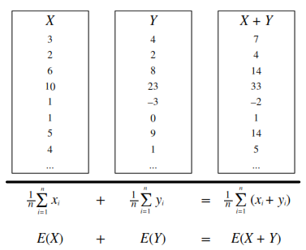
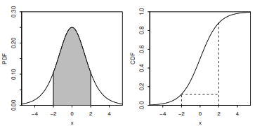
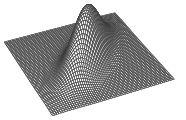

# Counting
---

## Multiplication Rule

Let's say we have a compound experiment (an experiment with multiple components). If the 1st component has $$n_1$$ possible outcomes, the 2nd component has $$n_2$$ possible outcomes, ..., and the $$r$$th component has $$n_r$$ possible outcomes, then overall there are $$n_1n_2 \dots n_r$$ possibilities for the whole experiment.

## Sampling Table

The sampling table gives the number of possible samples of size $$k$$ out of a population of size $$n$$, under various assumptions about how the sample is collected.

|                      | Order Matters          | Not Matter                    |
|----------------------|------------------------|-------------------------------|
| With Replacement     | $$n^k$$                  | $${n+k-1 \choose k}$$           |
| Without Replacement  | $$\frac{n!}{(n - k)!}$$  | $${n \choose k}$$               |

## Naive Definition of Probability

If all outcomes are equally likely, the probability of an event $$A$$ happening is:

$$P_{\textrm{naive}}(A) = \frac{\text{number of outcomes favorable to $A$}}{\text{number of outcomes}}$$

### Independence

#### Independent Events:
$$A$$ and $$B$$ are independent if knowing whether $$A$$ occurred gives no information about whether $$B$$ occurred. More formally, $$A$$ and $$B$$ (which have nonzero probability) are independent if and only if one of the following equivalent statements holds:\
&emsp;֍  $$P(A \cap B) = P(A)P(B)$$\
&emsp;֍  $$P(A|B) = P(A)$$\
&emsp;֍  $$P(B|A) = P(B)$$

#### Conditional Independence: 
$$A$$ and $$B$$ are conditionally independent given $$C$$ if\
$$P(A \cap B\|C) = P(A\|C)P(B\|C)$$.\
Conditional independence does not imply independence, and independence does not imply conditional independence.

### Unions, Intersections, and Complements

&emsp;֍  De Morgan's Laws: A useful identity that can make calculating probabilities of unions easier by relating them to intersections, and vice versa. Analogous results hold with more than two sets.\
&emsp;֍  $$(A \cup B)^c = A^c \cap B^c$$\
&emsp;֍  $$(A \cap B)^c = A^c \cup B^c$$

### Joint, Marginal, and Conditional

&emsp;֍  Joint Probability: $$P(A \cap B)$$ or $$P(A, B)$$ -- Probability of $$A$$ and $$B$$.\
&emsp;֍  Marginal (Unconditional) Probability: $$P(A)$$ -- Probability of $$A$$.\
&emsp;֍  Conditional Probability: $$P(A\|B) = \frac{P(A, B)}{P(B)}$$ -- Probability of $$A$$, given that $$B$$ occurred.\
&emsp;֍  Conditional Probability *is* Probability: $$P(A\|B)$$ is a probability function for any fixed $$B$$. Any theorem that holds for probability also holds for conditional probability.

### Probability of an Intersection or Union

**Intersections via Conditioning**

$$\begin{align*} 
    P(A,B) &= P(A)P(B|A) \\
    P(A,B,C) &= P(A)P(B|A)P(C|A,B)
\end{align*}$$

**Unions via Inclusion-Exclusion**

$$\begin{align*} 
    P(A \cup B) &= P(A) + P(B) - P(A \cap B) \\
    P(A \cup B \cup C) &= P(A) + P(B) + P(C) \\
    &\quad - P(A \cap B) - P(A \cap C) - P(B \cap C) \\
    &\quad + P(A \cap B \cap C)
\end{align*}$$

### Simpson's Paradox

It is possible to have
$$P(A\mid B,C) < P(A\mid B^c, C) \text{ and } P(A\mid B, C^c) < P(A \mid B^c, C^c)$$
$$\text{yet also } P(A\mid B) > P(A \mid B^c).$$

### Law of Total Probability (LOTP)

Let $${ B}_1, { B}_2, { B}_3, ... { B}_n$$ be a *partition* of the sample space (i.e., they are disjoint and their union is the entire sample space).

$$\begin{align*} 
    P({ A}) &= P({ A} | { B}_1)P({ B}_1) + P({ A} | { B}_2)P({ B}_2) + \dots + P({ A} | { B}_n)P({ B}_n)\\
    P({ A}) &= P({ A} \cap { B}_1)+ P({ A} \cap { B}_2)+ \dots + P({ A} \cap { B}_n)
\end{align*}$$ 

For **LOTP with extra conditioning**, just add in another event $$C$$!

$$\begin{align*} 
    P({ A}| { C}) &= P({ A} | { B}_1, { C})P({ B}_1 | { C}) + \dots +  P({ A} | { B}_n, { C})P({ B}_n | { C})\\
    P({ A}| { C}) &= P({ A} \cap { B}_1 | { C})+ P({ A} \cap { B}_2 | { C})+ \dots +  P({ A} \cap { B}_n | { C})
\end{align*}$$ 

Special case of LOTP with $${ B}$$ and $${ B^c}$$ as partition:

$$\begin{align*} 
P({ A}) &= P({ A} | { B})P({ B}) + P({ A} | { B^c})P({ B^c}) \\
P({ A}) &= P({ A} \cap { B})+ P({ A} \cap { B^c})
\end{align*}$$ 

### Bayes' Rule
**Bayes' Rule, with extra conditioning (just add in $$C$$!)**

$$P({ A}|{ B})  = \frac{P({ B}|{ A})P({ A})}{P({ B})}$$

$$P({ A}|{ B}, { C}) = \frac{P({ B}|{ A}, { C})P({ A} | { C})}{P({ B} | { C})}$$

We can also write

$$P(A|B,C) = \frac{P(A,B,C)}{P(B,C)} = \frac{P(B,C|A)P(A)}{P(B,C)}$$

**Odds Form of Bayes' Rule**\
$$\frac{P({ A}\| { B})}{P({ A^c}\| { B})} = \frac{P({ B}\|{ A})}{P({ B}| { A^c})}\frac{P({ A})}{P({ A^c})}$$

The *posterior odds* of $$A$$ are the *likelihood ratio* times the *prior odds*.

# Random Variables and their Distributions
## PMF, CDF, and Independence

**Probability Mass Function (PMF)**  
Gives the probability that a *discrete* random variable takes on the value *x*.

$$ p_X(x) = P(X=x) $$

The PMF satisfies:  
$$p_X(x) \geq 0 \quad \textrm{and} \quad \sum_x p_X(x) = 1$$

**Cumulative Distribution Function (CDF)**  
Gives the probability that a random variable is less than or equal to *x*.

$$F_X(x) = P(X \leq x)$$

The CDF is an increasing, right-continuous function with:  
$$F_X(x) \to 0 \quad \textrm{as} \quad x \to -\infty \quad \textrm{and} \quad F_X(x) \to 1 \quad \textrm{as} \quad x \to \infty$$

**Independence**  
Intuitively, two random variables are independent if knowing the value of one gives no information about the other. Discrete random variables *X* and *Y* are independent if for all values of *x* and *y*:

$$P(X=x, Y=y) = P(X = x)P(Y = y)$$

## Expected Value and Indicators
### Expected Value and Linearity

**Expected Value**  
(a.k.a. *mean*, *expectation*, or *average*) is a weighted average of the possible outcomes of our random variable.\
Mathematically, if *x1*, *x2*, *x3*, ... are all of the distinct possible values that *X* can take, the expected value of *X* is:

$$E(X) = \sum\limits_{i}x_iP(X=x_i)$$

**Linearity**  
For any random variables *X* and *Y*, and constants *a*, *b*, *c*:

$$E(aX + bY + c) = aE(X) + bE(Y) + c$$

**Same distribution implies same mean**  
If *X* and *Y* have the same distribution, then *E(X) = E(Y)* and, more generally:

$$E(g(X)) = E(g(Y))$$

**Conditional Expected Value**  
Conditional expected value is defined like expectation, only conditioned on any event *A*:

$$E(X | A) = \sum\limits_{x}xP(X=x | A)$$

### Indicator Random Variables

**Indicator Random Variable** 
An indicator random variable is a random variable that takes on the value 1 or 0. It is always an indicator of some event: if the event occurs, the indicator is 1; otherwise, it is 0. They are useful for many problems about counting how many events of some kind occur. Write:

$$
I_A =
\begin{cases}
   1 & \text{if $A$ occurs}, \\
   0 & \text{if $A$ does not occur}.
\end{cases}
$$

Note that: $$I_A^2 = I_A$$,&emsp; $$I_A I_B = I_{A \cap B}$$, &emsp;$$I_{A \cup B} = I_A + I_B - I_A I_B$$
 
**Distribution**  
$$I_A \sim Bern(p) where p = P(A)$$.

**Fundamental Bridge**  
The expectation of the indicator for event *A* is the probability of event *A*: $$E(I_A) = P(A)$$.

### Variance and Standard Deviation

$$var(X) = E \left(X - E(X)\right)^2 = E(X^2) - (E(X))^2$$

$$\textrm{SD}(X) = \sqrt{var(X)}$$

# Continuous RVs, LOTUS, UoU
## Continuous Random Variables (CRVs)
### What is a Continuous Random Variable (CRV)?

A continuous random variable can take on any possible value within a certain interval (for example, [0, 1]), whereas a discrete random variable can only take on variables in a list of countable values (for example, all the integers, or the values 1, 1/2, 1/4, 1/8, etc.)

### Do Continuous Random Variables have PMFs?

No. The probability that a continuous random variable takes on any specific value is 0.

### What's the probability that a CRV is in an interval?

Take the difference in CDF values (or use the PDF as described later).

$$P(a \leq X \leq b) = P(X \leq b) - P(X \leq a) = F_X(b) - F_X(a)$$

For X ~ N(μ, σ^2), this becomes

$$P(a \leq X \leq b) = \Phi\left(\frac{b-\mu}{\sigma}\right) - \Phi\left(\frac{a-\mu}{\sigma}\right)$$

### What is the Probability Density Function (PDF)?

The PDF f is the derivative of the CDF F.

$$F'(x) = f(x)$$

A PDF is nonnegative and integrates to 1. By the fundamental theorem of calculus, to get from PDF back to CDF we can integrate:

$$F(x) = \int_{-\infty}^x f(t)dt$$

To find the probability that a CRV takes on a value in an interval, integrate the PDF over that interval.

$$F(b) - F(a) = \int_a^b f(x)dx$$

### How do I find the expected value of a CRV?

Analogous to the discrete case, where you sum x times the PMF, for CRVs you integrate x times the PDF.

$$E(X) = \int_{-\infty}^\infty xf(x)dx$$

## LOTUS
### Expected value of a function of an r.v.

The expected value of X is defined this way:

$$E(X) = \sum_x xP(X=x) \text{ (for discrete X)}$$
$$E(X) = \int_{-\infty}^\infty xf(x)dx \text{ (for continuous X)}$$

The Law of the Unconscious Statistician (LOTUS) states that you can find the expected value of a function of a random variable, g(X), in a similar way, by replacing the x in front of the PMF/PDF by g(x) but still working with the PMF/PDF of X:

$$E(g(X)) = \sum_x g(x)P(X=x) \text{ (for discrete X)}$$
$$E(g(X)) = \int_{-\infty}^\infty g(x)f(x)dx \text{ (for continuous X)}$$

### What's a function of a random variable?

A function of a random variable is also a random variable. For example, if X is the number of bikes you see in an hour, then g(X) = 2X is the number of bike wheels you see in that hour, and h(X) = $${X \choose 2} = \frac{X(X-1)}{2}$$ is the number of pairs of bikes such that you see both of those bikes in that hour.

### What's the point?

You don't need to know the PMF/PDF of g(X) to find its expected value. All you need is the PMF/PDF of X.

## Universality of Uniform (UoU)

When you plug any CRV into its own CDF, you get a Uniform(0,1) random variable. When you plug a Uniform(0,1) r.v. into an inverse CDF, you get an r.v. with that CDF. For example, let's say that a random variable X has CDF

$$F(x) = 1 - e^{-x}, \textrm{ for } x>0$$

By UoU, if we plug X into this function then we get a uniformly distributed random variable.

$$F(X) = 1 - e^{-X} \sim \textrm{Unif}(0,1)$$

Similarly, if $$U ~ Unif(0,1)$$ then $$F^{-1}(U)$$ has CDF $$F$$. The key point is that for any continuous random variable $$X$$, we can transform it into a Uniform random variable and back by using its CDF.

### Moments

Moments describe the shape of a distribution. Let X have mean μ and standard deviation σ, and Z=(X-μ)/σ be the *standardized* version of X. The kth moment of X is μₖ = E(Xᵏ), and the kth standardized moment of X is mₖ = E(Zᵏ). The mean, variance, skewness, and kurtosis are important summaries of the shape of a distribution.

&emsp;֍  Mean: $$E(X) = μ₁$$\
&emsp;֍  Variance: $$var(X) = μ₂ - μ₁²$$\
&emsp;֍  Skewness: $$skew(X) = m₃$$\
&emsp;֍  Kurtosis: $$kurt(X) = m₄ - 3$$

### Moment Generating Functions

- *MGF* (Moment Generating Function): For any random variable X, the function\
 $$Mₓ(t) = E(e^{tX})$$\
is the *moment generating function (MGF)* of X, if it exists for all t in some open interval containing 0. The variable t could just as well have been called u or v. It's a bookkeeping device that lets us work with the function Mₓ rather than the sequence of moments.
- *Why is it called the Moment Generating Function?* Because the kth derivative of the moment generating function, evaluated at 0, is the kth moment of X. 
$$μₖ = E(Xᵏ) = Mₓ⁽ᵏ⁾(0)$$\
   This is true by Taylor expansion of $$e^{tX}$$ since\
   $$Mₓ(t) = E(e^{tX}) = ∑_(k=0)^(∞) [\frac{E(Xᵏ)tᵏ}{k!}] = ∑_(k=0)^(∞) [\frac{μₖtᵏ}{k!}]$$
- *MGF of linear functions*: If $$Y = aX + b$$, then $$Mₙ(t) = E(e^(t(aX + b))) = e^(bt)Mₓ(at)$$
- Uniqueness: If it exists, the MGF uniquely determines the distribution. This means that for any two random variables X and Y, they are distributed the same (their PMFs/PDFs are equal) if and only if their MGFs are equal.
- Summing Independent RVs by Multiplying MGFs: If X and Y are independent, then\
  $$Mₓ₊ᵧ(t) = E(e^(t(X + Y))) = E(e^{tX})E(e^(tY)) = Mₓ(t) ⋅ Mᵧ(t)$$\
  The MGF of the sum of two random variables is the product of the MGFs of those two random variables.

### Joint PDFs and CDFs

#### Joint Distributions
- Joint CDF: The joint cumulative distribution function (CDF) of X and Y is $$F(x,y) = P(X ≤ x, Y ≤ y)$$.
- Joint PMF: In the discrete case, X and Y have a joint probability mass function $$(PMF)$$\
$$ pₓᵧ(x,y) = P(X=x, Y=y)$$.
- Joint PDF: In the continuous case, X and Y have a joint probability density function $$(PDF)$$\
 $$fₓᵧ(x,y) = (∂²/∂x∂y)Fₓᵧ(x,y)$$.\
The joint PMF/PDF must be nonnegative and sum/integrate to 1.

#### Conditional Distributions
&emsp;֍  Conditioning and Bayes' rule for discrete random variables:\
 $$ P(Y=y|X=x) = P(X=x,Y=y) / P(X=x)$$\
            $$ = P(X=x|Y=y)P(Y=y) / ∑ᵧ P(X=x|Y=ᵧ)P(Y=ᵧ)$$\
&emsp;֍  Conditioning and Bayes' rule for continuous random variables:\
  $$fᵧ|ₓ(y|x) = fₓᵧ(x, y) / fₓ(x)$$\
             $$= (fₓ|ᵧ(x|y)fᵧ(y)) / fₓ(x)$$\
&emsp;֍  Hybrid Bayes' rule:\
  $$fₓ(x|A) = (P(A | X = x)fₓ(x)) / P(A)$$

#### Marginal Distributions
To find the distribution of one (or more) random variables from a joint PMF/PDF, sum/integrate over the unwanted random variables.\

&emsp;֍  Marginal PMF from joint PMF:\
  $$P(X = x) = ∑ₓ P(X=x, Y=y)$$\
&emsp;֍  Marginal PDF from joint PDF:\
  $$fₓ(x) = ∫[∞, -∞] fₓᵧ(x, y) dy$$

#### Independence of Random Variables
Random variables X and Y are independent if and only if any of the following conditions holds:\
&emsp;֍  Joint CDF is the product of the marginal CDFs.\
&emsp;֍  Joint PMF/PDF is the product of the marginal PMFs/PDFs.\
&emsp;֍  Conditional distribution of Y given X is the marginal distribution of Y.
Write X ⫫ Y to denote that X and Y are independent.

#### Multivariate LOTUS
Law of the unconscious statistician (LOTUS) in more than one dimension is analogous to the 1D LOTUS.\
For discrete random variables:\
$$E(g(X, Y)) = ∑ₓ∑y g(x, y)P(X=x, Y=y)$$\
For continuous random variables:\
$$E(g(X, Y)) = ∫[-∞, ∞]∫[-∞, ∞] g(x, y)fₓᵧ(x, y)dxdy$$

### Covariance and Transformations

### Covariance and Correlation

**Covariance** is the analog of variance for two random variables.
    $$\text{cov}(X, Y) = E\left((X - E(X))(Y - E(Y))\right) = E(XY) - E(X)E(Y)$$
    Note that 
    $$\text{cov}(X, X) = E(X^2) - (E(X))^2 =  \text{var}(X)$$

**Correlation** is a standardized version of covariance that is always between $$-1$$ and $$1$$.
    $$\text{corr}(X, Y) = \frac{\text{cov}(X, Y)}{\sqrt{\text{var}(X)\text{var}(Y)}}$$

**Covariance and Independence** If two random variables are independent, then they are uncorrelated. The converse is not necessarily true (e.g., consider $$X \sim \mathcal{N}(0,1)$$ and $$Y=X^2$$).\
 $$X \perp Y \longrightarrow \text{cov}(X, Y) = 0 \longrightarrow E(XY) = E(X)E(Y)$$

**Covariance and Variance** The variance of a sum can be found by
    $$var(X + Y) = var(X) + var(Y) + 2\text{cov}(X, Y)$$
    $$var(X_1 + X_2 + \dots + X_n ) = \sum_{i = 1}^{n}var(X_i) + 2\sum_{i < j} \text{cov}(X_i, X_j)$$
    If $$X$$ and $$Y$$ are independent, then they have covariance $$0$$, so
    $$X \perp Y \Longrightarrow var(X + Y) = var(X) + var(Y)$$
    If $$X_1, X_2, \dots, X_n$$ are identically distributed and have the same covariance relationships (often by symmetry), then 
    $$var(X_1 + X_2 + \dots + X_n ) = nvar(X_1) + 2{n \choose 2}\text{cov}(X_1, X_2)$$

**Covariance Properties** For random variables $$W, X, Y, Z$$ and constants $$a, b$$:
    $$\text{cov}(X, Y) = \text{cov}(Y, X)$$
    $$\text{cov}(X + a, Y + b) = \text{cov}(X, Y)$$
    $$\text{cov}(aX, bY) = ab\text{cov}(X, Y)$$
    $$\text{cov}(W + X, Y + Z) = \text{cov}(W, Y) + \text{cov}(W, Z) + \text{cov}(X, Y) + \text{cov}(X, Z)$$

**Correlation is location-invariant and scale-invariant** For any constants $$a,b,c,d$$ with $$a$$ and $$c$$ nonzero,
    $$\text{corr}(aX + b, cY + d) = \text{corr}(X, Y)$$

### Transformations

**One Variable Transformations** Let's say that we have a random variable $$X$$ with PDF $$f_X(x)$$, but we are also interested in some function of $$X$$. We call this function $$Y = g(X)$$. Also let $$y=g(x)$$. If $$g$$ is differentiable and strictly increasing (or strictly decreasing), then the PDF of $$Y$$ is
    $$f_Y(y) = f_X(x)\left|\frac{dx}{dy}\right| =  f_X(g^{-1}(y))\left|\frac{d}{dy}g^{-1}(y)\right|$$
    The derivative of the inverse transformation is called the **Jacobian**.

**Two Variable Transformations** Similarly, let's say we know the joint PDF of $$U$$ and $$V$$ but are also interested in the random vector $$(X, Y)$$ defined by $$(X, Y) = g(U, V)$$. Let 
   $$  \frac{\partial (u,v)}{\partial (x,y)}  = \begin{pmatrix} 
          \frac{\partial u}{\partial x} &  \frac{\partial u}{\partial y} \\
       \frac{\partial v}{\partial x} & \frac{\partial v}{\partial y}   \\
    \end{pmatrix}$$
 be the **Jacobian matrix**. If the entries in this matrix exist and are continuous, and the determinant of the matrix is never $$0$$, then
 $$f_{X,Y}(x, y) = f_{U,V}(u,v) \left|\left|   \frac{\partial (u,v)}{\partial (x,y)}\right| \right|$$
 The inner bars tell us to take the matrix's determinant, and the outer bars tell us to take the absolute value. In a $$2 \times 2$$ matrix, 
 $$ \left| \left|
 \begin{array}{ccc}
     a & b \\
     c & d
 \end{array}
 \right| \right| = |ad - bc|$$

### Convolutions

**Convolution Integral** If you want to find the PDF of the sum of two independent CRVs $$X$$ and $$Y$$, you can do the following integral:
    $$f_{X+Y}(t)=\int_{-\infty}^\infty f_X(x)f_Y(t-x)dx$$

**Example** Let $$X,Y \sim \mathcal{N}(0,1)$$ be i.i.d. Then for each fixed $$t$$,
$$f_{X+Y}(t)=\int_{-\infty}^\infty \frac{1}{\sqrt{2\pi}}e^{-x^2/2} \frac{1}{\sqrt{2\pi}}e^{-(t-x)^2/2} dx$$
By completing the square and using the fact that a Normal PDF integrates to $$1$$, this works out to $$f_{X+Y}(t)$$ being the $$\mathcal{N}(0,2)$$ PDF.

## Poisson Process
---

### Definition
We have a **Poisson process** of rate $$\lambda$$ arrivals per unit time if the following conditions hold:
1. The number of arrivals in a time interval of length $$t$$ is $$\text{Pois}(\lambda t)$$.
2. Numbers of arrivals in disjoint time intervals are independent.

For example, the numbers of arrivals in the time intervals $$[0,5]$$, $$(5,12),$$ and $$[13,23)$$ are independent with $$\text{Pois}(5\lambda)$$, $$\text{Pois}(7\lambda)$$, and $$\text{Pois}(10\lambda)$$ distributions, respectively.

### Count-Time Duality
Consider a Poisson process of emails arriving in an inbox at rate $$\lambda$$ emails per hour. Let $$T_n$$ be the time of arrival of the $$n$$th email (relative to some starting time $$0$$) and $$N_t$$ be the number of emails that arrive in $$[0,t]$$.

Let's find the distribution of $$T_1$$. The event $$T_1 > t$$, the event that you have to wait more than $$t$$ hours to get the first email, is the same as the event $$N_t = 0$$, which is the event that there are no emails in the first $$t$$ hours. So,

$$P(T_1 > t) = P(N_t = 0) = e^{-\lambda t}$$

Therefore, $$P(T_1 \leq t) = 1 - e^{-\lambda t}$$, and $$T_1$$ follows an exponential distribution with parameter $$\lambda$$.

By the memoryless property and similar reasoning, the interarrival times between emails are i.i.d. exponential random variables with parameter $$\lambda$$, i.e., the differences $$T_n - T_{n-1}$$ are i.i.d. exponential random variables with parameter $$\lambda$$.

## Order Statistics
---

### Definition
Let's say you have $$n$$ i.i.d. random variables $$X_1, X_2, \dots, X_n$$. If you arrange them from smallest to largest, the $$i$$th element in that list is the $$i$$th order statistic, denoted $$X_{(i)}$$. So $$X_{(1)}$$ is the smallest in the list and $$X_{(n)}$$ is the largest in the list.

Note that the order statistics are *dependent*, e.g., learning $$X_{(4)} = 42$$ gives us the information that $$X_{(1)},X_{(2)},X_{(3)}$$ are $$\leq 42$$ and $$X_{(5)},X_{(6)},\dots,X_{(n)}$$ are $$\geq 42$$.

### Distribution
Taking $$n$$ i.i.d. random variables $$X_1, X_2, \dots, X_n$$ with CDF $$F(x)$$ and PDF $$f(x)$$, the CDF and PDF of $$X_{(i)}$$ are:
$$F_{X_{(i)}}(x) = P (X_{(i)} \leq x) = \sum_{k=i}^n {n \choose k} F(x)^k(1 - F(x))^{n - k}$$
$$f_{X_{(i)}}(x) = n{n - 1 \choose i - 1}F(x)^{i-1}(1 - F(x))^{n-i}f(x)$$

### Uniform Order Statistics
The $$j$$th order statistic of i.i.d. $$U_1,\dots,U_n \sim \text{Unif}(0,1)$$ is $$U_{(j)} \sim \text{Beta}(j, n - j + 1)$$.

## Conditional Expectation
---

### Conditioning on an Event
We can find $$E(Y|A)$$, the expected value of $$Y$$ given that event $$A$$ occurred. A very important case is when $$A$$ is the event $$X=x$$. Note that $$E(Y|A)$$ is a *number*.

For example:
- The expected value of a fair die roll, given that it is prime, is $$\frac{1}{3} \cdot 2 + \frac{1}{3} \cdot 3 + \frac{1}{3} \cdot 5 = \frac{10}{3}$$.
- Let $$Y$$ be the number of successes in $$10$$ independent Bernoulli trials with probability $$p$$ of success. Let $$A$$ be the event that the first $$3$$ trials are all successes. Then $$E(Y\|A) = 3 + 7p$$ since the number of successes among the last $$7$$ trials is $$\text{Bin}(7,p)$$.
- Let $$T \sim \text{Expo}(1/10)$$ be how long you have to wait until the shuttle comes. Given that you have already waited $$t$$ minutes, the expected additional waiting time is $$10$$ more minutes, by the memoryless property. That is, $$E(T\|T>t) = t + 10$$.

### Conditioning on a Random Variable
We can also find $$E(Y|X)$$, the expected value of $$Y$$ given the random variable $$X$$. This is *a function of the random variable $$X$$*. It is *not* a number except in certain special cases such as if $$X \perp Y$$. To find $$E(Y|X)$$, find $$E(Y|X = x)$$ and then plug in $$X$$ for $$x$$.

For example:
- If $$E(Y\|X=x) = x^3+5x$$, then $$E(Y\|X) = X^3 + 5X$$.
- Let $$Y$$ be the number of successes in $$10$$ independent Bernoulli trials with probability $$p$$ of success and $$X$$ be the number of successes among the first $$3$$ trials. Then $$E(Y\|X)=X+7p$$.
- Let $$X \sim \mathcal{N}(0,1)$$ and $$Y=X^2$$. Then $$E(Y\|X=x) = x^2$$ since if we know $$X=x$$ then we know $$Y=x^2$$. And $$E(X\|Y=y) = 0$$ since if we know $$Y=y$$ then we know $$X = \pm \sqrt{y}$$, with equal probabilities (by symmetry). So $$E(Y\|X)=X^2$$, $$E(X\|Y)=0$$.

### Properties of Conditional Expectation
1. $$E(Y|X) = E(Y)$$ if $$X \perp Y$$
2. $$E(h(X)W|X) = h(X)E(W|X)$$ (taking out what's known) \\
   In particular, $$E(h(X)|X) = h(X)$$.
3. $$E(E(Y|X)) = E(Y)$$ (Adam's Law, a.k.a. Law of Total Expectation)

### Adam's Law (a.k.a. Law of Total Expectation)
For any events $$A_1, A_2, \dots, A_n$$ that partition the sample space:
$$E(Y) = E(Y|A_1)P(A_1) + \dots + E(Y|A_n)P(A_n)$$

For the special case where the partition is $$A, A^c$$, this says:
$$E(Y) = E(Y|A)P(A) + E(Y|A^c)P(A^c)$$

### Eve's Law (a.k.a. Law of Total Variance)
$$\text{Var}(Y) = E(\text{Var}(Y|X)) + \text{Var}(E(Y|X))$$

# MVN, LLN, CLT
---

## Law of Large Numbers (LLN)
Let $$X_1, X_2, X_3, \dots$$ be i.i.d. with mean $$\mu$$. The sample mean is $$\bar{X}_n = \frac{X_1 + X_2 + X_3 + \dots + X_n}{n}$$. The Law of Large Numbers states that as $$n \to \infty$$, $$\bar{X}_n \to \mu$$ with probability $$1$$. For example, in flips of a coin with probability $$p$$ of Heads, let $$X_j$$ be the indicator of the $$j$$th flip being Heads. Then LLN says the proportion of Heads converges to $$p$$ (with probability $$1$$).

## Central Limit Theorem (CLT)
### Approximation using CLT
We use $$\dot{\,\sim\,}$$ to denote "is approximately distributed." We can use the Central Limit Theorem to approximate the distribution of a random variable $$Y = X_1 + X_2 + \dots + X_n$$ that is a sum of $$n$$ i.i.d. random variables $$X_i$$. Let $$E(Y) = \mu_Y$$ and $$\text{Var}(Y) = \sigma^2_Y$$. The CLT says:
$$Y \dot{\,\sim\,} \mathcal{N}(\mu_Y, \sigma^2_Y)$$

If the $$X_i$$ are i.i.d. with mean $$\mu_X$$ and variance $$\sigma^2_X$$, then $$\mu_Y = n \mu_X$$ and $$\sigma^2_Y = n \sigma^2_X$$. For the sample mean $$\bar{X}_n$$, the CLT says:
$$\bar{X}_n = \frac{1}{n}(X_1 + X_2 + \dots + X_n) \dot{\,\sim\,} \mathcal{N}(\mu_X, \frac{\sigma^2_X}{n})$$

### Asymptotic Distributions using CLT
We use $$\xrightarrow{D}$$ to denote "converges in distribution to" as $$n \to \infty$$. The CLT says that if we standardize the sum $$X_1 + \dots + X_n$$, then the distribution of the sum converges to $$\mathcal{N}(0,1)$$ as $$n \to \infty$$:
$$\frac{1}{\sigma\sqrt{n}}(X_1 + \dots + X_n - n\mu_X) \xrightarrow{D} \mathcal{N}(0, 1)$$
In other words, the CDF of the left-hand side goes to the standard Normal CDF, $$\Phi$$. In terms of the sample mean, the CLT says:
$$\frac{\sqrt{n}(\bar{X}_n - \mu_X)}{\sigma_X} \xrightarrow{D} \mathcal{N}(0, 1)$$

# Markov Chains
---

## Definition
A Markov chain is a random walk in a state space, which we will assume is finite, say $$\{1, 2, \dots, M\}$$. We let $$X_t$$ denote which element of the state space the walk is visiting at time $$t$$. The Markov chain is the sequence of random variables tracking where the walk is at all points in time, $$X_0, X_1, X_2, \dots$$. By definition, a Markov chain must satisfy the Markov property, which says that if you want to predict where the chain will be at a future time, if we know the present state then the entire past history is irrelevant. Given the present, the past and future are conditionally independent. In symbols:
$$P(X_{n+1} = j | X_0 = i_0, X_1 = i_1, \dots, X_n = i) = P(X_{n+1} = j | X_n = i)$$

## State Properties
A state is either recurrent or transient.
- If you start at a recurrent state, then you will always return back to that state at some point in the future. \textmusicalnote You can check-out any time you like, but you can never leave. \textmusicalnote
- Otherwise, you are at a transient state. There is some positive probability that once you leave, you will never return. \textmusicalnote You don't have to go home, but you can't stay here. \textmusicalnote

A state is either periodic or aperiodic.
- If you start at a periodic state of period $$k$$, then the GCD of the possible numbers of steps it would take to return back is $$k > 1$$.
- Otherwise, you are at an aperiodic state. The GCD of the possible numbers of steps it would take to return back is 1.

## Transition Matrix
Let the state space be $$\{1,2,\dots,M\}$$. The transition matrix $$Q$$ is the $$M \times M$$ matrix where element $$q_{ij}$$ is the probability that the chain goes from state $$i$$ to state $$j$$ in one step:

$$q_{ij} = P(X_{n+1} = j | X_n = i)$$

To find the probability that the chain goes from state $$i$$ to state $$j$$ in exactly $$m$$ steps, take the $$(i, j)$$ element of $$Q^m$$:

$$q^{(m)}_{ij} = P(X_{n+m} = j | X_n = i)$$

If $$X_0$$ is distributed according to the row vector PMF $$\vec{p}$$, i.e., $$p_j = P(X_0 = j)$$, then the PMF of $$X_n$$ is $$\vec{p}Q^n$$.

## Chain Properties
A chain is **irreducible** if you can get from anywhere to anywhere. If a chain (on a finite state space) is irreducible, then all of its states are recurrent. A chain is **periodic** if any of its states are periodic, and is **aperiodic** if none of its states are periodic. In an irreducible chain, all states have the same period.

A chain is **reversible** with respect to $$\vec{s}$$ if $$s_iq_{ij} = s_jq_{ji}$$ for all $$i, j$$. Examples of reversible chains include any chain with $$q_{ij} = q_{ji}$$, with $$\vec{s} = (\frac{1}{M}, \frac{1}{M}, \dots, \frac{1}{M})$$, and random walk on an undirected network.

## Stationary Distribution
Let $$\vec{s} = (s_1, s_2, \dots, s_M)$$ be a PMF (written as a row vector). We will call $$\vec{s}$$ the **stationary distribution** for the chain if $$\vec{s}Q = \vec{s}$$. As a consequence, if $$X_t$$ has the stationary distribution, then all future $$X_{t+1}, X_{t + 2}, \dots$$ also have the stationary distribution.

For irreducible, aperiodic chains, the stationary distribution exists, is unique, and $$s_i$$ is the long-run probability of a chain being at state $$i$$. The expected number of steps to return to $$i$$ starting from $$i$$ is $$1/s_i$$.

To find the stationary distribution, you can solve the matrix equation $$(Q' - I){\vec{s}\,}'= 0$$. The stationary distribution is uniform if the columns of $$Q$$ sum to 1.

**Reversibility Condition Implies Stationarity:** If you have a PMF $$\vec{s}$$ and a Markov chain with transition matrix $$Q$$, then $$s_iq_{ij} = s_jq_{ji}$$ for all states $$i, j$$ implies that $$\vec{s}$$ is stationary.

## Random Walk on an Undirected Network

If you have a collection of **nodes**, pairs of which can be connected by undirected **edges**, and a Markov chain is run by going from the current node to a uniformly random node that is connected to it by an edge, then this is a random walk on an undirected network. The stationary distribution of this chain is proportional to the **degree sequence** (this is the sequence of degrees, where the degree of a node is how many edges are attached to it). For example, the stationary distribution of random walk on the network shown above is proportional to $$(3,3,2,4,2)$$, so it's $$(\frac{3}{14}, \frac{3}{14}, \frac{2}{14}, \frac{4}{14}, \frac{2}{14})$$.

## Continuous Distributions

### Uniform Distribution
Let $$U$$ be distributed $$\text{Unif}(a, b)$$. We know the following:

- **Properties of the Uniform:** For a Uniform distribution, the probability of a draw from any interval within the support is proportional to the length of the interval.
- **Example:** William throws darts really badly, so his darts are uniform over the whole room because they're equally likely to appear anywhere. William's darts have a Uniform distribution on the surface of the room. The Uniform is the only distribution where the probability of hitting in any specific region is proportional to the length/area/volume of that region, and where the density of occurrence in any one specific spot is constant throughout the whole support.

- **PDF and CDF (top is Unif(0, 1), bottom is Unif(a, b))**

For the Uniform distribution:

- Unif(0, 1):
  - PDF:
    $$
    f(x) = \left\{
    \begin{array}{lr}
    1 & x \in [0, 1] \\
    0 & x \notin [0, 1]
    \end{array}
    \right.
    $$
  - CDF:
    $$
    F(x) = \left\{
    \begin{array}{lr}
    0 & x < 0 \\
    x & x \in [0, 1] \\
    1 & x > 1
    \end{array}
    \right.
    $$

- Unif(a, b):
  - PDF:
    $$
    f(x) = \left\{
    \begin{array}{lr}
    \frac{1}{b-a} & x \in [a, b] \\
    0 & x \notin [a, b]
    \end{array}
    \right.
    $$
  - CDF:
    $$
    F(x) = \left\{
    \begin{array}{lr}
    0 & x < a \\
    \frac{x-a}{b-a} & x \in [a, b] \\
    1 & x > b
    \end{array}
    \right.
    $$
### Normal Distribution

Let us say that X is distributed N(μ, σ^2). We know the following:

**Central Limit Theorem**
The Normal distribution is ubiquitous because of the Central Limit Theorem, which states that the sample mean of i.i.d. r.v.s will approach a Normal distribution as the sample size grows, regardless of the initial distribution.

**Location-Scale Transformation**
Every time we shift a Normal r.v. (by adding a constant) or rescale a Normal (by multiplying by a constant), we change it to another Normal r.v. For any Normal X ~ N(μ, σ^2), we can transform it to the standard N(0, 1) by the following transformation:
Z = (X - μ) / σ ~ N(0, 1)

**Standard Normal**
The Standard Normal, Z ~ N(0, 1), has mean 0 and variance 1. Its CDF is denoted by Φ.

### Exponential Distribution

Let us say that X is distributed Expo(λ). We know the following:

**Story**
You're sitting on an open meadow right before the break of dawn, wishing that airplanes in the night sky were shooting stars, because you could really use a wish right now. You know that shooting stars come on average every 15 minutes, but a shooting star is not "due" to come just because you've waited so long. Your waiting time is memoryless; the additional time until the next shooting star comes does not depend on how long you've waited already.

**Example**
The waiting time until the next shooting star is distributed Expo(4) hours. Here λ=4 is the rate parameter, since shooting stars arrive at a rate of 1 per 1/4 hour on average. The expected time until the next shooting star is 1/λ = 1/4 hour.

**Expos as a rescaled Expo(1)**
Y ~ Expo(λ) ⇒ X = λY ~ Expo(1)

**Memorylessness**
The Exponential Distribution is the only continuous memoryless distribution. The memoryless property says that for X ~ Expo(λ) and any positive numbers s and t:
P(X > s + t | X > s) = P(X > t)
Equivalently,
(X - a | X > a) ~ Expo(λ)

**Min of Expos**
If we have independent Xi ~ Expo(λi), then min(X1, ..., Xk) ~ Expo(λ1 + λ2 + ... + λk).

**Max of Expos**
If we have i.i.d. Xi ~ Expo(λ), then max(X1, ..., Xk) has the same distribution as Y1 + Y2 + ... + Yk, where Yj ~ Expo(jλ) and the Yj are independent.

### Gamma Distribution

Let us say that X is distributed Gam(a, λ). We know the following:

**Story**
You sit waiting for shooting stars, where the waiting time for a star is distributed Expo(λ). You want to see n shooting stars before you go home. The total waiting time for the nth shooting star is Gam(n, λ).

**Example**
You are at a bank, and there are 3 people ahead of you. The serving time for each person is Exponential with mean 2 minutes. Only one person at a time can be served. The distribution of your waiting time until it's your turn to be served is Gam(3, 1/2).

### Beta Distribution

**Conjugate Prior of the Binomial**
In the Bayesian approach to statistics, parameters are viewed as random variables, to reflect our uncertainty. The prior for a parameter is its distribution before observing data. The posterior is the distribution for the parameter after observing data. Beta is the conjugate prior of the Binomial because if you have a Beta-distributed prior on p in a Binomial, then the posterior distribution on p given the Binomial data is also Beta-distributed. Consider the following two-level model:
X | p ~ Bin(n, p)
p ~ Beta(a, b)
Then after observing X = x, we get the posterior distribution p | (X = x) ~ Beta(a + x, b + n - x)

**Order statistics of the Uniform**
See Order Statistics.

**Beta-Gamma relationship**
If X ~ Gam(a, λ), Y ~ Gam(b, λ), with X independent of Y, then:
- X / (X + Y) ~ Beta(a, b)
- X + Y independent of X / (X + Y)

### Chi-Square Distribution

Let us say that X is distributed chi2_n. We know the following:

**Story**
A Chi-Square(n) is the sum of the squares of n independent standard Normal r.v.s.

**Properties and Representations**
- X is distributed as Z1^2 + Z2^2 + ... + Zn^2 for i.i.d. Z_i ~ N(0,1)
- X ~ Gam(n/2, 1/2)

## Discrete Distributions
---

### Distributions for four sampling schemes

|                   | Replace          | No Replace        |
|-------------------|------------------|-------------------|
| **Fixed # trials ($$n$$)**  | Binomial         | Hypergeometric    |
|                     | (Bern if $$n = 1$$)|                   |
| **Draw until $$r$$ success** | Negative Binomial| Noncentral Hypergeometric |
|                     | (Geometric if $$r = 1$$) |              |

### Bernoulli Distribution

The Bernoulli distribution is the simplest case of the Binomial distribution, where we only have one trial ($$n=1$$). Let us say that X is distributed Bern(p). We know the following:

**Story**
A trial is performed with probability p of "success", and X is the indicator of success: 1 means success, 0 means failure.

**Example**
Let X be the indicator of Heads for a fair coin toss. Then X follows the Bernoulli distribution with parameter p=1/2. Also, 1 - X follows the Bernoulli distribution with parameter p=1/2, representing the indicator of Tails.

### Binomial Distribution

Let us say that X is distributed Bin(n, p). We know the following:

**Story**
X is the number of "successes" that we will achieve in n independent trials, where each trial is either a success or a failure, each with the same probability p of success. X can be expressed as the sum of multiple independent Bernoulli random variables with parameter p. If X ~ Bin(n, p) and Xj ~ Bern(p), where all the Bernoullis are independent, then:
X = X1 + X2 + X3 + ... + Xn

**Example**
If Jeremy Lin makes 10 free throws, and each throw independently has a 3/4 chance of getting in, then the number of successful throws is distributed as Bin(10, 3/4).

**Properties**
- Redefine success: If X ~ Bin(n, p), then n - X ~ Bin(n, 1 - p)
- Sum: If X ~ Bin(n, p) and Y ~ Bin(m, p) with X and Y being independent, then X + Y ~ Bin(n + m, p)
- Conditional: If X ~ Bin(n, p) and Y ~ Bin(m, p) with X and Y being independent, then X | (X + Y = r) ~ Hypergeometric(n, m, r)
- Binomial-Poisson Relationship: Bin(n, p) is approximately Pois(np) if p is small.
- Binomial-Normal Relationship: Bin(n, p) is approximately N(np, np(1 - p)) if n is large and p is not near 0 or 1.

### Geometric Distribution

Let us say that X is distributed Geom(p). We know the following:

**Story**
X is the number of "failures" that we will achieve before we achieve our first success. The successes have a probability p.

**Example**
If each Pokéball we throw has a 1/10 probability of catching Mew, then the number of failed Pokéballs before catching Mew follows the Geometric distribution with parameter p = 1/10.

The PMF of a Poisson distribution is given by:

$$P(X = k) = \frac{e^{-\lambda}\lambda^k}{k!}$$

where X is the random variable following a Poisson distribution, and λ is the average rate of events occurring per unit space or time.

# Multivariate Distributions
## Multinomial Distribution
Let us say that the vector $$\vec{X} = (X_1, X_2, X_3, \dots, X_k) \sim \text{Mult}_k(n, \vec{p})$$  where $$\vec{p} = (p_1, p_2, \dots, p_k)$$.

- **Story:** We have $$n$$ items, which can fall into any one of the $$k$$ buckets independently with the probabilities $$\vec{p} = (p_1, p_2, \dots, p_k)$$.
- **Example:** Let us assume that every year, 100 students in the Harry Potter Universe are randomly and independently sorted into one of four houses with equal probability. The number of people in each of the houses is distributed $$\text{Mult}_4(100, \vec{p})$$, where $$\vec{p} = (0.25, 0.25, 0.25, 0.25)$$. Note that $$X_1 + X_2 + \dots + X_4 = 100$$, and they are dependent.
- **Joint PMF:** For $$n = n_1 + n_2 + \dots + n_k$$, the joint probability mass function is:
$$P(\vec{X} = \vec{n}) = \frac{n!}{n_1!n_2!\dots n_k!}p_1^{n_1}p_2^{n_2}\dots p_k^{n_k}$$
- **Marginal PMF, Lumping, and Conditionals:** Marginally, $$X_i \sim \text{Bin}(n,p_i)$$ since we can define "success" to mean category $$i$$. If you lump together multiple categories in a Multinomial, then it is still Multinomial. Conditioning on some $$X_j$$ also gives a Multinomial.
- **Variances and Covariances:** We have $$X_i \sim \text{Bin}(n, p_i)$$ marginally, so $$\text{Var}(X_i) = np_i(1-p_i)$$. Also, $$\text{Cov}(X_i, X_j) = -np_ip_j$$ for $$i \neq j.

## Multivariate Uniform Distribution
See the univariate Uniform for stories and examples. For the 2D Uniform on some region, probability is proportional to area. Every point in the support has equal density, of value $$1/\text{area of region}$$. For the 3D Uniform, probability is proportional to volume.

## Multivariate Normal (MVN) Distribution
A vector $$\vec{X} = (X_1, X_2, \dots, X_k)$$ is Multivariate Normal if every linear combination is Normally distributed, i.e., $$t_1X_1 + t_2X_2 + \dots + t_kX_k$$ is Normal for any constants $$t_1, t_2, \dots, t_k$$. The parameters of the Multivariate Normal are the mean vector $$\vec{\mu} = (\mu_1, \mu_2, \dots, \mu_k)$$ and the covariance matrix where the $$(i, j)$$ entry is $$\text{cov}(X_i, X_j)$$.

- **Properties:** The Multivariate Normal has the following properties:
  - Any subvector is also MVN.
  - If any two elements within an MVN are uncorrelated, then they are independent.
  - The joint PDF of a Bivariate Normal $$(X,Y)$$ with $$\mathcal{N}(0,1)$$ marginal distributions and correlation $$\rho \in (-1,1)$$ is:
    $$f_{X,Y}(x,y) = \frac{1}{2 \pi \tau} \exp\left(-\frac{1}{2 \tau^2} (x^2+y^2-2 \rho xy)\right),$$
    with $$\tau = \sqrt{1-\rho^2}$$.

# Distribution Properties
## Important CDFs
- **Standard Normal:** $$\Phi$$
- **Exponential($$\lambda$$):** $$F(x) = 1 - e^{-\lambda x}$$, for $$x \in (0, \infty)$$
- **Uniform(0,1):** $$F(x) = x$$, for $$x \in (0, 1)$$

## Convolutions of Random Variables
A convolution of $$n$$ random variables is simply their sum. For the following results, let $$X$$ and $$Y$$ be independent.
1. $$X \sim \text{Pois}(\lambda_1)$$, $$Y \sim \text{Pois}(\lambda_2)$$ $$\longrightarrow X + Y \sim \text{Pois}(\lambda_1 + \lambda_2)$$
2. $$X \sim \text{Bin}(n_1, p)$$, $$Y \sim \text{Bin}(n_2, p)$$ $$\longrightarrow X + Y \sim \text{Bin}(n_1 + n_2, p)$$. $$\text{Bin}(n,p)$$ can be thought of as a sum of i.i.d. $$\text{Bern}(p)$$ random variables.
3. $$X \sim \text{Gam}(a_1, \lambda)$$, $$Y \sim \text{Gam}(a_2, \lambda)$$ $$\longrightarrow X + Y \sim \text{Gam}(a_1 + a_2, \lambda)$$. $$\text{Gam}(n,\lambda)$$ with $$n$$ an integer can be thought of as a sum of i.i.d. $$\text{Expo}(\lambda)$$ random variables.
4. $$X \sim \text{NBin}(r_1, p)$$, $$Y \sim \text{NBin}(r_2, p)$$ $$\longrightarrow X + Y \sim \text{NBin}(r_1 + r_2, p)$$. $$\text{NBin}(r,p)$$ can be thought of as a sum of i.i.d. $$\text{Geom}(p)$$ random variables.
5. $$X \sim \mathcal{N}(\mu_1, \sigma_1^2)$$, $$Y \sim \mathcal{N}(\mu_2, \sigma_2^2)$$ $$\longrightarrow X + Y \sim \mathcal{N}(\mu_1 + \mu_2, \sigma_1^2 + \sigma_2^2)$$

## Special Cases of Distributions
1. $$\text{Bin}(1, p) \sim \text{Bern}(p)$$
2. $$\text{Beta}(1, 1) \sim \text{Unif}(0, 1)$$
3. $$\text{Gam}(1, \lambda) \sim \text{Expo}(\lambda)$$
4. $$\chi^2_n \sim \text{Gam}\left(\frac{n}{2}, \frac{1}{2}\right)$$
5. $$\text{NBin}(1, p) \sim \text{Geom}(p)$$

$$
\textbf{Inequalities}
$$

\begin{enumerate}
\item \textbf{Cauchy-Schwarz}: $$|E(XY)| \leq \sqrt{E(X^2)E(Y^2)}$$

\item \textbf{Markov}: $$P(X \geq a) \leq \frac{E|X|}{a}$$ for $$a>0$$

\item \textbf{Chebyshev}: $$P(|X - \mu| \geq a) \leq \frac{\sigma^2}{a^2}$$ for $$E(X)=\mu$$, $$\text{Var}(X) = \sigma^2$$

\item \textbf{Jensen}: $$E(g(X)) \geq g(E(X))$$ for $$g$$ convex; reverse if $$g$$ is concave
\end{enumerate}

$$
\textbf{Formulas}
$$

\hrule height 2pt

$$
\textbf{Geometric Series}
$$

$$
1 + r + r^2 + \dots + r^{n-1} = \sum_{k=0}^{n-1} r^k = \frac{1 - r^n}{1 -r}
$$

$$
1 + r + r^2 + \dots = \frac{1}{1-r} \text{ if } |r|<1
$$

$$
\textbf{Exponential Function ($$e^x$$)}
$$

$$
e^x = \sum_{n=0}^\infty \frac{x^n}{n!}= 1 + x + \frac{x^2}{2!} + \frac{x^3}{3!} + \dots = \lim_{n \rightarrow \infty} \left( 1 + \frac{x}{n} \right)^n
$$

$$
\textbf{Gamma and Beta Integrals}
$$

You can sometimes solve complicated-looking integrals by pattern-matching to a gamma or beta integral:

$$
\int_0^\infty x^{t-1}e^{-x}\, dx = \Gamma(t) \hspace{1 cm} \int_0^1 x^{a - 1}(1-x)^{b-1}\, dx = \frac{\Gamma(a)\Gamma(b)}{\Gamma(a + b)}
$$

Also, $$\Gamma(a+1) = a \Gamma(a)$$, and $$\Gamma(n) = (n - 1)!$$ if $$n$$ is a positive integer.

$$
\textbf{Euler's Approximation for Harmonic Sums}
$$

$$
1 + \frac{1}{2} + \frac{1}{3} + \dots + \frac{1}{n} \approx \log n + 0.577 \dots
$$

$$
\textbf{Stirling's Approximation for Factorials}
$$

$$
n! \approx \sqrt{2\pi n}\left(\frac{n}{e}\right)^n
$$

## Miscellaneous Definitions
---

**Medians and Quantiles**
Let $$X$$ have CDF $$F$$. Then $$X$$ has median $$m$$ if $$F(m) \geq 0.5$$ and $$P(X \geq m) \geq 0.5$$. For $$X$$ continuous, $$m$$ satisfies $$F(m) = \frac{1}{2}$$. In general, the $$a$$th quantile of $$X$$ is $$\min \{x: F(x) \geq a\}$$; the median is the case $$a = \frac{1}{2}$$.

**log**
Statisticians generally use $$\log$$ to refer to natural log (i.e., base $$e$$).

**i.i.d r.v.s**
Independent, identically-distributed random variables.

## Example Problems
---

### Calculating Probability
A textbook has $$n$$ typos, which are randomly scattered amongst its $$n$$ pages, independently. You pick a random page. What is the probability that it has no typos?
**Answer:** There is a $$\left(1 - \frac{1}{n}\right)$$ probability that any specific typo isn't on your page, and thus a $$\boxed{\left(1 - \frac{1}{n}\right)^n}$$ probability that there are no typos on your page. For $$n$$ large, this is approximately $$e^{-1} = \frac{1}{e}$$.

### Linearity and Indicators (1)
In a group of $$n$$ people, what is the expected number of distinct birthdays (month and day)? What is the expected number of birthday matches?
**Answer:** Let $$X$$ be the number of distinct birthdays and $$I_j$$ be the indicator for the $$j$$th day being represented.

$$E(I_j) = 1 - P(\text{no one born on day }j) = 1 - \left(\frac{364}{365}\right)^n$$

By linearity, $$\boxed{E(X) = 365\left(1-\frac{364}{365}\right)^n}$$. 

Now let $$Y$$ be the number of birthday matches and $$J_i$$ be the indicator that the $$i$$th pair of people have the same birthday. The probability that any two specific people share a birthday is $$\frac{1}{365}$$, so $$\boxed{E(Y) = \frac{\binom{n}{2}}{365}}$$. 

### Linearity and Indicators (2)
*This problem is commonly known as the* ***hat-matching problem***. *There are $$n$$ people at a party, each with a hat. At the end of the party, they each leave with a random hat. What is the expected number of people who leave with the right hat?*
**Answer:** Each hat has a $$\frac{1}{n}$$ chance of going to the right person. By linearity, the average number of hats that go to their owners is $$\boxed{1}$$.

### Linearity and First Success
*This problem is commonly known as the* ***coupon collector problem***.
There are $$n$$ coupon types. At each draw, you get a uniformly random coupon type. What is the expected number of coupons needed until you have a complete set?
**Answer:** Let $$N$$ be the number of coupons needed; we want $$E(N)$$. Let $$N = N_1 + \dots + N_n$$, where $$N_1$$ is the draws to get our first new coupon, $$N_2$$ is the *additional* draws needed to draw our second new coupon, and so on. By the story of the First Success, $$N_2 \sim \text{FS}\left(\frac{n-1}{n}\right)$$ (after collecting the first coupon type, there's $$\frac{n-1}{n}$$ chance you'll get something new). Similarly, $$N_3 \sim \text{FS}\left(\frac{n-2}{n}\right)$$, and $$N_j \sim \text{FS}\left(\frac{n-j+1}{n}\right)$$. By linearity,

$$E(N) = E(N_1) + \dots + E(N_n) = \frac{n}{n} + \frac{n}{n-1} + \dots + \frac{n}{1} = \boxed{n\sum^n_{j=1} \frac{1}{j}}$$

This is approximately $$n (\log(n) + 0.577)$$ by Euler's approximation.

### Orderings of i.i.d. random variables
I call 2 UberX's and 3 Lyfts at the same time. If the time it takes for the rides to reach me are i.i.d., what is the probability that all the Lyfts will arrive first?
**Answer:** Since the arrival times of the five cars are i.i.d., all $$5!$$ orderings of the arrivals are equally likely. There are $$3!2!$$ orderings that involve the Lyfts arriving first, so the probability that the Lyfts arrive first is $$\boxed{\frac{3!2!}{5!} = \frac{1}{10}}$$. Alternatively, there are $$\binom{5}{3}$$ ways to choose 3 of the 5 slots for the Lyfts to occupy, where each of the choices is equally likely. One of these choices has all 3 of the Lyfts arriving first, so the probability is $$\boxed{\frac{1}{{5 \choose 3}} = \frac{1}{10}}$$.

### Expectation of Negative Hypergeometric
What is the expected number of cards that you draw before you pick your first Ace in a shuffled deck (not counting the Ace)?
**Answer:** Consider a non-Ace. Denote this to be card $$j$$. Let $$I_j$$ be the indicator that card $$j$$ will be drawn before the first Ace. Note that $$I_j=1$$ says that $$j$$ is before all 4 of the Aces in the deck. The probability that this occurs is $$\frac{1}{5}$$ by symmetry. Let $$X$$ be the number of cards drawn before the first Ace. Then $$X = I_1 + I_2 + \ldots + I_{48}$$, where each indicator corresponds to one of the 48 non-Aces. Thus,

$$E(X) = E(I_1) + E(I_2) + \ldots + E(I_{48}) = \frac{48}{5} = \boxed{9.6}$$.

## Minimum and Maximum of RVs
What is the CDF of the maximum of $$n$$ independent Unif(0,1) random variables?
**Answer:** Note that for r.v.s $$X_1,X_2,\dots,X_n$$,

$$ P(\min(X_1, X_2, \dots, X_n) \geq a) = P(X_1 \geq a, X_2 \geq a, \dots, X_n \geq a) $$

Similarly,

$$ P(\max(X_1, X_2, \dots, X_n) \leq a) = P(X_1 \leq a, X_2 \leq a, \dots, X_n \leq a) $$

We will use this principle to find the CDF of $$U_{(n)}$$, where $$U_{(n)} = \max(U_1, U_2, \dots, U_n)$$ and $$U_i \sim \text{Unif}(0, 1)$$ are i.i.d.

$$
P(\max(U_1, U_2, \dots, U_n) \leq a) = P(U_1 \leq a, U_2 \leq a, \dots, U_n \leq a) = P(U_1 \leq a)P(U_2 \leq a)\dots P(U_n \leq a) = \boxed{a^n}
$$

for $$0<a<1$$ (and the CDF is $$0$$ for $$a \leq 0$$ and $$1$$ for $$a \geq 1$$).

## Pattern-matching with $$e^x$$ Taylor series
For $$X \sim \text{Pois}(\lambda)$$, find $$E\left(\frac{1}{X+1}\right)$$.
**Answer:** By LOTUS,

$$
E\left(\frac{1}{X+1}\right) = \sum_{k=0}^\infty \frac{1}{k+1} \frac{e^{-\lambda}\lambda^k}{k!} = \frac{e^{-\lambda}}{\lambda}\sum_{k=0}^\infty \frac{\lambda^{k+1}}{(k+1)!} = \boxed{\frac{e^{-\lambda}}{\lambda}(e^\lambda-1)}
$$

## Adam's Law and Eve's Law
William really likes speedsolving Rubik's Cubes. But he's pretty bad at it, so sometimes he fails. On any given day, William will attempt $$N \sim \text{Geom}(s)$$ Rubik's Cubes. Suppose each time, he has probability $$p$$ of solving the cube, independently. Let $$T$$ be the number of Rubik's Cubes he solves during a day. Find the mean and variance of $$T$$.
**Answer:** Note that $$T|N \sim \text{Bin}(N,p)$$. So by Adam's Law,

$$E(T) = E(E(T|N)) = E(Np) = \boxed{\frac{p (1-s)}{s}}$$

Similarly, by Eve's Law, we have

$$
\text{Var}(T) = E(\text{Var}(T|N)) + \text{Var}(E(T|N)) =  E(Np(1-p)) + \text{Var}(Np) = \frac{p(1-p)(1-s)}{s} +  \frac{p^2(1-s)}{s^2} = \boxed{\frac{p(1-s)(p+s(1-p))}{s^2}}
$$

## MGF -- Distribution Matching
(Continuing the Rubik's Cube question above) Find the MGF of $$T$$. What is the name of this distribution and its parameter(s)?
**Answer:** By Adam's Law, we have

$$
E(e^{tT}) = E(E(e^{tT}|N)) = E((pe^t + q)^N) = s\sum_{n=0}^\infty(pe^t + 1-p)^n(1-s)^n =\frac{s}{1-(1-s)(pe^t+1-p)} =\frac{s}{s+(1-s)p-(1-s)pe^t}
$$

Intuitively, we would expect that $$T$$ is distributed Geometrically since $$T$$ is just a filtered version of $$N$$, which itself is Geometrically distributed. The MGF of $$X\sim\text{Geom}(\theta)$$ is

$$E(e^{tX}) = \frac{\theta}{1-(1-\theta) e^t}$$

So, we would want to try to get our MGF into this form to identify what $$\theta$$ is. Taking our original MGF, it would appear that dividing by $$s+(1-s)p$$ would allow us to do this. Therefore, we have that

$$
E(e^{tT}) = \frac{s}{s+(1-s)p - (1-s)pe^t} = \frac{\frac{s}{s+(1-s)p}}{1-\frac{(1-s)p}{s+(1-s)p}e^t}
$$

By pattern-matching, it thus follows that $$\boxed{T \sim \text{Geom}(\theta)}$$ where

$$\boxed{\theta = \frac{s}{s+(1-s)p}}$$

## MGF -- Finding Moments
Find $$E(X^3)$$ for $$X \sim \text{Expo}(\lambda)$$ using the MGF of $$X$$.
**Answer:** The MGF of an $$\text{Expo}(\lambda)$$ is $$M(t) = \frac{\lambda}{\lambda-t}$$. To get the third moment, we can take the third derivative of the MGF and evaluate at $$t=0$$:

$$\boxed{E(X^3) = \frac{6}{\lambda^3}}$$

But a much nicer way to use the MGF here is via pattern recognition: note that $$M(t)$$ looks like it came from a geometric series:

$$\frac{1}{1-\frac{t}{\lambda}} = \sum^{\infty}_{n=0} \left(\frac{t}{\lambda}\right)^n = \sum^{\infty}_{n=0} \frac{n!}{\lambda^n} \frac{t^n}{n!}$$

The coefficient of $$\frac{t^n}{n!}$$ here is the $$n$$th moment of $$X$$, so we have $$E(X^n) = \frac{n!}{\lambda^n}$$ for all nonnegative integers $$n$$.

## Markov chains (1)
Suppose $$X_n$$ is a two-state Markov chain with transition matrix 

$$
Q = \begin{bmatrix}
1-\alpha & \alpha \\
\beta & 1-\beta
\end{bmatrix}
$$

Find the stationary distribution $$\vec{s} = (s_0, s_1)$$ of $$X_n$$ by solving $$\vec{s} Q = \vec{s}$$, and show that the chain is reversible with respect to $$\vec{s}$$.
**Answer:** The equation $$\vec{s}Q = \vec{s}$$ says that

$$
s_0 = s_0(1-\alpha) + s_1 \beta \text{ and } s_1 = s_0(\alpha) + s_0(1-\beta)
$$

By solving this system of linear equations, we have 

$$
\boxed{\vec{s} = \left(\frac{\beta}{\alpha+\beta}, \frac{\alpha}{\alpha+\beta}\right)}
$$

To show that the chain is reversible with respect to $$\vec{s}$$, we must show $$s_i q_{ij} = s_j q_{ji}$$ for all $$i, j$$. This is done if we can show $$s_0 q_{01} = s_1 q_{10}$$. And indeed,

$$
s_0  q_{01}  = \frac{\alpha\beta}{\alpha+\beta} = s_1 q_{10}
$$

### Markov chains (2)

William and Sebastian play a modified game of Settlers of Catan, where every turn they randomly move the robber (which starts on the center tile) to one of the adjacent hexagons.

\begin{figure}[h]
  \centering
  \includegraphics[width=0.5\linewidth]{image_url}
\end{figure}

1. Is this Markov chain irreducible? Is it aperiodic?
   \textbf{Answer:} Yes to both. The Markov chain is irreducible because it can get from anywhere to anywhere else. The Markov chain is aperiodic because the robber can return back to a square in 2, 3, 4, 5, ... moves, and the greatest common divisor (GCD) of those numbers is 1.

2. What is the stationary distribution of this Markov chain?
   \textbf{Answer:} Since this is a random walk on an undirected graph, the stationary distribution is proportional to the degree sequence. The degree for the corner pieces is 3, the degree for the edge pieces is 4, and the degree for the center pieces is 6. To normalize this degree sequence, we divide by its sum. The sum of the degrees is 6(3) + 6(4) + 7(6) = 84. Thus, the stationary probability of being on a corner is 3/84 = 1/28, on an edge is 4/84 = 1/21, and in the center is 6/84 = 1/14.

3. What fraction of the time will the robber be in the center tile in this game, in the long run?
   \textbf{Answer:} By the above, 1/14.

4. What is the expected amount of moves it will take for the robber to return to the center tile?
   \textbf{Answer:} Since this chain is irreducible and aperiodic, to get the expected time to return we can just invert the stationary probability. Thus, on average it will take 14 turns for the robber to return to the center tile.

## Problem-Solving Strategies
---
Contributions from Jessy Hwang, Yuan Jiang, Yuqi Hou

1. **Getting started.** Start by *defining relevant events and random variables*. ("Let $$A$$ be the event that I pick the fair coin"; "Let $$X$$ be the number of successes.") Clear notion is important for clear thinking! Then decide what it is that you're supposed to be finding, in terms of your notation ("I want to find $$P(X=3|A)$$"). Think about what type of object your answer should be (a number? A random variable? A PMF? A PDF?) and what it should be in terms of.

Try simple and extreme cases. To make an abstract experiment more concrete, try *drawing a picture* or making up numbers that could have happened. Pattern recognition: does the structure of the problem resemble something we've seen before?

2. **Calculating probability of an event.** Use counting principles if the naive definition of probability applies. Is the probability of the complement easier to find? Look for symmetries. Look for something to condition on, then apply Bayes' Rule or the Law of Total Probability.

3. **Finding the distribution of a random variable.** First make sure you need the full distribution not just the mean (see next item). Check the *support* of the random variable: what values can it take on? Use this to rule out distributions that don't fit. Is there a *story* for one of the named distributions that fits the problem at hand? Can you write the random variable as a function of an r.v. with a known distribution, say $$Y = g(X)$$?

4. **Calculating expectation.** If it has a named distribution, check out the table of distributions. If it's a function of an r.v. with a named distribution, try LOTUS. If it's a count of something, try breaking it up into indicator r.v.s. If you can condition on something natural, consider using Adam's law.

5. **Calculating variance.** Consider independence, named distributions, and LOTUS. If it's a count of something, break it up into a sum of indicator r.v.s. If it's a sum, use properties of covariance. If you can condition on something natural, consider using Eve's Law.

6. **Calculating $$E(X^2)$$.** Do you already know $$E(X)$$ or $$\text{Var}(X)$$? Recall that $$\text{Var}(X) = E(X^2) - (E(X))^2$$. Otherwise try LOTUS.

7. **Calculating covariance.** Use the properties of covariance. If you're trying to find the covariance between two components of a Multinomial distribution, $$X_i, X_j$$, then the covariance is $$-np_ip_j$$ for $$i \neq j$$.

8. **Symmetry.** If $$X_1,\dots,X_n$$ are i.i.d., consider using symmetry.

9. **Calculating probabilities of orderings.** Remember that all $$n!$$ ordering of i.i.d. continuous random variables $$X_1,\dots,X_n$$ are equally likely.

10. **Determining independence.** There are several equivalent definitions. Think about simple and extreme cases to see if you can find a counterexample.

11. **Do a painful integral.** If your integral looks painful, see if you can write your integral in terms of a known PDF (like Gamma or Beta), and use the fact that PDFs integrate to $$1$$?

12. **Before moving on.** Check some simple and extreme cases, check whether the answer seems plausible, check for biohazards.

## Biohazards
---
Contributions from Jessy Hwang

1. **Don't misuse the naive definition of probability.** When answering "What is the probability that in a group of 3 people, no two have the same birth month?", it is *not* correct to treat the people as indistinguishable balls being placed into 12 boxes, since that assumes the list of birth months {January, January, January} is just as likely as the list {January, April, June}, even though the latter is six times more likely.

2. **Don't confuse unconditional, conditional, and joint probabilities.** In applying $$P(A|B) = \frac{P(B|A)P(A)}{P(B)}$$, it is *not* correct to say "$$P(B) = 1$$ because we know $$B$$ happened"; $$P(B)$$ is the *prior* probability of $$B$$. Don't confuse $$P(A|B)$$ with $$P(A,B)$$.

3. **Don't assume independence without justification.** In the matching problem, the probability that card 1 is a match and card 2 is a match is not $$1/n^2$$. Binomial and Hypergeometric are often confused; the trials are independent in the Binomial story and dependent in the Hypergeometric story.

4. **Don't forget to do sanity checks.** Probabilities must be between $$0$$ and $$1$$. Variances must be $$\geq 0$$. Supports must make sense. PMFs must sum to $$1$$. PDFs must integrate to $$1$$.

5. **Don't confuse random variables, numbers, and events.** Let $$X$$ be an r.v. Then $$g(X)$$ is an r.v. for any function $$g$$. In particular, $$X^2$$, $$|X|$$, $$F(X)$$, and $$I_{X>3}$$ are r.v.s. $$P(X^2 < X | X \geq 0)$$, $$E(X)$$, $$\text{Var}(X)$$, and $$g(E(X))$$ are numbers. $$X = 2$$ and $$F(X) \geq -1$$ are events. It does not make sense to write $$\int_{-\infty}^\infty F(X) dx$$, because $$F(X)$$ is a random variable. It does not make sense to write $$P(X)$$, because $$X$$ is not an event.

6. **Don't confuse a random variable with its distribution.** To get the PDF of $$X^2$$, you can't just square the PDF of $$X$$. The right way is to use transformations. To get the PDF of $$X + Y$$, you can't just add the PDF of $$X$$ and the PDF of $$Y$$. The right way is to compute the [convolution](#convolutions).

7. **Don't pull non-linear functions out of expectations.** $$E(g(X))$$ does not equal $$g(E(X))$$ in general. The St. Petersburg paradox is an extreme example. See also Jensen's inequality. The right way to find $$E(g(X))$$ is with [LOTUS](#lotus).

## Distributions in R
---
 

| Command                  | What it does                                    |
|--------------------------|-------------------------------------------------|
| `help(distributions)`    | shows documentation on distributions            |
| `dbinom(k,n,p)`          | PMF $$P(X=k)$$ for $$X \sim \text{Bin}(n,p)$$       |
| `pbinom(x,n,p)`          | CDF $$P(X \leq x)$$ for $$X \sim \text{Bin}(n,p)$$  |
| `qbinom(a,n,p)`          | $$a$$th quantile for $$X \sim \text{Bin}(n,p)$$     |
| `rbinom(r,n,p)`          | vector of $$r$$ i.i.d. $$\text{Bin}(n,p)$$ r.v.s     |
| `dgeom(k,p)`             | PMF $$P(X=k)$$ for $$X \sim \text{Geom}(p)$$        |
| `dhyper(k,w,b,n)`        | PMF $$P(X=k)$$ for $$X \sim \text{HGeom}(w,b,n)$$   |
| `dnbinom(k,r,p)`         | PMF $$P(X=k)$$ for $$X \sim \text{NBin}(r,p)$$      |
| `dpois(k,r)`             | PMF $$P(X=k)$$ for $$X \sim \text{Pois}(r)$$        |
| `dbeta(x,a,b)`           | PDF $$f(x)$$ for $$X \sim \text{Beta}(a,b)$$        |
| `dchisq(x,n)`            | PDF $$f(x)$$ for $$X \sim \chi^2_n$$                |
| `dexp(x,b)`              | PDF $$f(x)$$ for $$X \sim \text{Expo}(b)$$          |
| `dgamma(x,a,r)`          | PDF $$f(x)$$ for $$X \sim \text{Gam}(a,r)$$         |
| `dlnorm(x,m,s)`          | PDF $$f(x)$$ for $$X \sim \mathcal{LN}(m,s^2)$$     |
| `dnorm(x,m,s)`           | PDF $$f(x)$$ for $$X \sim \mathcal{N}(m,s^2)$$      |
| `dt(x,n)`                | PDF $$f(x)$$ for $$X \sim t_n$$                      |
| `dunif(x,a,b)`           | PDF $$f(x)$$ for $$X \sim \text{Unif}(a,b)$$        |

The table above gives R commands for working with various named distributions. Commands analogous to `pbinom`, `qbinom`, and `rbinom` work for the other distributions in the table. For example, `pnorm`, `qnorm`, and `rnorm` can be used to get the CDF, quantiles, and random generation for the Normal. For the Multinomial, `dmultinom` can be used for calculating the joint PMF and `rmultinom` can be used for generating random vectors. For the Multivariate Normal, after installing and loading the `mvtnorm` package, `dmvnorm` can be used for calculating the joint PDF and `rmvnorm` can be used for generating random vectors.

## Recommended Resources
---
 

- [Introduction to Probability Book](http://bit.ly/introprobability)
- [Stat 110 Online](http://stat110.net)
- [Stat 110 Quora Blog](https://stat110.quora.com/)
- [Quora Probability FAQ](http://bit.ly/probabilityfaq)
- [R Studio](https://www.rstudio.com)
- LaTeX File: [github.com/wzchen/probability_cheatsheet](https://github.com/wzchen/probability_cheatsheet)

*Please share this cheatsheet with friends!* [wzchen.com/probability-cheatsheet](http://wzchen.com/probability-cheatsheet)

## Table of Distributions
---
 

| Distribution | PMF/PDF and Support                        | Expected Value                                   | Variance                                         | MGF                                |
|--------------|--------------------------------------------|-------------------------------------------------|--------------------------------------------------|------------------------------------|
| Bernoulli    | $$P(X=1) = p$$ $$P(X=0) = q=1-p$$            | $$p$$                                             | $$pq$$                                             | $$q + pe^t$$                         |
| Binomial     | $$P(X=k) = {n \choose k}p^k q^{n-k}$$          | $$np$$                                            | $$npq$$                                            | $$(q + pe^t)^n$$                      |
| Geometric    | $$P(X=k) = q^kp$$                             | $$q/p$$                                           | $$q/p^2$$                                          | $$\frac{p}{1-qe^t}, \, qe^t < 1$$    |
| Negative Binomial | $$P(X=n) = {r + n - 1 \choose r -1}p^rq^n$$ | $$rq/p$$                                          | $$rq/p^2$$                                         | $$(\frac{p}{1-qe^t})^r, \, qe^t < 1$$ |
| | Hypergeometric | $$P(X=k) = \sfrac{{w \choose k}}{{b \choose n-k}}{{w + b \choose n}}$$ | $$\mu = \frac{nw}{b+w}$$               | $$\left(\frac{w+b-n}{w+b-1} \right) n\frac{\mu}{n}(1 - \frac{\mu}{n})$$ | messy  |
| Poisson      | $$P(X=k) = \frac{e^{-\lambda}\lambda^k}{k!}$$  | $$\lambda$$                                       | $$\lambda$$                                        | $$e^{\lambda(e^t-1)}$$                |
| Uniform      | $$f(x) = \frac{1}{b-a}$$                       | $$\frac{a+b}{2}$$                                 | $$\frac{(b-a)^2}{12}$$                            | $$\frac{e^{tb}-e^{ta}}{t(b-a)}$$      |
| Normal       | $$f(x) = \frac{1}{\sigma \sqrt{2\pi}} e^{-\sfrac{(x - \mu)^2}{(2 \sigma^2)}}$$ | $$\mu$$                 | $$\sigma^2$$                                      | $$e^{t\mu + \frac{\sigma^2t^2}{2}}$$ |
| Exponential  | $$f(x) = \lambda e^{-\lambda x}$$              | $$\frac{1}{\lambda}$$                             | $$\frac{1}{\lambda^2}$$                           | $$\frac{\lambda}{\lambda - t}, \, t < \lambda$$ |
| Gamma        | $$f(x) = \frac{1}{\Gamma(a)}(\lambda x)^ae^{-\lambda x}\frac{1}{x}$$ | $$\frac{a}{\lambda}$$           | $$\frac{a}{\lambda^2}$$                           | $$\left(\frac{\lambda}{\lambda - t}\right)^a, \, t < \lambda$$ |
| Beta         | $$f(x) = \frac{\Gamma(a+b)}{\Gamma(a)\Gamma(b)}x^{a-1}(1-x)^{b-1}$$ | $$\mu = \frac{a}{a + b}$$           | $$\frac{\mu(1-\mu)}{(a + b + 1)}$$                 | messy                              |
| Log-Normal   | $$\frac{1}{x\sigma \sqrt{2\pi}}e^{-(\log x - \mu)^2/(2\sigma^2)}$$ | $$\theta = e^{ \mu + \sigma^2/2}$$ | $$\theta^2 (e^{\sigma^2} - 1)$$                    | doesn't exist                      |
| Chi-Square   | $$\frac{1}{2^{n/2}\Gamma(n/2)}x^{n/2 - 1}e^{-x/2}$$ | $$n$$                                           | $$2n$$                                             | $$(1 - 2t)^{-n/2}, \, t < 1/2$$      |
| Student-$$t$$  | $$\frac{\Gamma((n+1)/2)}{\sqrt{n\pi} \Gamma(n/2)} (1+x^2/n)^{-(n+1)/2}$$ | $$0$$ if $$n>1$$                         | $$\frac{n}{n-2}$$ if $$n>2$$                         | doesn't exist                      |

