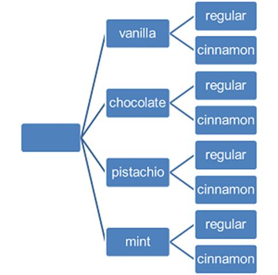

## Concepts / Definitions

The **Fundamental Counting Principle** states that if one event has $$m$$ possible outcomes and a second independent event has $$n$$ possible outcomes, then there are **$$m$$ x $$n$$ total possible outcomes** for the two events together.

If you have four flavors of ice cream and two types of cones, then ther are $$4 * 2 = 8$$ possible combinations.

In mathematics, the **factorial** of a non-negative integer $$n$$, denoted by $$n!$$, is the product of all positive integers less than or equal to $$n$$.
$$n! = n(n-1)(n-2)(n-3)\ ...\ (2)(1)$$
By definition, $$0! = 1$$.

**Permutations** are the number of ways a set of $$n$$ distinguishable objects can be *arranged in order*. 
$$4!$$ = 24 ways to order four items

The number of permutations on $$n$$ objects taken $$r$$ at a time is given by
$$P\binom{n}{r} = P(n, r) = nPr = \frac{n!}{(n-r)!}$$

The number of ways $$n$$ items can be *ordered with replacement $$r$$* times is **$$n^r$$**

$$\frac{4!}{(4-3)!}$$ = 24 ways of selecting and ordering 3 or 4 letters, but only 4 ways if order does not matter.

**Combinations** are the number of ways selecting $$r$$ items from a group of $$n$$ items where *order does not matter*. 
**To take out all the ways $$r$$ can happen, we divide out all the ways $$r!$$ can happen.** 
The number of combinitions of $$n$$ objects taken $$r$$ at a time is given by
$$C\binom{n}{r} = C(n, r) = nCr = \frac{n!}{r!(n-r)!}$$
$$\implies$$ Also called $$n$$ choose $$k$$, noted $$\binom{n}{k} = \frac{n!}{k!(n-k)!}$$

**Counting Subsets of an $$n$$-Set** 
Consider a binomial situation, where there is a yes or no, success or failure, possibility happening $$n$$ times. The number of ways this can happen is $$2^n$$. There are $$2^n$$ subsets of a set with $$n$$ objects.

## Exercises
> ### 1. A four-volume work is placed in random order on a bookshelf.  What is the probability of the  volumes being in proper  order  from left  to  right  or  from right to left?
> 
> > ## Solution
> >
> > If you have four volumes, and the question is what order to place them
in, the question is a simple permutation problem. There are 4
possibilities for the first, 3 for the second, 2 for the third and only
one for the last, making the number of permutations of the books 24.
Only one order has them in ascending order and only one order will have
them in descending order. Thus: 
> > $$P=\frac{2}{24}=\frac{1}{12}\label{answer1.1}$$
> {: .solution}
{: .challenge}
> ### 2.A wooden cube with painted faces is sawed  up into  1000 little cubes, all of the same  size.  The  little cubes  are  then mixed  up,  and  one  is chosen at  random. What  is the probability of its having just  2 painted faces?
> 
> > ## Solution
> >
> > The wooden cube is made of $$10^3$$ cubes implying a 10x10x10 cube. The
cubes that have two faces painted will be the edges which are not on a
corner. Thus, since there are 12 edges of 10 cubes each, 8 of which are
not corners, that implies we have 96 edges. 96 thus becomes our number
of desireable outcomes and 1000 has always been the total number of
outcomes: $$P=\frac{96}{1000} = 0.096\label{answer1.2}$$
> {: .solution}
{: .challenge}

> ### 3.  A  batch of  n  manufactured items  contains  k  defective items.  Suppose  m items  are  selected  at random from  the  batch.   What is the  probability that l of these  items are  defective?
> 
> > ## Solution
> >
> > If there are $$n$$ total items and $$k$$ of them are defective. We select
$$m$$ and want to know the probability of $$l$$ of them being defective
ones.
> > There are $$\binom{n}{m}$$ possible ways to chose $$m$$ different items from
the population of $$n$$ items which will be our denominator. Now we need
to know how many of those possibilities have $$l$$ bad ones in them for
our numerator. If there's $$k$$ total defective ones, then there are
$$\binom{k}{l}$$
$$P = \frac{\binom{k}{l}}{\binom{n}{m}}\label{answer1.3}$$
> {: .solution}
{: .challenge}
> ### 4.  Ten  books  are  placed  in random order on  a bookshelf.  Find  the probability of three  given books  being side by side.
> 
> > ## Solution
> >
> > There are $$10!$$ possible ways to order the ten books. You can imagine
that since the three books have to take up three adjacent positions,
there are 8 possible locations for the three books to be ordered. Taking
just the first position (that being the first three "Slots"), there are
6 ways to order the desired books and then $$7!$$ ways to order the
remaining books. Thus there are $$8 \cdot{} 6 \cdot{} 7!$$ desirable
orders giving us a probability of
> > $$P=\frac{8 \cdot{} 6 \cdot{} 7!}{10!}=\frac{1}{15}\label{answer1.4}$$
> {: .solution}
{: .challenge}
> ### 5.  One marksman has  an 80% probability of hitting a target, while another has only  a 70%  probability of hitting the  target. What  is the  probability of the target being  hit  (at least  once)  if both  marksman fire at it simultaneously?
> 
> > ## Solution
> >
> > There are 4 possibilities to consider here: neither hits, one or the
other hits and both hits. While it may be tempting to calculate the
probability of each event, since we only care about the probability of
at least one hitting the target, we need only calculate the probability
that no one hits and subtract that from 1. The first marksman has an
$$.8$$ probability of hitting meaning he has a missing probability of .2;
similarly the second marksman has a .7 chance of hitting and a .3 chance
of missing. Thus, the probability of both one and two missing is the
product of the two missing probabilities: $$.2*.3=.06$$
$$P=1-.06=.94\label{answer1.5}$$
> {: .solution}
{: .challenge}
> ### 6.  Suppose  n people  sit down  at random and  independently of each other in an auditorium containingn + k seats. What is the probability that  m seats specified in advance (m  < n) will be occupied?
> 
> > ## Solution
> >
> > The total number of ways $$n+k$$ seats can be occupied by $$n$$ people is
$$\binom{n+k}{n}=\frac{(n+k)!}{n!k!}$$ but once again the difficult part
is finding the total number of desirable outcomes. If you were to
specify $$m$$ seats, you effectively divide the auditorium into two
buckets so we need to find the number of ways to partition people into
those two buckets which will give us the numerator,
$$\binom{n+k}{m}=\frac{(n+k)!}{m!(n+k-m)!}$$\
> > $$P=\frac{(n+k)!}{m!(n+k-m)!}\frac{n!k!}{(n+k)!}$$\
> > $$=\frac{n!k!}{m!(n+k-m)!}$$
> {: .solution}
{: .challenge}
> ### 7.  Three  cards  are  drawn  at random from  a full deck.  What  is the probability of getting  a three, a seven  and  an ace?
> 
> > ## Solution
> >
> > Again, the number of ways to get three cards from a 52 card deck is
$$\binom{52}{3}$$. Since there are 4 each of sevens, threes and aces,
there are $4^3$ desirable hands.
$$P=\frac{4^3}{\frac{52!}{3!49!}}=\frac{16}{5525}=0.00289593
\label{answer1.7}$$ Which it is worth pointing out, is no different than
any other 3-card hand of three different cards.
> {: .solution}
{: .challenge}
> ### 8.  What  is the probability of being able  to form  a triangle from  three segments chosen  at random from five line segments  of lengths  1,  3, 5, 7 and 9?
> Hint.   A triangle cannot be formed if one segment is longer than  the sum of the other two.
> 
> > ## Solution
> >
> > If you indiscriminately chose 3 line segments from our bank of 5, you
have $$\binom{5}{3}=10$$ total possibilities for triangles. When you look
at the bank (1, 3, 5, 7, 9), however, you have to make sure that no two
segments are longer than the third segment, otherwise making a triangle
is impossible. The brute-force way to do this is start with 1 and
realize there's only one triangle that can be formed with 1: (1, 3, 5).
Then, looking at 3, you realize that you can do (3, 5, 7) and (3, 5, 9).
Starting now with 5, you can do (5, 7, 9) but that's the only triangle
that hasn't already been enumerated. At this point, you realize you're
done and that the answer is plain to see $$P=\frac{4}{10}=.4
\label{answer1.8}$$
> {: .solution}
{: .challenge}
> ### 9.  Suppose a number from  1  to  1000 is selected  at random.  What is the proba­bility that the last two digits of its cube are both  1? 
> Hint    There is no need  to look  through a table  of cubes.
> 
> > ## Solution
> >
> > We could do this problem in 5 minutes of programming and an instant of
computation but that's not the point! We need to think our way through
this one. How many cubes of the numbers between 1 and 1000, have 11 for
the last two digits. Luckily, each cube is unique so there's no
complications there: only 1000 possibilities.
Let's break down the number we're cubing into two parts, one that
encapsulates the part less than 100 and then the rest of the number
$$n=a+b=100c+b$$ Now, just for fun, let's cube than number
$$n^3=(100c+b)^3=b^3+300 b^2 c+30000 b c^2+1000000 c^3$$ Clearly the
only term here that will matter to the last two digits of the cube is
$$b$$, the part less than 100. Now we can reduce our now size 100 subspace
by a great deal if you realize that in order for a number's cube to end
in 1, the last number in the cube will need to be 1, leaving us: (1, 11,
21, 31, 41, 51, 61, 71, 81, 91). At this point I recommend just cubing
all the numbers and realizing that only $$71^3=357911$$ fulfills the
requirements giving only one desirable outcome per century(71, 171, 271
etc.)
$$P=\frac{10}{1000}=.01\label{answer1.9}$$
> {: .solution}
{: .challenge}
> ### 10.  Find  the  probability that  a randomly selected positive  integer will  give  a number ending  in 1  if it is
> a)  Squared ;
> b)  Raised  to the fourth power;
> c)  Multiplied  by an arbitrary positive  integer.
> Hint. It is enough to consider one-digit numbers.
> 
> > ## Solution
> >
> > Now we want to know about all positive integers but just the last digit
and the probability that the last digit is one. To prove that we can use
the hint given, we'll split the integer into the past less than 10 and
the part greater than 10. $$n=10a+b$$
> > #### a--Squared
> > $$n^2=100a^2+10ab+b^2$$ OK, so clearly only $$b^2$$ contributes to the
last digit. At this point\... just do the squaring especially since it's
something you can do in your head. (1, 2, 3, 4, 5, 6, 7, 8,
9)$$\rightarrow$$(1, 4, 9, 16, 25, 36, 49, 64, 81) therefore there are two
desireable outcomes for every decade of random positive integers.\
> > $$P=\frac{2}{10}=.2$$
> > #### b--fourth-powered
> > $$n^4=100000000 a^4+4000000 a^3 b+60000 a^2 b^2+400 a b^3+b^4$$ Great,
once again, just $$b^4$$. Now, doing the forth power is a little harder so
let's reason through and reduce the subspace. Clearly, only odd numbers
will contribute since any power of an even number is again an even
number. Now, let's just do the arithmetic. (1, 3, 5, 7,
9)$$\rightarrow$$(1, 81, 625, 2401, 6561) giving us 4 desirable outcomes
per decade of random numbers\
> > $$P=\frac{4}{10}=.4$$
> > #### c--multiplied by random positive number
> > $$n*r=(10a+b)r$$ Now let's let $r$ be a similar integer as n
$$n*r=(10a+b)(10c+d)=100ac+10(bc+ad)+bd$$
So we just need to consider the first two digits of both the random
number and the arbitrary number. This leaves us with $10^2$
possibilities; $$5^2$$ possible desirable outcomes once we exclude even
numbers: (1, 3, 5, 7, 9). Once again we resort to brute force by just
defining the above as a vector and multiplying the transpose of that
vector by the vector. The only desirable outcomes turn out to be (1\*1,
9\*9, 7\*3, 3\*7), giving four desirable outcomes per century.\
> > $$P=\frac{4}{100}=.04$$
> {: .solution}
{: .challenge}
> ### 11.  One of the numbers 2, 4, 6, 7, 8, 11,  12 and  13 is chosen  at random as the numerator of a fraction, and  then  one  of the  remaining numbers is chosen at random as  the  denominator of  the  fraction. What   is  the  probability of  the fraction being  in lowest  terms?
> 
> > ## Solution
> >
> > Here we are given 8 possible numbers (2, 4, 6, 7, 8, 11, 12, 13) and are
told that it making a random fraction out of two of the numbers. There
are $$\binom{8}{2}=28$$ possible pairs but since
$$\frac{a}{b} \neq \frac{b}{a}$$, we multiply that by two to get the total
number of fractions we can get from these numbers as being 56.
Looking at the numbers given, 7, 11 and 13 are all prime and all the
others are divisible by two; therefore only the fractions that contain
one or more prime numbers will be in lowest terms. The number 7 can be
in 7 different pairs with the other numbers which makes for 14
fractions. 11 can be in 6 pairs or 12 fractions (since we already
counted 7) and similarly, 13 can be in 10 uncounted fractions giving 36
possible fractions in lowest terms.\
$$P=\frac{36}{56}=\frac{9}{14}\label{answer1.11}$$ 
> {: .solution}
{: .challenge}
> ### 12.  The  word  "drawer" is spelled  with  six scrabble tiles.  The  tiles  are  then randomly rearranged.  What  is the  probability of  the  rearranged tiles  spelling the word  "reward?»
> 
> > ## Solution
> >
> > The word drawer has 6 letters and there are $$6!=720$$ possible ways of
arranging the letters. It is then natural to say there's only one way to
spell reward correctly and thus the probability of spelling it correctly
after a random reordering is $$1/720$$ BUT there is a complication in that
the two of our letters are the same, meaning there are to distinct
arrangement of our distinguishable tiles that will give us the proper
spelling.
$$P=\frac{2}{720} = \frac{1}{360}\label{answer1.12}$$
> {: .solution}
{: .challenge}
> ### 13.  In  throwing 6n dice,  what  is the  probability of getting  each  face  n times? Use  Stirling's  formula  to estimate this probability for large  n.
> 
> > ## Solution
> >
> > For any die, there are 6 different possibilities. Since one dice's
outcome does not depend on another's, that means that for a roll of $$6n$$
die, there are $$6^{6n}$$ different possible outcomes for the dice rolls.
Now for desirable outcomes, we want each of the 6 faces to show up n
times. To accomplish this, we just count the number of ways to apportion
$$6n$$ things into 6 groups of $n$ each or $$\frac{(6n)!}{(n!)^6}$$ which,
given Stirling's approximation $$n! \approx \sqrt{2 \pi n} n^n e^{-n}$$
gives us for large $$n$$
$$\frac{(6n)!}{(n!)^6} \approx \sqrt{2 \pi 6n} (6n)^{6n} e^{-6n} * \frac{1}{(\sqrt{2 \pi n} n^n e^{-n})^6} = \frac{3 \cdot 6^{6n}}{4 (\pi n)^{5/2}}$$
$$P=\frac{(6n)!}{(n!)^6 6^{6n}} \approx \frac{3}{4 (\pi n)^{5/2}}\label{answer1.13}$$
> {: .solution}
{: .challenge}
> ### 14.  A full deck  of cards is divided in half  at  random.  Use  Stirling's formula to estimate  the  probability  that  each  half  contains  the  same  number of red  and black  cards.
> 
> > ## Solution
> >
> > To figure out the total number of possibilities, we must realize that
one draw of half a deck, implies the other half of the deck implicitly,
therefore there are $$\binom{52}{26}$$ total 26 card draws. Then, to get
13 red cards, there are $$\binom{26}{13} = 10400600$$ ways to get 13 red
cards and the same number for black cards making $10400600^2$ the number
of total possible desirable outcomes.\
$$P=\frac{16232365000}{74417546961}=0.218126$$\
Because we're cool and modern and have Mathematica,
we don't NEED to do the Stirling's formula approximation but it'll be
good for us so we shall.\
$$P=\frac{\binom{26}{13}^2}{\binom{52}{26}} = \frac{(26!)^4}{(13!)^4 52!}=\frac{((2n)!)^4}{(n!)^4 (4n)!}$$
where $$n=13$$.\
$$P=\frac{(\sqrt{4 \pi n}(2n)^{2n}e^{-2n})^4}{(\sqrt{2 \pi n}n^{n}e^{-n})^4 (\sqrt{8 \pi n}(4n)^{4n}e^{-4n})}$$\
$$P=\frac{(4 \pi n)^2}{(2 \pi n)^2 \sqrt{8 \pi n}} \frac{(2n)^{8n}}{n^{4n}(4n)^{4n}} = \frac{4}{\sqrt{8 \pi n}} \frac{2^{8n}}{4^{4n}}$$\
$$P=\frac{2}{\sqrt{26 \pi}} = 0.221293$$ which when you take the ratio
of approximate to exact, you get $1.01452$ so the approximation is less
than $$2\%$$ off\... not bad!
> {: .solution}
{: .challenge}
> ### 15.  Use  Stirling's   formula  to  estimate   the  probability   that   all  50  states  are represented in a committee of 50 senators  chosen  at random.
> 
> > ## Solution
> >
> > There are 100 senators at any given time. Much like the previous
problem, there are $$\binom{100}{50}=100891344545564193334812497256$$
different 50 senator committees. Much like the previous problem, there
are $$\binom{2}{1}=2$$ ways for California to be represented on the
committee making for 50 states $$2^{50}$$ possible even committees
$$P=\frac{2^{50}}{\binom{100}{50}} = \text{1.115952921347132$\grave{ }$*${}^{\wedge}$-14}\label{answer1.15}$$
> {: .solution}
{: .challenge}
> ### 16.  Suppose 2n customers stand  in line at a box office, n with  5-dollar bills and n with  IO-dollar  bills.  Suppose  each  ticket  costs  5 dollars,  and  the  box  office has no money  initially.  What  is the probability that  none  of the customers has to wait  for  change?
> 
> > ## Solution
> >
> > For $$2n$$ people, there are $$(2n)!$$ different possible lines; we want the
number of lines where at any given point in the line, there are more
people with 5 dollar bills than 10 dollar bills.
The given reference (freely available on Google books) has a fascinating
geometrical argument about how $$\binom{2n}{n+1}$$ is the number of lines
that have one or more too many people with tens in front of people with
fives. Also, in this argument, there are $$\binom{2n}{n}$$ trajectories
instead of $$(2n)!$$ lines.
$$P=\frac{\binom{2n}{n}-\binom{2n}{n+1}}{\binom{2n}{n}} = \frac{1}{n+1}\label{answer1.16}$$
> {: .solution}
{: .challenge}
> ### 17. Prove that $$\sum_{k=0}^{n} {n \choose k} ^{2} ={n \choose 2} ^{n}$$
> Hint. Use the binomial theorem to calculate the coefficient of $$x^{n}$$ in the product $$(1 + x)^{n} \cdot (1 + x)^{n} = (1 + x)^{2n}$$.
> 
> > ## Solution
> >
> > We wish to prove that
$$\sum_{k=0}^{n} \binom{n}{k}^2 = \binom{2n}{n}\label{answer1.17}$$
This is easies if we listen to the hint and consider that
$$\binom{2n}{n}$$ is the coefficient of $$x^n$$ in the polynomial
$$(x+1)^{2n}$$ which is also equivalent to $$(x+1)^n(x+1)^n$$
We make use of: $$(x+1)^n = \sum_{k=0}^{n} \binom{n}{k} x^k$$
$$(x+1)^n(x+1)^n = \sum_{k=0}^{n}\sum_{j=0}^{n} \binom{n}{k} \binom{n}{j} x^k x^j$$
We want the $$x^n$$ term: where $$k+j=n$$ or, put another way, where
$$k=n-j$$\...
$$\sum_{j=0}^{n} \binom{n}{n-j} \binom{n}{j} = \sum_{j=0}^{n} \frac{n!}{j!(n-j)!}\frac{n!}{(n-j)!j!} = \sum_{j=0}^{n} \binom{n}{j}^2$$ QED
> {: .solution}
{: .challenge}
> ## Exercises
> 1. How many ways can 8 runners in a track race finish?
> 2. Subway is running a special on 6" subs for $3.99 with 6 choices of bread, 3 choices of meat, and 2 choices of cheese. Not including toppings or sause, how many choices are available?
> 3. How many ways can 2 students of a class of 25 be selected for room reps?
> 4. How many distinguishable ways can the letters, TOPPINGS be written?
> 5. A license plate has 3 letters followed by 3 digits. How many possible plates are there?
> 6. From a group fo 10 people in theater, how many possible ways can a teacher select roles for a show on the 7 dwarfs?
> 7. In the original version of poker, straight poker, a five-card hand is dealt from a standard deck of 52. How many different hands are possible?
> 8. A coin is flipped 10 times, and the sequence is recorded.
     1. How many sequences are possible?
     2. How many sequences have exactly 7 heads?
> 9. A particular subway advertises 256 ways for a sandwich to be fixed with veggies. How many veggie toppings does this subway offer?
> 10. Calculate $$_{10}C_3$$ without a calculator.
> 
{: .challenge}
