# Random Variables and Event Probabilities

## Random variables

Let $$Y$$ be the result of a fair coin flip.  Not a general coin flip,
but a specific instance of flipping a specific coin at a specific
time.  Defined this way, $$Y$$ is what's known as a *random variable*,
meaning a variable that takes on different values with different
probabilities.^[Random variables are conventionally written using
upper-case letters to distinguish them from ordinary mathematical
variables which are bound to single values and conventionally written
using lower-case letters.]

Probabilities are scaled between 0% and 100% as in natural language.
If a coin flip is fair, there is a 50% chance the coin lands face up
("heads") and a 50% chance it lands face down ("tails").  For
concreteness and ease of analysis, random variables will be restricted
to numerical values.  For the specific coin flip in question, the
random variable $$Y$$ will take on the value 1 if the coin lands heads
and the value 0 if it lands tails.


## Events and probability

An outcome such as the coin landing heads is called an *event* in
probability theory.  For our purposes, events will be defined as
conditions on random variables.  For example, $$Y = 1$$ denotes the
event in which our coin flip lands heads. The functional $$\mbox{Pr}[\,
\cdot \,]$$ defines the probability of an event.  For example, for our
fair coin toss, the probability of the event of the coin landing heads
is written as

$$
\mbox{Pr}[Y = 1] = 0.5.
$$

In order for the flip to be fair, we must have $$\mbox{Pr}[Y = 0] =
0.5$$, too.  The two events $$Y = 1$$ and $$Y = 0$$ are mutually exclusive
in the sense that both of them cannot occur at the same time.  In
probabilistic notation,

$$
\mbox{Pr}[Y = 1 \ \mbox{and} \ Y = 0] = 0.
$$

The events $$Y = 1$$ and $$Y = 0$$ are also exhaustive, in the sense that
at least one of them must occur.  In probabilistic notation,

$$
\mbox{Pr}[Y = 1 \ \mbox{or} \ Y = 0] = 1.
$$

In these cases, events are conjoined (with "and") and disjoined (with
"or").  These operations apply in general to events, as does negation.
As an example of negation,

$$
\mbox{Pr}[Y \neq 1] = 0.5.
$$


## Sample spaces and possible worlds

Even though the coin flip will have a specific outcome in the real
world, we consider alternative ways the world could have been.  Thus
even if the coin lands heads $$(Y = 1)$$, we entertain the possibility
that it could've landed tails $$(Y = 0)$$.  Such counterfactual
reasoning is the key to understanding probability theory and applied
statistical inference.

An alternative way the world could be, that is, a *possible world*,
will determine the value of every random variable. The collection of
all such possible worlds is called the *sample space*.^[The sample
space conventionally written as 
$$
\Omega
$$, the capitalized form of the
last letter in the Greek alphabet.]  The sample space may be
conceptualized as an urn containing a ball for each possible way the
world can be.  On each ball is written the value of every random
variable.^[Formally, a random variable $$X$$ can be represented as a
function from the sample space to a real value, i.e., 
$$X:
\Omega
\rightarrow \mathbb{R}
$$. 


For each possible world $$\omega \in \Omega$$,
the variable $$X$$ takes on a specific value 

$$
X(\omega) \in
\mathbb{R}
$$.]

Statistic is the logic of uncertainty.

A **sample space** is the set of all possible outcomes of an experiment

An **event** is a subset of sample space

Now consider the event $$Y = 0$$, in which our coin flip lands tails. In
some worlds, the event occurs (i.e., $$0$$ is the value recorded for
$$Y$$) and in others it doesn't.  An event picks out the subset of
worlds in which it occurs.^[Formally, an event is defined by a subset
of the sample space, $$E \subseteq \Omega$$.]


### Naive definetion of probability

 P(A) = #favorable outcome / #possible outcomes

Example: tossing of fair coins

Assumes all outcome equally likely, finite sample space

### Sampling table

choose k objects out of n

|               | order matter     | order doesn't      |
| ------------- | ---------------- | ------------------ |
| replace       | n^k^             | $$\binom{n+k-1}{k}$$ |
| don't replace | n(n-1)...(n-k+1) | $$\binom{n}{k}$$     |

1. Don't lose common sense 
2. Do check answers, especially by doing simple and extreme cases
3. Label people , objects etc. If have n people, then label them 1,2…n

Example: 10 people, split into them of 6, team of 4 => $$\binom{10}{6}$$  2 teams of 5 => $$\binom{10}{5}$$ /2

Problem: pick k times from set of n objects, where order doesn't matter, with replacement.

Extreme cases: k = 0; k = 1; n = 2

Equiv : how many ways are there to put k indistinguishable particles into  n distinguishable boxes?

### Axioms of Probability

**Non-naive definition**

Probability sample consists of S and P, where S is sample space, and P , a function which takes an event $$A\subseteq S$$ as input, returns $$P(A) \in [0,1]$$ as output. 

such that 

1. $$P(\phi) = 0, P(S) = 1$$\ 
2. $$P(U_{n=1}^{\infty}A_n) =  \sum_{n=1}^{\infty} P(A_n) $$ if $$A1,A2..An$$ are disjoint (not overlap)

### [Birthday Problem](https://en.wikipedia.org/wiki/Birthday_problem)

(Exclude Feb 29, assume 365 days equally likely, assume indep. of birth)

k people , find prob. that two have same birthday 

If k > 365, prob. is 1

Let k <= 365, $$P(no  match) =\frac{ 365 * 364 *... (365 - k + 1) }{365^k}$$ 

P(match) ~ 50.7%, if k = 23; 97% if k = 50; 99.9999%, if k = 100

$$\binom{k}{2} =  \frac{k(k-1)}{2} $$  $$\binom{23}{2} = 253$$ 

### Properties of Probability

1. $$P(A^c) = 1 - P(A)​$$\
2. If $$A \subseteq B$$ , then $$P(A) \subseteq P(B)$$\ 
3. $$P(A\cup B) = P(A) + P(B) - P(A\cap B)$$

$$P(A\cup B\cup C) = P(A) + P(B) + P(C) - P(A\cap B) - P(A\cap C) - P(B\cap C) + P(A\cap B\cap C)$$ 

**Proof:**

1. $$1 = P(S) = P(A\cap A^c) = P(A) + P(A^c)$$\
2. $$B = A\cup(B\cap A^c)$$  $$P(B) = P(A)+P(B\cap A^c)$$\ 
3. $$P(A\cup B) = P(A\cap (B\cap A^c)) = P(A) + P(B\cap A^c)$$ 

General case: 


### deMontmort's Problem(1713)

**[matching problem](http://www.math.uah.edu/stat/urn/Matching.html)** 

n cards labeled 1 to n, flipping cards over one by one, you win if the card that you name is the card that appears.

 Let $$A_j$$  be the event, ''jth card matches" 

$$P(A_j) = 1 / n $$ since all position equally likely for card labeled j\

$$P(A_1\cap A_2) = (n-2)! / n! = 1/n(n-1)$$\ 

...

$$P(A_1\cap … A_k) = (n-k)! / n!$$\

$$P(A_1\cup …A_n) = n*1/n - n(n-1)/2 * 1/n(n-1) + …$$\

$$= 1 - 1/2! + 1/3! - 1/4! … (-1)^n1/n!$$ $$\approx 1- 1/e$$ 


### Story proof- proof by interpretation

Ex1 $$\binom{n}{k}$$ =  $$\binom{n}{n-k}$$ 

Ex2  n$$\binom{n-1}{k-1}$$ = k$$\binom{n}{k}$$  pick k people out of n, with one desigenate as president.

Ex3 $$ \binom{m+n}{k} = \sum_{j=0}^k \binom{m}{j} \binom{n}{k-j} $$ ([vandermonde](https://en.wikipedia.org/wiki/Vandermonde_matrix))

## Simulating random variables

We are now going to turn our attention to computation, and in
particular, simulation, with which we will use to estimate event
probabilities.

The primitive unit of simulation is a function that acts like a random
number generator.  But we only have computers to work with and they
are deterministic.  At best, we can created so-called *pseudorandom
number generators*.  Pseudorandom number generators, if they are well
coded, produce deterministic streams of output that appear to be
random.^[There is a large literature on pseudorandom number generators
and tests for measurable differences from truly random streams.]

For the time being, we will assume we have a primitive pseudorandom
number generator `uniform_01_rng()`, which behaves roughly like it has
a 50% chance of returning 1 and a 50% chance of returning 0.^[The name
arises because random variables in which every possible outcome is
equally likely are said to be *uniform*.]

Suppose we want to simulate our random variable $$Y$$.  We can do so by
calling `uniform_01_rng` and noting the answer.


A simple program to generate a realization of a random coin flip,
assign it to an integer variable `y`, and print the result could be
coded as follows.^[Computer programs are presented using a consistent
pseudocode, which provides a sketch of a program that should be
precise enough to be coded in a concrete programming language.  R
implementations of the pseudocode generate the results and are
available in the source code repository for this book.]

```
import random

y = random.randint(0, 1)
print("y =", y)
```
{: .language-python}

The variable `y` is declared to be an integer and assigned to the
result of calling the `uniform_01_rng()` function.^[The use of a
lower-case $$y$$ was not accidental.  The variable $$y$$ represents an
integer, which is the type of a realization of a random $$Y$$
representing the outcome of a coin flip.  In code, variables are
written in typewriter font (e.g., `y`), whereas in text they are
written in italics like other mathematical variables (e.g., $$y$$).]
The print statement outputs the quoted string `y = ` &nbsp; followed
by the value of the variable `y`.  Executing the program might produce
the following output.

```
y = 1
```
{: .output}

If we run it a nine more times, it might print

```
for i in range(9):
    y = random.randint(0,1)
    print("y =", y)

```
{: .language-python}

```
y = 0
y = 1
y = 0
y = 1
y = 1
y = 0
y = 1
y = 1
y = 0
```
{: .output}

When we say it might print these things, we mean the results will
depend on the state of the pseudorandom number generator.

## Seeding a simulation

Simulations can be made exactly reproducible by setting what is known
as the *seed* of a pseudorandom number generator.  This seed
establishes the deterministic sequence of results that the
pseudorandom number generator produces.  For instance, contrast the program

```
random.seed(1234)
for n in range(10):
    print(random.randint(0, 1)')
for n in range(10):
    print(random.randint(0, 1))
```
{: .language-python}

which produces the output

```
1 0 1 1 0 1 0 0 0 0  
0 0 0 1 0 1 1 1 0 0 
```
{: .output}

with the program

```
random.seed(1234)
for n in range(10):
    print(random.randint(0, 1)')
random.seed(1234)
for n in range(10):
    print(random.randint(0, 1))
```
{: .language-python}

which produces

```
1 0 0 0 0 0 0 1 0 0 
1 0 0 0 0 0 0 1 0 0 
```
{: .output}

Resetting the seed in the second case causes exactly the same ten
pseudorandom numbers to be generated a second time.  Every
well-written pseudorandom number generator and piece of simulation
code should allow the seed to be set manually to ensure reproducibility
of results.^[Replicability of results with different seeds is a
desirable, but stricter condition.]

## Using simulation to estimate event probabilities

We know that $$\mbox{Pr}[Y = 1]$$ is 0.5 because it represents the flip
of a fair coin.  Simulation based methods allow us to estimate event
probabilities straightforwardly if we can generate random realizations
of the random variables involved in the event definitions.

For example, we know we can generate multiple simulations of flipping
the same coin.  That is, we're not simulating the result of flipping
the same coin ten different times, but simulating ten different
realizations of exactly the same random variable, which represents a
single coin flip.

The fundamental method of computing event probabilities will not
change as we move through this book.  We simply simulate a sequence of
values and return the proportion in which the event occurs as our
estimate.

For example, let's simulate 10 values of $$Y$$ again and record the
proportion of the simulated values that are 1.  That is, we count the
number of time the event occurs in that the simulated value $$y^{(m)}$$
is equal to 1.

```
M = 100  # Set the value of M
occur = 0

for m in range(1, M+1):
    y = random.uniform(0, 1)
    occur += (y == 1)

estimate = occur / M
print(f"estimated Pr[Y = 1] = {estimate}")
```
{: .language-python}

The equality operator is written as `==`, as in the condition `y[m] ==
1` to distinguish it from the assignment statement `y[m] = 1`, which
sets the value of `y[m]` to 1. The condition expression `y[m] == 1`
evaluates to 1 if the condition is true and 0 otherwise.

If we let `uniform_01_rng(M)` be the result of generating `M`
pseudorandom coin flip results, the program can be shortened to

```
M = 100  # Set the value of M
y = [random.uniform(0, 1) for i in range(M)]
occur = sum([1 for i in y if i == 1])
estimate = occur / M
print(f"estimated Pr[Y = 1] = {estimate}")
```
{: .language-python}

A condition such as `y == 1` on a sequence returns a sequence of the
same length with value 1 in positions where the condition is true. For
instance, if

```
y = (2, 1, 4, 2, 2, 1)
```
then
```
y == 2
```
evaluates to
```
(1, 0, 0, 1, 1, 0).
```

Thus `sum(y == 1)` is the number of positions in the sequence `y`
which have the value 1.  Running the program provides the following
estimate based on ten simulation draws.

```
import numpy as np

M = 10
y_sim = np.random.binomial(1, 0.5, M)
for n in range(M):
    print(y_sim[n], end=' ')
print(f"estimated Pr[Y = 1] = {np.sum(y_sim) / M}")
```
{: .language-python}

Let's try that a few more times.

```
M = 10

for k in range(1, 11):
    y_sim = np.random.binomial(1, 0.5, M)
    for n in range(M):
        print(y_sim[n], end=' ')
    print(f"estimated Pr[Y = 1] = {np.sum(y_sim) / M}")
```
{: .language-python}

```
1 1 0 0 0 1 1 1 0 0 estimated Pr[Y = 1] = 0.5
0 0 1 1 1 1 0 0 1 0 estimated Pr[Y = 1] = 0.5
0 0 0 1 1 0 1 0 1 1 estimated Pr[Y = 1] = 0.5
1 0 0 1 0 0 1 0 1 0 estimated Pr[Y = 1] = 0.4
1 1 0 0 1 0 0 0 0 1 estimated Pr[Y = 1] = 0.4
0 0 1 0 1 1 1 1 1 0 estimated Pr[Y = 1] = 0.6
1 1 0 1 1 1 0 0 0 1 estimated Pr[Y = 1] = 0.6
0 0 0 1 1 1 0 1 0 1 estimated Pr[Y = 1] = 0.5
0 0 0 0 1 0 1 0 0 1 estimated Pr[Y = 1] = 0.3
0 1 0 1 1 1 0 1 1 0 estimated Pr[Y = 1] = 0.6
```
{: .output}

The estimates are close, but not very exact.  What if we use 100
simulations?

```
M = 100
y_sim = np.random.binomial(1, 0.5, M)
for n in range(M):
    print(y_sim[n], end=' ')
print(f"estimated Pr[Y = 1] = {np.sum(y_sim) / M}")
```
{: .language-python}

```
0 0 0 0 0 1 0 0 0 0 1 0 0 1 1 0 0 0 1 1 0 0 1 1 1 1 0 1 1 1 0 0 0 0 1 0 0 0 1 0 0 0 0 1 1 1 1 0 1 0 1 1 0 1 0 1 0 0 0 1 0 1 1 1 1 1 0 0 0 1 1 0 0 1 0 0 1 1 1 1 1 1 1 1 0 0 1 0 1 1 0 0 1 1 1 1 0 0 0 0 
estimated Pr[Y = 1] = 0.48
```
{: .output}

That's closer than most of the estimates based on ten simulation draws.  Let's
try that a few more times without bothering to print all 100 simulated
values,

```
for k in range(1, 11):
    y_sim = np.random.binomial(1, 0.5, M)
    print(f"estimated Pr[Y = 1] = {np.sum(y_sim) / M}")
```
{: .language-python}

```
estimated Pr[Y = 1] = 0.52
estimated Pr[Y = 1] = 0.58
estimated Pr[Y = 1] = 0.55
estimated Pr[Y = 1] = 0.37
estimated Pr[Y = 1] = 0.52
estimated Pr[Y = 1] = 0.48
estimated Pr[Y = 1] = 0.53
estimated Pr[Y = 1] = 0.53
estimated Pr[Y = 1] = 0.5
estimated Pr[Y = 1] = 0.53
```
{: .output}

What happens if we let $$M = 10,000$$ simulations?

```
M = 10000

for k in range(1, 11):
    y_sim = np.random.binomial(1, 0.5, M)
    print(f"estimated Pr[Y = 1] = {np.sum(y_sim) / M}")
```
{: .language-python}

```
estimated Pr[Y = 1] = 0.5074
estimated Pr[Y = 1] = 0.4991
estimated Pr[Y = 1] = 0.5088
estimated Pr[Y = 1] = 0.5015
estimated Pr[Y = 1] = 0.4926
estimated Pr[Y = 1] = 0.4987
estimated Pr[Y = 1] = 0.4959
estimated Pr[Y = 1] = 0.5004
estimated Pr[Y = 1] = 0.4928
estimated Pr[Y = 1] = 0.5032
```
{: .output}

Now the estimates are very close to the true probability being
estimated (i.e., 0.5, because the flip is fair). This raises the
questions of how many simulation draws we need in order to be
confident our estimates are close to the values being estimated.


## Law of large numbers

Visualization in the form of simple plots goes a long way toward
understanding concepts in statistics and probability.  A traditional
way to plot what happens as the number of simulation draws $$M$$
increases is to keep a running tally of the estimate as each draw is
made and plot the estimated event probability $$\mbox{Pr}[Y = 1]$$ for
each $$m \in 1:M$$.^[See, for example, the quite wonderful little book,
Bulmer, M.G., 1965. *Principles of Statistics*. Oliver and Boyd,
Edinburgh.]

To calculate such a running tally of the estimate at each online, we can do this:

```
M = 100
y = np.zeros(M)
estimate = np.zeros(M)
occur = 0

for m in range(1, M+1):
    y[m-1] = np.random.randint(0, 2)
    occur += (y[m-1] == 1)
    estimate[m-1] = occur / m
    print(f"estimated Pr[Y = 1] after {m} trials = {estimate[m-1]}")
```
{: .language-python}

```
estimated Pr[Y = 1] after 1 trials = 0.0
estimated Pr[Y = 1] after 2 trials = 0.5
estimated Pr[Y = 1] after 3 trials = 0.3333333333333333
estimated Pr[Y = 1] after 4 trials = 0.25
estimated Pr[Y = 1] after 5 trials = 0.2
estimated Pr[Y = 1] after 6 trials = 0.3333333333333333
estimated Pr[Y = 1] after 7 trials = 0.42857142857142855
estimated Pr[Y = 1] after 8 trials = 0.375
estimated Pr[Y = 1] after 9 trials = 0.4444444444444444
estimated Pr[Y = 1] after 10 trials = 0.4
estimated Pr[Y = 1] after 11 trials = 0.36363636363636365
estimated Pr[Y = 1] after 12 trials = 0.3333333333333333
estimated Pr[Y = 1] after 13 trials = 0.3076923076923077
estimated Pr[Y = 1] after 14 trials = 0.2857142857142857
estimated Pr[Y = 1] after 15 trials = 0.3333333333333333
estimated Pr[Y = 1] after 16 trials = 0.375
estimated Pr[Y = 1] after 17 trials = 0.35294117647058826
estimated Pr[Y = 1] after 18 trials = 0.3888888888888889
estimated Pr[Y = 1] after 19 trials = 0.42105263157894735
estimated Pr[Y = 1] after 20 trials = 0.4
estimated Pr[Y = 1] after 21 trials = 0.42857142857142855
estimated Pr[Y = 1] after 22 trials = 0.45454545454545453
estimated Pr[Y = 1] after 23 trials = 0.43478260869565216
estimated Pr[Y = 1] after 24 trials = 0.4166666666666667
estimated Pr[Y = 1] after 25 trials = 0.4
estimated Pr[Y = 1] after 26 trials = 0.4230769230769231
estimated Pr[Y = 1] after 27 trials = 0.4444444444444444
estimated Pr[Y = 1] after 28 trials = 0.42857142857142855
estimated Pr[Y = 1] after 29 trials = 0.41379310344827586
estimated Pr[Y = 1] after 30 trials = 0.4
estimated Pr[Y = 1] after 31 trials = 0.3870967741935484
estimated Pr[Y = 1] after 32 trials = 0.40625
estimated Pr[Y = 1] after 33 trials = 0.3939393939393939
estimated Pr[Y = 1] after 34 trials = 0.4117647058823529
estimated Pr[Y = 1] after 35 trials = 0.4
estimated Pr[Y = 1] after 36 trials = 0.3888888888888889
estimated Pr[Y = 1] after 37 trials = 0.3783783783783784
estimated Pr[Y = 1] after 38 trials = 0.39473684210526316
estimated Pr[Y = 1] after 39 trials = 0.41025641025641024
estimated Pr[Y = 1] after 40 trials = 0.425
estimated Pr[Y = 1] after 41 trials = 0.43902439024390244
estimated Pr[Y = 1] after 42 trials = 0.42857142857142855
estimated Pr[Y = 1] after 43 trials = 0.4186046511627907
estimated Pr[Y = 1] after 44 trials = 0.4090909090909091
estimated Pr[Y = 1] after 45 trials = 0.4
estimated Pr[Y = 1] after 46 trials = 0.391304347826087
estimated Pr[Y = 1] after 47 trials = 0.40425531914893614
estimated Pr[Y = 1] after 48 trials = 0.4166666666666667
estimated Pr[Y = 1] after 49 trials = 0.42857142857142855
estimated Pr[Y = 1] after 50 trials = 0.42
estimated Pr[Y = 1] after 51 trials = 0.43137254901960786
estimated Pr[Y = 1] after 52 trials = 0.4423076923076923
estimated Pr[Y = 1] after 53 trials = 0.4528301886792453
estimated Pr[Y = 1] after 54 trials = 0.46296296296296297
estimated Pr[Y = 1] after 55 trials = 0.4727272727272727
estimated Pr[Y = 1] after 56 trials = 0.48214285714285715
estimated Pr[Y = 1] after 57 trials = 0.47368421052631576
estimated Pr[Y = 1] after 58 trials = 0.4827586206896552
estimated Pr[Y = 1] after 59 trials = 0.4745762711864407
estimated Pr[Y = 1] after 60 trials = 0.4666666666666667
estimated Pr[Y = 1] after 61 trials = 0.47540983606557374
estimated Pr[Y = 1] after 62 trials = 0.46774193548387094
estimated Pr[Y = 1] after 63 trials = 0.47619047619047616
estimated Pr[Y = 1] after 64 trials = 0.46875
estimated Pr[Y = 1] after 65 trials = 0.46153846153846156
estimated Pr[Y = 1] after 66 trials = 0.4696969696969697
estimated Pr[Y = 1] after 67 trials = 0.47761194029850745
estimated Pr[Y = 1] after 68 trials = 0.4852941176470588
estimated Pr[Y = 1] after 69 trials = 0.4782608695652174
estimated Pr[Y = 1] after 70 trials = 0.4714285714285714
estimated Pr[Y = 1] after 71 trials = 0.4788732394366197
estimated Pr[Y = 1] after 72 trials = 0.4861111111111111
estimated Pr[Y = 1] after 73 trials = 0.4931506849315068
estimated Pr[Y = 1] after 74 trials = 0.5
estimated Pr[Y = 1] after 75 trials = 0.49333333333333335
estimated Pr[Y = 1] after 76 trials = 0.4868421052631579
estimated Pr[Y = 1] after 77 trials = 0.4935064935064935
estimated Pr[Y = 1] after 78 trials = 0.5
estimated Pr[Y = 1] after 79 trials = 0.5063291139240507
estimated Pr[Y = 1] after 80 trials = 0.5125
estimated Pr[Y = 1] after 81 trials = 0.5185185185185185
estimated Pr[Y = 1] after 82 trials = 0.5121951219512195
estimated Pr[Y = 1] after 83 trials = 0.5180722891566265
estimated Pr[Y = 1] after 84 trials = 0.5119047619047619
estimated Pr[Y = 1] after 85 trials = 0.5176470588235295
estimated Pr[Y = 1] after 86 trials = 0.5116279069767442
estimated Pr[Y = 1] after 87 trials = 0.5172413793103449
estimated Pr[Y = 1] after 88 trials = 0.5227272727272727
estimated Pr[Y = 1] after 89 trials = 0.5280898876404494
estimated Pr[Y = 1] after 90 trials = 0.5333333333333333
estimated Pr[Y = 1] after 91 trials = 0.5384615384615384
estimated Pr[Y = 1] after 92 trials = 0.5434782608695652
estimated Pr[Y = 1] after 93 trials = 0.5483870967741935
estimated Pr[Y = 1] after 94 trials = 0.5425531914893617
estimated Pr[Y = 1] after 95 trials = 0.5473684210526316
estimated Pr[Y = 1] after 96 trials = 0.5520833333333334
estimated Pr[Y = 1] after 97 trials = 0.5463917525773195
estimated Pr[Y = 1] after 98 trials = 0.5510204081632653
estimated Pr[Y = 1] after 99 trials = 0.5454545454545454
estimated Pr[Y = 1] after 100 trials = 0.54
```
{: .output}

Recall that the expression `(y[m] == 1)` evaluates to 1 if the
condition holds and 0 otherwise. The result of running the program is
that `estimate[m]` will hold the estimate $$\mbox{Pr}[Y = 1]$$ after $$m$$
simulations.  We can then plot the estimates as a function
of the number of draws using a line plot to display the trend.

```
import numpy as np
import pandas as pd
import matplotlib.pyplot as plt
import random

np.random.seed(0)

M = 100000
Ms = []
y_sim = [random.randint(0,1) for i in range(M)]
hat_E_Y = []
Ms = []

for i in range(51):
    Ms.append(min(M, 10 ** (i / 10)))
    hat_E_Y.append(np.mean(y_sim[:int(Ms[i])]))

df = pd.DataFrame({'M': Ms, 'hat_E_Y': hat_E_Y})
plot = plt.scatter(df['M'], df['hat_E_Y'])
plt.axhline(y=0.5, color='red')
plt.xscale('log')
plt.xlabel('simulation draws')
plt.ylabel('estimated Pr[Y = 1]')
plt.xlim((1, 100000))
plt.ylim((0, 1))
plt.xticks([1, 50000], ["1", "50,000"])#, "100,000"])
plt.show()

```
{: .language-python}

<!-- 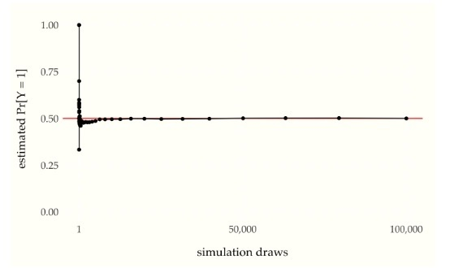 -->

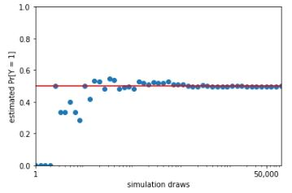


The linear scale of the previous plot obscures the behavior of the estimates.  Consider instead a plot with the $$x$$-axis on the logarithmic scale.

Monte Carlo estimate of probability that a coin lands head as a function of the number of simulation draws.  The line at 0.5 marks the true probability being estimated.  The log-scaled $$x$$-axis makes the early rate of convergence more evident. Plotted on a linear scale, it is clear how quickly the estimates converge to roughly the right value.

```
import matplotlib.pyplot as plt
import pandas as pd

df = pd.DataFrame({'M': Ms, 'hat_E_Y': hat_E_Y})

plt.plot(df['M'], df['hat_E_Y'], linestyle='-', marker='o')
plt.axhline(y=0.5, color='red')
plt.xscale('log')
plt.xlabel('simulation draws')
plt.ylabel('estimated Pr[Y = 1]')
plt.xlim((1, 50000))
plt.ylim((0, 1))
plt.xticks([1, 50000], ["1", "50,000"])#, "100,000"])
plt.yticks([0, 0.25, 0.5, 0.75, 1.0])
plt.show()


```
{: .language-python}

<!-- 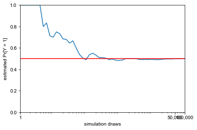 -->
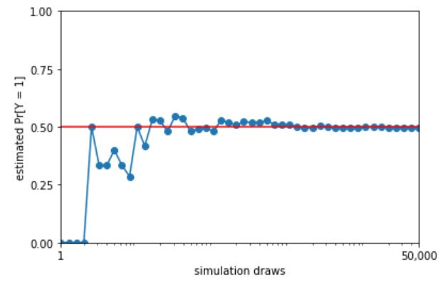

<!-- 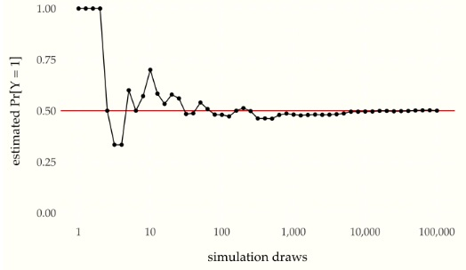 -->

With a log-scaled $$x$$-axis, the values between 1 and 10 are plotted
with the same width as the values between $$10\,000$$ and $$100\,000$$;
both take up 20% of the width of the plot. On the linear scale, the
values between 1 and 10 take up only $$\frac{10}{100\,000}$$, or 0.01%,
of the plot, whereas values between $$10\,000$$ and $$100\,000$$ take up
90% of the plot.

Plotting the progression of multiple simulations demonstrates the
trend in errors.

Each of the one hundred grey lines represents the ratio of heads observed in a sequence of coin flips, the size of which indicated on the $$x$$-axis.  The line at 0.5 indicates the probability a coin lands heads in a fair coin toss.  The convergence of the ratio of heads to 0.5 in all of the sequences is clearly visible.

```
 
import numpy as np
import pandas as pd
import matplotlib.pyplot as plt
import seaborn as sns

np.random.seed(0)

M_max = 10000
J = 100
I = 47
N = I * J
df2 = pd.DataFrame({'r': [np.nan]*N, 'M': [np.nan]*N, 'hat_E_Y': [np.nan]*N})
pos = 0

for j in range(1, J+1):
    y_sim = np.random.binomial(1, 0.5, size=M_max)
    for i in range(4, 51):
        M = max(100, min(M_max, int((10**(1/10))**i)))
        hat_E_Y = np.mean(y_sim[:M])
        df2.loc[pos, :] = [j, M, hat_E_Y]
        pos += 1

pr_Y_eq_1_plot = sns.lineplot(data=df2, x='M', y='hat_E_Y', hue='r', alpha=0.15, linewidth=2)
pr_Y_eq_1_plot.axhline(y=0.5, color='red', linewidth=2)
pr_Y_eq_1_plot.set(xscale='log', xlabel='simulation draws', ylabel='estimated Pr[Y = 1]',
                    xlim=(100, 10000), ylim=(0.375, 0.625), xticks=[1000, 10000],
                    xticklabels=["1,000", "10,000"])
sns.set_theme(style='ticks')

plt.show()

```
{: .language-python}

<!-- 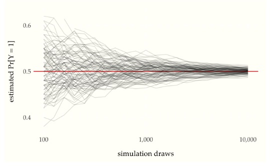 -->

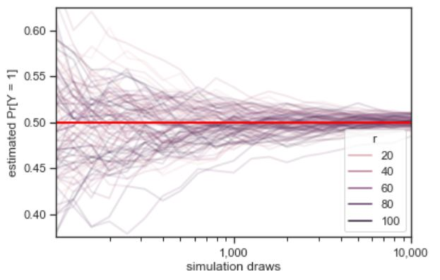

Continuing where the previous plot left off, each of the one hundred grey lines represents the ratio of heads observed in a sequence of coin flips.  The values on the $$x$$ axis is one hundred times larger than in the previous plot, and the scale of the $$y$$-axis is one tenth as large.  The trend in error reduction appears the same at the larger scale.

```
import numpy as np
import pandas as pd
import matplotlib.pyplot as plt
import seaborn as sns

np.random.seed(0)

M_max = 1000000
J = 100
I = 47
N = I * J
df2 = pd.DataFrame({'r': [np.nan]*N, 'M': [np.nan]*N, 'hat_E_Y': [np.nan]*N})
pos = 0

for j in range(1, J+1):
    y_sim = np.random.binomial(1, 0.5, size=M_max)
    for i in range(4, 61):
        M = max(100, min(M_max, int((10**(1/10))**i)))
        hat_E_Y = np.mean(y_sim[:M])
        df2.loc[pos, :] = [j, M, hat_E_Y]
        pos += 1

pr_Y_eq_1_plot = sns.lineplot(data=df2, x='M', y='hat_E_Y', hue='r', alpha=0.15)
pr_Y_eq_1_plot.axhline(y=0.5, color='red')
pr_Y_eq_1_plot.set(xscale='log', xlabel='simulation draws', ylabel='estimated Pr[Y = 1]',
                    xlim=(1e4, 1e6), ylim=(0.485, 0.515), xticks=[1e4, 1e5, 1e6],
                    xticklabels=["10,000", "100,000", "1,000,000"])
sns.set_theme(style='ticks')

plt.show()

```
{: .language-python}

<!-- 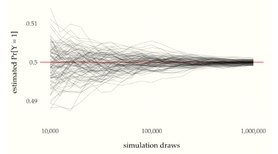 -->
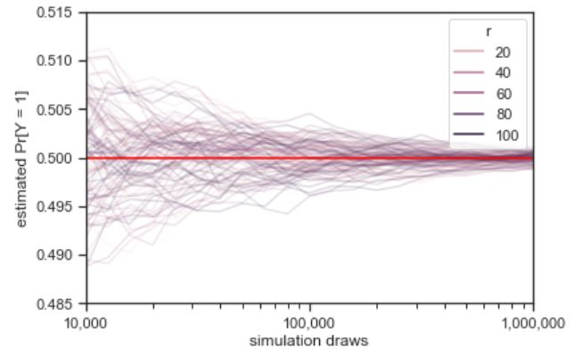

The *law of large numbers*^[Which technically comes in a strong and
weak form.] says roughly that as the number of simulated values grows,
the average will converge to the expected value.  In this case, our
estimate of $$\mbox{Pr}[Y = 1]$$ can be seen to converge to the true
value of 0.5 as the number of simulations $$M$$ increases.
Because the quantities involved are probabilistic, the exact specification is a
little more subtle than the $$\epsilon$$-$$\delta$$ proofs in calculus.


## Simulation notation

We will use parenthesized superscripts to pick out the elements of a sequence of simulations.  For example,

$$
y^{(1)}, y^{(2)}, \ldots, y^{(M)}
$$

will be used for $$M$$ simulations of a single random variable
$$Y$$.^[Each $$y^{(m)}$$ is a possible realization of $$Y$$, which is why
they are written using lowercase.]  It's important to keep in mind
that this is $$M$$ simulations of a single random variable, not a single
simulation of $$M$$ different random variables.

Before we get going, we'll need to introduce *indicator function*
notation.  For example, we write

$$
\mathrm{I}[y^{(m)} = 1]
=
\begin{cases}
1 & \mbox{if} \ y^{(m)} = 1
\\[4pt]
0 & \mbox{otherwise}
\end{cases}
$$

The indicator function maps a condition, such as $$y^{(m)} = 1$$ into
the value 1 if the condition is true and 0 if it is false.^[Square
bracket notation is used for functions when the argument is itself a
function.  For example, we write $$\mbox{Pr}[Y > 0]$$ because $$Y$$ is a
random variable, which is modeled as a function.  We also write
$$\mathrm{I}[x^2 + y^2 = 1]$$ because the standard bound variables $$x$$
and $$y$$ are functions from contexts defining variable values.]

Now we can write out the formula for our estimate of $$\mbox{Pr}[Y =
1]$$ after $$M$$ draws,

$$
\begin{array}{rcl}
\mbox{Pr}[Y = 1]
& \approx &
\frac{\displaystyle \mathrm{I}[y^{(1)} = 1]
      \ + \ \mathrm{I}[y^{(2)} = 1]
      \ + \ \cdots
      \ + \ \mathrm{I}[y^{(M)} = 1]}
     {\displaystyle M}
\end{array}
$$

That is, our estimate is the proportion of the simulated values which
take on the value 1.  It quickly becomes tedious to write out
sequences, so we will use standard summation notation, where we write

$$
\mathrm{I}\!\left[y^{(1)} = 1]
      + \mathrm{I}[y^{(2)} = 1]
      + \cdots
      + \mathrm{I}[y^{(M)} = 1\right]
\ = \
\sum_{m=1}^M \mathrm{I}[y^{(m)} = 1]
$$

Thus we can write our simulation-based estimate of the probability
that a fair coin flip lands heads as^[In general, the way to estimate an event probability $$\phi(Y)$$ where $$\phi$$ defines some condition, given simulations $$y^{(1)}, \ldots, y^{(M)}$$ of $$Y$$, is as $$\mbox{Pr}[\phi(Y)] = \frac{1}{M} \sum_{m = 1}^M \mathrm{I}[\phi(y^{(m)})].$$]

$$
\mbox{Pr}[Y = 1]
\approx
\frac{1}{M}
\,
\sum_{m=1}^M \mathrm{I}[y^{(m)} = 1]
$$

The form $$\frac{1}{M} \sum_{m=1}^M$$ will recur repeatedly in
simulation --- it just says to average over values indexed by $$m \in
1:M$$.^[We are finally in a position to state the *strong law of large numbers* as the event probability of a limit, $$\mbox{Pr}\!\left\lbrack \lim_{M \rightarrow \infty} \frac{1}{M} \sum_{m = 1}^M \mathrm{I}\!\left\lbrack y^{(m)} = 1 \right\rbrack \ = \ 0.5 \right\rbrack,$$  where each $$y^{(m)}$$ is a separate fair coin toss. ]


## Central limit theorem

The law of large numbers tells us that with more simulations, our
estimates become more and more accurate.  But they do not tell us how
quickly we can expect that convergence to proceed.  The *central limit
theorem* provides the convergence rate.

First, we have to be careful about what we're defining.  First, we
define the *error* for an estimate as the difference from the true
value,

$$
\left( \frac{1}{M} \sum_{m=1} \mathrm{I}[y^{(m)} = 1] \right) - 0.5
$$

The *absolute error* is just the absolute value^[In general, the
absolute value function applied to a real number $$x$$ is written as
$$|x|$$ and defined to be $$x$$ if $$x$$ is non-negative and $$-x$$ if $$x$$ is
negative.] of this,

$$
\left| \,
\left( \frac{1}{M} \sum_{m=1} \mathrm{I}[y^{(m)} = 1] \right) - 0.5
\, \right|
$$

The absolute error of the simulation-based probability estimate as a function of the number of simulation draws.  One hundred sequences of one million flips are shown.

```
import numpy as np
import pandas as pd
import matplotlib.pyplot as plt
import seaborn as sns
from scipy.stats import binom

np.random.seed(1234)

M_max = 1000000
J = 100
I = 47
N = I * J

df2 = pd.DataFrame({'r': [np.nan]*N, 'M': [np.nan]*N, 'err_hat_E_Y': [np.nan]*N})
pos = 0

for j in range(1, J+1):
    y_sim = binom.rvs(1, 0.5, size=M_max)
    for i in range(4, 61):
        M = max(100, min(M_max, int((10**(1/10))**i)))
        err_hat_E_Y = abs(np.mean(y_sim[:M]) - 0.5)
        df2.loc[pos, :] = [j, M, err_hat_E_Y]
        pos += 1

abs_err_plot = sns.lineplot(data=df2, x='M', y='err_hat_E_Y', hue='r', alpha=0.15)
abs_err_plot.axhline(y=0.5, color='red')
abs_err_plot.set(xscale='log', xlabel='simulation draws', ylabel='absolute error',
                  xlim=(10000, 1000000), ylim=(0, 0.015),
                  xticks=[10000, 100000, 1000000], xticklabels=["10,000", "100,000", "1,000,000"])
sns.set_theme(style='ticks')

plt.show()

```
{: .language-python}

<!-- 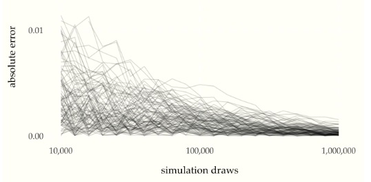 -->
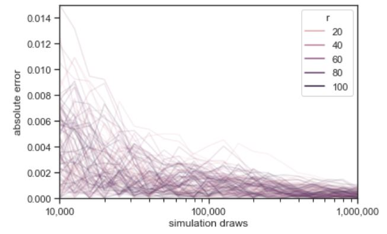

```
import numpy as np
from scipy.stats import norm

np.random.seed(1234)

M_max = int(1e6)
J = 300
Ms = 10 ** (np.arange(6, 13, 0.5) / 2)
N = len(Ms)
ys = np.empty((N, J))

for j in range(J):
    z = np.random.binomial(1, 0.5, M_max)
    for n in range(N):
        ys[n, j] = abs(np.mean(z[:int(Ms[n])]) - 0.5)

mean = np.empty(N)
sd = np.empty(N)
quant_68 = np.empty(N)
quant_95 = np.empty(N)

sixty_eight_pct = norm.cdf(1) - norm.cdf(-1)
ninety_five_pct = norm.cdf(2) - norm.cdf(-2)

for n in range(N):
    mean[n] = np.mean(ys[n, :])
    sd[n] = np.std(ys[n, :])
    quant_68[n] = np.quantile(ys[n, :], sixty_eight_pct)
    quant_95[n] = np.quantile(ys[n, :], ninety_five_pct)

```
{: .language-python}


Plotting both the number of simulations and the absolute error on the
log scale reveals the rate at which the error decreases with more
draws.

Absolute error versus number of simulation draws for 100 simulated sequences of $$M = 1,000,000$$ draws. The blue line is at the 68 percent quantile and the red line at the 95 percent quantile of these draws.  The relationship between the log number of draws and log error is revealed to be linear.

```

import numpy as np
from scipy.stats import binom, norm
import pandas as pd
import matplotlib.pyplot as plt
import math

np.random.seed(1234)

M_max = int(1e6)
J = 300
Ms = np.power(10, np.arange(6, 13, 0.5) / 2)
N = len(Ms)
ys = np.empty((N, J))
for j in range(J):
    z = np.random.binomial(1, 0.5, size=M_max)
    for n in range(N):
        ys[n, j] = np.abs(np.mean(z[:int(Ms[n])]) - 0.5)

mean = np.empty(N)
sd = np.empty(N)
quant_68 = np.empty(N)
quant_95 = np.empty(N)
sixty_eight_pct = norm.cdf(1) - norm.cdf(-1)
ninety_five_pct = norm.cdf(2) - norm.cdf(-2)
for n in range(N):
    mean[n] = np.mean(ys[n, :])
    sd[n] = np.std(ys[n, :], ddof=1)
    quant_68[n] = np.quantile(ys[n, :], q=sixty_eight_pct)
    quant_95[n] = np.quantile(ys[n, :], q=ninety_five_pct)

fudge = 1e-6
x = 0.5 * np.arange(1, 101)
log_abs_err_plot = plt.plot()
df2 = pd.DataFrame({'M': Ms, 'err_hat_E_Y': mean - 0.5})
for r in range(J):
    plt.plot(Ms, ys[:, r], alpha=0.15, color='gray')
plt.plot(Ms, quant_68, color='blue', linewidth=0.5)
plt.plot(Ms, quant_95, color='red', linewidth=0.5)
plt.xscale('log')
plt.xlim(0.9 * 1e3, 1.1 * 1e6)
plt.xticks([10**3, 10**4, 10**5, 10**6], ['1,000', '10,000', '100,000', '1,000,000'])
plt.ylim(0.8e-6, 2e-5)
plt.yticks([0.00005, 0.0005, 0.005, 0.05], ['0.00001', '0.0001', '0.001', '0.01'])
plt.xlabel('simulation draws')
plt.ylabel('log absolute error + 1e-5')
plt.show()

```
{: .language-python}

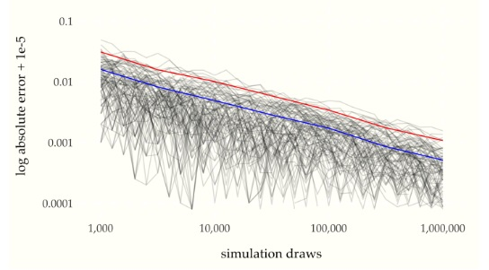

We can read two points $$(x_1, y_1)$$ and $$(x_2, y_2)$$ off of the graph for $$x_1 = 10\,000$$ and $$x_2 = 100\,000$$ as

```
print("x[1], y[1] = %7.f, %6.5f\nx[2], y[2] = %7.f, %6.5f" % (
        Ms[3], quant_68[3],
        Ms[5], quant_68[5]))
```
{: .language-python}

~~~
x[1], y[1] =    5623, 0.00685
x[2], y[2] =   17783, 0.00411
~~~  
{: .output}

which gives us the following values on the log scale

```
import math

print(f"log x[1], log y[1] = {math.log(Ms[3]):5.2f}, {math.log(quant_68[3]):4.2f}\nlog x[2], log y[2] = {math.log(Ms[5]):5.2f}, {math.log(quant_68[5]):4.2f}")


```
{: .language-python}

~~~
log x[1], log y[1] =  8.63, -4.98
log x[2], log y[2] =  9.79, -5.49
~~~  
{: .output}

Using the log scale values, the estimated slope of the reduction in quantile bounds is

```
print(f"estimated slope\n(log y[2] - log y[1])\n / (log x[2] - log x[1])  =  {(math.log(quant_68[5]) - math.log(quant_68[3])) / (math.log(Ms[5]) - math.log(Ms[3])) :3.2f}")

```
{: .language-python}

~~~
estimated slope
(log y[2] - log y[1])
 / (log x[2] - log x[1])  =  -0.44
~~~  
{: .output}

If we let $$\epsilon_M$$ be the value of one of the quantile lines at
$$M$$ simulation draws, the linear relationship plotted in the figures
have the form^[A line through the points $$(x_1, y_1)$$ and $$(x_2, y_2)$$ has
$$
\mbox{slope} = \frac{y_2 - y_1}{x_2 - x_1}.
$$]

$$
\log \epsilon_M = -\frac{1}{2} \, \log M + \mbox{const}.
$$

When writing "const" in a mathematical expression, the presumption is
that it refers to a constant that does not depend on the free
variables of interest (here, $$M$$, the number of simulation draws).
Ignoring constants lets us focus on the order of the dependency.  The
red line and blue line have the same slope, but different constants.

Seeing how this plays out on the linear scale requires exponentiating
both sides of the equation and reducing,

$$
\begin{array}{rcl}
\exp(\log \epsilon_M)
& = &
\exp( -\frac{1}{2} \, \log M + \mbox{const} )
\\[6pt]
%
\epsilon_M
& = &
\exp( -\frac{1}{2} \, \log M )
\times
\exp(\mbox{const})
%
\\[6pt]
\epsilon_M
& = &
\exp( \log M )^{-\frac{1}{2}}
\times
\exp(\mbox{const})
\\[6pt]
\epsilon_M
& = &
\exp(\mbox{const}) \times M^{-\frac{1}{2}}
\end{array}
$$

Dropping the constant, this relationship between the expected absolute
error $$\epsilon_M$$ after $$M$$ simulation draws may be succinctly
summarized using proportionality notation,^[In general, we write $$f(x)
\propto g(x)$$ if there is a positive constant $$c$$ that does not depend
on $$x$$ such that $$f(x) = c \times g(x).$$ For example, $$3x^2 \propto
9x^2,$$ with $$c = \frac{1}{3}$$.]

$$
\displaystyle
\epsilon_M
\ \propto \
\frac{\displaystyle 1}{\displaystyle \sqrt{M}}.
$$

This is a fundamental result in statistics derived from the
*central limit theorem*. The central limit theorem governs the
accuracy of almost all simulation-based estimates. We will return to a
proper formulation when we have the scaffolding in place to deal with
the pesky constant term.

In practice, what does this mean? It means that if we want to get an
extra decimal place of accuracy in our estimates, we need one hundred
(100) times as many draws. For example, the plot shows error rates
bounded by roughly 0.01 with $$10\,000$$ draws, yielding estimates that
are very likely to be within $$(0.49, 0.51).$$ To reduce that likely
error bound to 0.001, that is, ensuring estimates are very likely in
$$(0.0499, 0.501),$$ requires 100 times as many draws (i.e., a whopping
$$1\,000\,000$$ draws).^[For some perspective, $$10\,000$$ is the number
of at bats in an entire twenty-year career for a baseball player,
the number of field goal attempts in an entire career of most basketball
players, and the size of a very large disease study or meta-analysis in
epidemiology.]

Usually, one hundred draws will provide a good enough estimate of most
quantities of interest in applied statistics. The variability of the
estimate based on a single draw depends on the variability of the
quantity being estimated. One hundred draws reduces the expected
estimation bound to one tenth of the variability of a single draw.
Reducing that variability to one hundredth of the variability of a
single draw would require ten thousand draws. In most applications,
the extra estimation accuracy is not worth the extra computation.

## Exercise

> ### 1. A motorist encounters  four consecutive traffic lights, each equally likely to be red  or  green.  Let  Z  be the number  of green lights passed  by the motorist before being stopped by a red light.  What is the probability  distribution of  Z?
>
> > ## Solution
> > Thinking of this problem as 4 buckets each with 2 possibilities paves a clear way to the solution of the problem. There are $$2^4 = 16$$ possibilities. There is only one way for them to all be green ($$\xi = 4$$), and again only one way for 3 greens followed by one red ($$\xi = 3$$). Once you have get to $$\xi = 2$$, then the last light can be either green or red giving two possibilities then at $$\xi = 1$$ you have two lights that can be either red or green giving 4 possibilities. Clearly, then, there are 8 for the case of $$\xi = 0$$.
> > $$P(\xi) = \left\{ \begin{array}{rl}
    \frac{1}{2}, \xi=0  \\
    \frac{1}{4}, \xi=1  \\
    \frac{1}{8}, \xi=2  \\
    \frac{1}{16}, \xi=3  \\
    \frac{1}{16}, \xi=4
       \end{array} \right.
\label{answer4.1}$$ **Answer not verified**
>{: .solution}
{: .challenge}
### 

To summarize what we want here: $$\begin{aligned}
    \xi_1 \neq \xi_2 \\
    \Phi_{\xi_1}(x) = \Phi_{\xi_2}(x) \\
    \int_{-\infty}^x p_{\xi_1}(x')dx' = \int_{-\infty}^x p_{\xi_2}(x')dx'\end{aligned}$$
Since the question does not rule out the possibility that the
probability distributions are the same, we can just say that $$\xi_1$$ is
the outcome of a coin-flip experiment and that $$\xi_2$$ is the outcome of
the first spin measurement of an EPR experiment. **Answer not verified**

### 

If $$p(x)dx = \frac{dx}{b-a}$$ then
$$\Phi(x) = \int_{-a}^x p(x')dx' = \int_{a}^x \frac{dx'}{b-a}$$
$$\Phi(x) = \frac{x - a}{b-a}
\label{answer4.3}$$ **Answer not verified**

### 

The distribution is clearly not normalized so the first step will be to
normalise it.

$$\int^{\infty}_{-\infty} \frac{a}{x^2+1}dx = 1 = a \pi$$

$$a = \frac{1}{\pi}
\label{answer4.4a}$$

Just by definition:
$$\Phi(x) = \int^{x}_{\infty} \frac{1}{\pi(x'^2+1)}dx' = \left \frac{\arctan x'}{\pi} \right] ^x_{-\infty} = \frac{\arctan x}{\pi}+\frac{1}{2}
\label{answer4.4b}$$ and last but not least:
$$P( \{ -1 \leq x \leq 1 \} = \int^{1}_{-1} \frac{1}{\pi(x'^2+1)}dx' = \frac{1}{2}
\label{answer4.4c}$$

**Answers verified**

### 

Once again we start by normalizing
$$1= \int^{\infty}_{0} a x^2 e^{-k x} dx = -\left \frac{e^{-k x} \left(2+2 k x+k^2 x^2\right)}{k^3} \right]^{\infty}_{0}= \frac{2 a}{k^3}$$
$$a = \frac{k^3}{2}
\label{answer4.5a}$$
$$\Phi(x) = \int^{x}_{0} \frac{k^3}{2}x'^2 e^{-k x'}dx' = 1 - \frac{e^{-k x} \left(2+2 k x+k^2 x^2\right)}{2}
\label{answer4.5b}$$
$$P( \{ 0 \leq x \leq \frac{1}{k} \} = \int_{0}^{\frac{1}{k}} \frac{k^3}{2}x^2 e^{-k x}dx = \frac{2e - 5}{2 e}
\label{answer4.4c}$$ **Answer not verified**

### 

$$\Phi(\infty) = 1 \Rightarrow 1 = a + \frac{b \pi}{2}$$
$$\Phi(-\infty) = 0 \Rightarrow 0 = a - \frac{b \pi}{2}$$ Which you can
solve to get $$\begin{aligned}
    b = \frac{1}{\pi} \\
    a = \frac{1}{2}\end{aligned}$$ Since $$\Phi$$ is the integral of $$p$$,
we can take the derivative of it and then make sure it's normalized.
$$p(x) = \frac{d \Phi}{dx} = \frac{1}{2 \pi \left(1+\frac{x^2}{4}\right)}$$
And the normalization is indeed still correct!

**Answer not verified**

### 

The area of the table is simply $$\pi R^2$$ and the are of each of the
smaller circles are $$\pi r^2$$. The ratio of the sum of the area of the
two circles to the total table area will be the chance that one of the
circles gets hit: $$p = \frac{2r^2}{R^2}$$. **Answer verified**

### 

Just like in example 2 in the book, this problem will go by very well if
we draw a picture indicating the given criteria:

{width="\\textwidth"}

Where does this come from? $$\begin{aligned}
    x_1 + x_2 \leq 1 \\ 
    x_2 \leq 1 - x_1\end{aligned}$$ which is the straight line.
$$\begin{aligned}
    x_1x_2 \leq \frac{2}{9} \\ 
    x_2 \leq \frac{2}{9 x_1}\end{aligned}$$ A little bit of algebra
shows that these two lines intersect at $$\frac{1}{3}$$ and $$\frac{2}{3}$$
so the area underneath the straight line but not above the curved line
is $$\begin{aligned}
    A =\int_0^{\frac{1}{3}}(1-x)dx + \int_{\frac{1}{3}}^{\frac{2}{3}}\frac{2}{9x}dx + \int_{\frac{2}{3}}^{1}(1-x)dx \\ 
    = \frac{5}{18} + \int_{\frac{1}{3}}^{\frac{2}{3}}\frac{2}{9x}dx + \frac{1}{18} \\
    = \frac{1}{3} + \int_{\frac{1}{3}}^{\frac{2}{3}}\frac{2}{9x}dx \\ 
    = \frac{1}{3    } + \frac{2 \ln 2}{9} \approx 0.487366\end{aligned}$$
And the answer is properly normalized since the initial probability
distributions were unity (the box length is only 1). **Answer verified**

### 

As we showed in example number 4, $$p_{\eta}$$ is the convolution of
$$p_{\xi_1}$$ and $$p_{\xi_2}$$. $$\begin{aligned}
    p_{\eta}(y) = \int_{-\infty}^{\infty} p_{\xi_1}(y-x)p_{\xi_2}(x)dx\end{aligned}$$
I think the integration will look more logical if we stick in Heaviside
step-functions. $$\begin{aligned}
    p_{\eta}(y) = \frac{1}{6} \int_{-\infty}^{\infty}e^{-\frac{y-x}{3}}e^{-\frac{x}{3}}H(y-x)H(x)dx\end{aligned}$$
Clearly $$x$$ has to be greater than zero and $$y$$ must be greater than x,
leading to the following limits of integration. $$\begin{aligned}
    p_{\eta}(y) = \frac{1}{6} \int_{0}^{y}e^{-\frac{y-x}{3}}e^{-\frac{x}{3}}dx \\
    = e^{-\frac{y}{3}}\left(1- e^{-\frac{y}{6}}  \right)\end{aligned}$$
Only when y is greater than zero! **Answer verified**

### 

Due to the magic of addition, finding the probability distribution of
$$\xi_1 + \xi_2 + \xi_3$$ is no different than the probability
distribution of $$(\xi_1 + \xi_2) + \xi_3$$ but we already know what the
probability distribtution of the parenthesized quantity is:
$$p_{\xi_1 + \xi_2}(y) = \int_{-\infty}^{\infty} p_{\xi_1}(y-x)p_{\xi_2}(x)dx$$
Therefore the total combination is
$$p_{\xi_1 + \xi_2+ \xi_3}(z) = \int_{-\infty}^{\infty} p_{\xi_1 + \xi_2}(z-y)p_{\xi_3}(y)dx$$
$$p_{\xi_1 + \xi_2+ \xi_3}(z) = \int_{-\infty}^{\infty} \left[ \int_{-\infty}^{\infty} p_{\xi_1}(z-y-x)p_{\xi_2}(x)dx \right]p_{\xi_3}(y)dy$$
$$p_{\xi_1 + \xi_2+ \xi_3}(z) = \int_{-\infty}^{\infty}  \int_{-\infty}^{\infty} p_{\xi_1}(z-y-x)p_{\xi_2}(x)p_{\xi_3}(y)dx dy$$
which is just a triple convolution.

**Answer not verified**

### 

$$p_{\xi}(n) = \frac{1}{3^n}$$ therefore
$$\textbf{E}\xi = \sum_{n=1}^{\infty}\frac{n}{3^n} =  \frac{3}{4}
\label{answer4.11}$$ **Answer not verified**

### 

Since finding a ball in one urn versus the other urn has nothing to do
with each other, the events are clearly independent so we can multiply
probabilities. The probability of finding a white ball at any given urn
is $$p_w = \frac{w}{w+b}$$ If you find a white ball on the $$n^{th}$$ try
then that means you found $$n-1$$ black balls before you got to the white
ball. $$p_w(n) = \frac{b^{n-1} w}{(w+b)^n}$$
$$\textbf{E}n = \sum_{i=1}^{\infty}n p_w(n) = \sum_{i=1}^{\infty}n \frac{b^{n-1} w}{(w+b)^n} = \frac{b+w}{w}$$
Which is the total number of balls drawn, subtract one to get the
average number of black balls drawn: $$m=\frac{b}{w}$$ Now for the
variance. to start with we need the average of the square of the random
variable.
$$\textbf{E}n^2 = \sum_{i=1}^{\infty}n^2 p_w(n) = \sum_{i=1}^{\infty}n^2 \frac{b^{n-1} w}{(w+b)^n} = \frac{(b+w) (2 b+w)}{w^2}$$
$$\textbf{D}n = \textbf{E}n^2 - (\textbf{E}n)^2 =  \frac{(b+w) (2 b+w)}{w^2} - \left( \frac{b+w}{w} \right)^2 = \frac{b^2+wb}{w^2}$$
A note that we don't need to subtract anything for the variance since
shifting a distribution over does not affect its variance: just its
average. **Answer verified**

### 

$$\textbf{E}\xi = \int_{-\infty}^{\infty} x\frac{1}{2}e^{-|x|} = 0$$
because the function is even about $$x=0$$.
$$\textbf{E}\xi^2 = \int_{-\infty}^{\infty} x^2\frac{1}{2}e^{-|x|} = 2$$
Therefore: $$\textbf{D}\xi = \textbf{E}\xi^2 - (\textbf{E}\xi)^2 = 2$$
**Answer verified**

### 

$$\textbf{E}x = \int_{a-b}^{a+b} \frac{xdx}{2b} = a$$
$$\textbf{E}x^2 = \int_{a-b}^{a+b} \frac{x^2dx}{2b} = a^2+\frac{b^2}{3}$$
Therefore: $$\textbf{D}x = \frac{b^2}{3}$$ **Answer verified**

### 

If the distribution function is
$$\Phi_{\xi}(x) = a + b \arcsin x, |x| \leq 1$$ then it must fulfill the
proper boundary conditions as specified by both the problem and the
definition of a distribution function.
$$\Phi_{\xi}(-1)= 0 = a - b \frac{\pi}{2}$$
$$\Phi_{\xi}(1) = 1 = a + b \frac{\pi}{2}$$ Some easy algebra gets you
$$\begin{aligned}
    \Phi_{\xi}(x) = \frac{1}{2} + \frac{1}{\pi} \arcsin x\end{aligned}$$
Therefore: $$p_{\xi}(x) = \frac{1}{\pi\sqrt{1-x^2}}$$ $$\begin{aligned}
    \textbf{E}x = \int_{-1}^{1} \frac{x dx}{\pi\sqrt{1-x^2}} = 0 \\
    \textbf{D}x = \int_{-1}^{1} \frac{x^2 dx}{\pi\sqrt{1-x^2}} = \frac{1}{2}\end{aligned}$$
**Answer verified**

### 

Each side of the die has the same probability, $$\frac{1}{6}$$
$$\textbf{E}x = \sum_{i=1}^6 \frac{i}{6} = \frac{7}{2}$$
$$\textbf{E}x^2 = \sum_{i=1}^6 \frac{i^2}{6} = \frac{91}{6}$$ Therefore:
$$\textbf{D}x = \frac{91}{6} - \left( \frac{7}{2} \right)^2 = \frac{91}{6} - \frac{49}{4} = \frac{35}{12}$$
**Answer verified**

### 

This problem may seem difficult until you realize that being
$$\pm \frac{5}{2}$$ away from the mean means you're at either 1 or 6,
meaning that there's a unity probability of being that far from the
mean. Chebyshev's inequality, however, would have us believe that
$$P \{ |x + \textbf{E}x| > \frac{5}{2}  \} \leq \frac{4}{25} \frac{91}{6} = \frac{182}{75} = 2.42667$$
which is not only far off from the actual answer, it's also unphysical
to have probabilities greater than 1! **Answer not verified**

### 

We want to consider the probability distribution of $$\xi$$ by way of
$$\eta$$ $$\eta = e^{\frac{a\xi}{2}}$$ We know from Chebyshev's identity:

$$P\{ \eta > \epsilon(\eta) \} \leq \frac{\textbf{E}\eta^2}{\epsilon(\eta)^2}$$
Let $$\epsilon$$ be the error in $$\xi$$ we're looking for.
$$P\{ \xi > \epsilon \} \leq \frac{\textbf{E}(e^{\frac{a\xi}{2}})^2}{(e^{\frac{a\epsilon}{2}})^2}$$
$$P\{ \xi > \epsilon \} \leq \frac{\textbf{E}e^{a\xi}}{e^{a\epsilon}}$$
**Answer not verified**

### 

First some initial calculations: $$\begin{aligned}
    \textbf{E}\xi = \frac{1}{4} \left( -2+-1+1+2  \right) = 0 \\
    \textbf{E}\xi^2 = \frac{1}{4} \left( (-2)^2+(-1)^2+1^2+2^2  \right) = \frac{10}{4} = \frac{5}{2} = \textbf{E}\eta \\
    \textbf{E}\xi^4 = \frac{1}{4} \left( (-2)^4+(-1)^4+1^4+2^4  \right) = \frac{34}{4} = \frac{17}{2} = \textbf{E}\eta^2\end{aligned}$$
Now, we know that $$\begin{aligned}
    r = \frac{\textbf{E} \left[ (\xi - \textbf{E}\xi)(\eta - \textbf{E}\eta)  \right]}{(\textbf{E}\xi^2 - (\textbf{E}\xi)^2)(\textbf{E}\eta^2 - (\textbf{E}\eta)^2)}\end{aligned}$$
The denominator $$D$$ is the easiest:
$$D = \left( \frac{5}{2} - 0 \right)\left( \frac{17}{2} - \frac{5^2}{2^2} \right) = \frac{45}{8}$$
Now for the numerator: $$\begin{aligned}
    \textbf{E} \left[ (\xi - \textbf{E}\xi)(\eta - \textbf{E}\eta)  \right] \\
    = \frac{1}{16} \left[  \sum_{\xi, \eta} (\xi - \textbf{E}\xi)(\eta - \textbf{E}\eta)      \right]\end{aligned}$$
If we look at the set we'll be summing over, we have
$${\xi - \textbf{E}\xi} = -2, -1, 1, 2$$ and
$${\eta - \textbf{E}\eta} = \frac{3}{2}, -\frac{3}{2}, -\frac{3}{2}, \frac{3}{2}$$
and clearly, since we have to sum over all possible products, since both
distributions are symmetric about 0, the sum will go to zero. $$r=0$$
**Answer not verified**

### 

First some initial calculations: $$\begin{aligned}
    \textbf{E}x_1 = \int_0^{\frac{\pi}{2}} x_1 \sin x_1 \sin x_2 dx_1dx_2 = 1 \\
    \textbf{E}x_2 = 1 \\
    \textbf{E}x_1^2 = \int_0^{\frac{\pi}{2}} x_1^2 \sin x_1 \sin x_2 dx_1dx_2 = (\pi - 2) \\
    \textbf{E}x_2^2 = (\pi - 2) \\\end{aligned}$$ $$\begin{aligned}
    \textbf{E} \left[ (x_1 - \textbf{E}x_1)(x_2 - \textbf{E}x_2)  \right] \\
    = \int_0^{\frac{\pi}{2}} \int_0^{\frac{\pi}{2}} \left[(x_1 - 1)(x_2 - 1)\right]\sin x_1 \sin x_2 dx_1dx_2 = 0 \\
    \sigma_1 \sigma_2 =  \sqrt{(\pi - 2)- 1}\sqrt{(\pi - 2) - 1} = (\pi - 3) \\
    r= \frac{0}{(\pi - 3)} = 0\end{aligned}$$ **Answer not verified**

### 

First some initial calculations: $$\begin{aligned}
    \textbf{E}x_1 = \frac{1}{2}\int_0^{\frac{\pi}{2}} x_1 \sin (x_1 + x_2) dx_1dx_2 = \frac{\pi}{4} \\
    \textbf{E}x_2 = \frac{\pi}{4} \\
    \textbf{E}x_1^2 = \frac{1}{2}\int_0^{\frac{\pi}{2}} x_1^2 \sin (x_1 + x_2) dx_1dx_2 = -2+\frac{\pi}{2} +\frac{\pi ^2}{8} \\
    \textbf{E}x_2^2 = -2+\frac{\pi}{2} +\frac{\pi ^2}{8} \\\end{aligned}$$
$$\begin{aligned}
    \textbf{E} \left[ (x_1 - \textbf{E}x_1)(x_2 - \textbf{E}x_2)  \right] \\
    = \frac{1}{2}\int_0^{\frac{\pi}{2}} \int_0^{\frac{\pi}{2}} \sin (x_1 + x_2) \left[(x_1 - \frac{\pi}{2})(x_2 - \frac{\pi}{2})\right]dx_1dx_2  = -\frac{1}{16} (\pi -4)^2 \\
    \sigma_1\sigma_2 = -2+\pi +\frac{\pi ^2}{2} +\frac{\pi^2}{8} - \frac{\pi^2}{16} = -2+\pi +\frac{\pi ^2}{2} +\frac{\pi^2}{16} \\
    r = \frac{-\frac{1}{16} (\pi -4)^2}{-2+\pi +\frac{\pi ^2}{2} +\frac{\pi^2}{16}}\end{aligned}$$
**Answer verified**

### 

Ill-defined problem, don't feel like translating: **SKIPPED**

### 

Based off 4.22: **SKIPPED**

### 

$$\begin{aligned}
    E\xi = \int_{-\infty}^{\infty} \frac{x}{\pi(1+x^2)}dx = \left \frac{\log \left(x^2+1\right)}{2 \pi } \right]_{-\infty}^{\infty} \rightarrow \infty \\
    E\xi^2 = \int_{-\infty}^{\infty} \frac{x^2}{\pi(1+x^2)}dx = \left \frac{x}{\pi }-\frac{\tan ^{-1}(x)}{\pi } \right]_{-\infty}^{\infty} \rightarrow \infty\end{aligned}$$
Neither integral actually converges so we cannot define averages or
dispersions for this distribution. **Answer verified**
