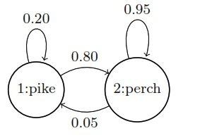
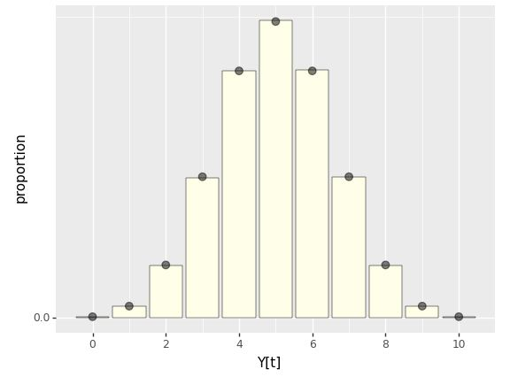
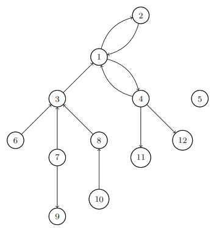
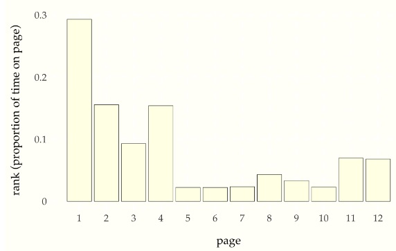
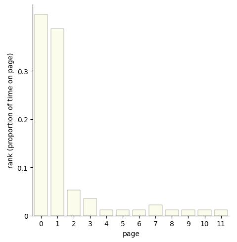

# Finite-State Markov Chains


## Random processes

A finite sequence of random variables is said to be a random vector.
An infinite sequence

$$
Y = Y_1, Y_2, \ldots
$$

of random variables is said to be a *random process*.^[We consider
only discrete random processes where the set of indexes is the
counting numbers $$1, 2, 3, \ldots$$.  Nevertheless, the set of indexes
is infinite, so much of the approach to finite vectors has to be
reworked.]  A trivial example is a sequence of independent Bernoulli
trials in which each $$Y_t$$ is drawn independently according to $$Y_t
\sim \mbox{bernoulli}(\theta)$$.  A sequence of independent Bernoulli
trials is called a *Bernoulli process.*

In this chapter, we will restrict attention to processes $$Y$$ whose
elements take on values $$Y_t \in 0:N$$ or $$Y_t \in 1:N$$ for some fixed
$$N$$.^[The choice of starting at 0 or 1 is a convention that varies by
distribution.  For example, Bernoulli and binomial variates may take
on value zero, but categorical values take on values in $$1:N$$.]  The
Bernoulli process is finite in this sense because each $$Y_t$$ takes on
boolean values, so that $$Y_t \in 0:1$$.


## Finite-State Markov chains

A random process $$Y$$ is said to be a *Markov chain* if each element is
generated conditioned on only the previous element, so that

$$
p_{Y_{t + 1} \mid Y_1, \ldots, Y_t}(y_{t + 1} \mid y_1, \ldots, y_t)
\ = \
p_{Y_{t + 1} \mid Y_t}(y_{t + 1} \mid y_t)
$$

holds for all $$y_1, \ldots, y_{t + 1}$$.  In this chapter, we only
consider Markov chains in which the $$Y_t$$ are finite random variables
taking on values $$Y_t \in 0:N$$ or $$Y_t \in 1:N$$, the range depending
on the type of variable.^[We generalize in two later chapters, first
to Markov chains taking on countably infinite values and then to ones
with continuous values.]

The Bernoulli process discussed in the previous section is a trivial
example of a finite Markov chain.  Each value is generated
independently, so that for all $$y_1, \ldots, y_{t+1}$$, we have

$$
\begin{array}{rcl}
p_{Y_{t+1} \mid Y_1, \ldots, Y_t}(y_{t+1} \mid y_1, \ldots, y_t)
& = &
p_{Y_{t+1} \mid Y_t}(y_{t+1} \mid y_t)
\\[4pt]
= \mbox{bernoulli}(y_{t+1} \mid \theta).
\end{array}
$$

## Fish in the stream

Suppose a person is ice fishing for perch and pike, and notes that if
they catch a perch, it is 95% likely that the next fish they catch is
a perch, whereas if they catch a pike, it is 20% likely the next fish
they catch is a pike.^[This is a thinly reskinned version of the
classic exercise involving cars and trucks from Ross, S.M.,2014. *Introduction to Probability Models.* Tenth edition. Academic
Press. Exercise 30, page 279.] We'll treat the sequence of fish types
as a random process $$Y = Y_1, Y_2, \ldots$$ with values

$$ Y_t= $$

$$
\begin{cases} 1 
& \mbox{if fish t is a pike, and}
\\[4pt]
2 
& \mbox{if fish t is a perch.}
\end{cases}
$$

The sequence $$Y$$ forms a Markov chain with transition probabilities

$$
\begin{array}{rcl}
\mbox{Pr}[Y_{t + 1} = 1 \mid Y_t = 1] & = & 0.20
\\[4pt]
\mbox{Pr}[Y_{t + 1} = 1 \mid Y_t = 2] & = & 0.05
\end{array}
$$

The easiest way to visual a Markov chain with only a few states is as
a state transition diagram.  In the case of the pike and perch, the
transition diagram is as follows.

State diagram for finite Markov chain generating sequences of fishes. The last fish observed determines the current state and the arrows indicate transition probabilities to the next fish observed.

<!-- 
\begin{tikzpicture}
\node[circle,draw,semithick] (A) {1:pike};
\node[circle,draw,semithick] (B) [right of=A] {2:perch};
\path (A) edge [bend left] node {0.80} (B);
\path (B) edge [bend left] node {0.05} (A);
\path (A) edge [loop above] node {0.20} (A);
\path (B) edge [loop above] node {0.95} (B);
\end{tikzpicture}
 -->

Like all such transition graphs, the probabilities on the edges going
out of a node must sum to one.

Let's simulate some fishing. The approach is to generate the type of
each fish in the sequence, then report the overall proportion of
pike.^[With some sleight of hand here for compatibility with Bernoulli
variates and to facilitate computing proportions, we have recoded
perch as having value 0 rather than 2.] We will start with a random
fish drawn according to $$\mbox{bernoulli(1/2)}$$.

```
import numpy as np

T = 100 # number of time points
y = np.zeros(T, dtype=int) # initialize array of outcomes
y[0] = np.random.binomial(1, 0.5) # generate first outcome

for t in range(1, T):
    p = 0.2 if y[t-1] == 1 else 0.05 # determine success probability
    y[t] = np.random.binomial(1, p) # generate outcome

prop = np.mean(y) # calculate proportion of 1's
print(f"Simulated proportion of 1's: {prop:.2f}")

```
{: .language-python}

```
Simulated proportion of 1's: 0.08
```
{: .output}

Now let's assume the fish are really running, and run a few simulated
chains until $$T = 10,000$$.

```
import numpy as np

np.random.seed(1234)
T = 10000
M = 5
for k in range(M):
    y = np.zeros(T, dtype=int)
    y[0] = np.random.binomial(1, 0.5)
    for t in range(1, T):
        p = 0.2 if y[t-1] == 1 else 0.05
        y[t] = np.random.binomial(1, p)
    prop = np.mean(y)
    print(f"Simulated proportion of 1's: {prop:.3f}")
```
{: .language-python}

```
Simulated proportion of 1's: 0.058
Simulated proportion of 1's: 0.063
Simulated proportion of 1's: 0.060
Simulated proportion of 1's: 0.058
Simulated proportion of 1's: 0.060
```
{: .output}

The proportion of pike is roughly 0.06.


## Ehrenfest's Urns

Suppose we have two urns, with a total of $$N$$ balls distributed
between them. At each time step, a ball is chosen uniformly at random
from among the balls in both urns and moved to the other urn.^[This
model was originally introduced as an example of entropy and
equilibrium in P. Ehrenfest and T. Ehrenfest. 1906. Über eine Aufgabe
aus der Wahrscheinlichkeitsrechnung, die mit der kinetischen Deutung
der Entropievermehrung zusammenhängt. *Mathematisch-Naturwissenschaftliche Blätter* No. 11 and 12.]

The process defines a Markov chain $$Y$$ where transitions are governed
by

$$
p_{Y_{t+1} \mid Y_t}(y_{t+1} \mid y_t)$$
$$
= \begin{cases}
\displaystyle \frac{y_t}{N}
& \mbox{if } \ y_{t + 1} = y_t - 1, \ \mbox{and}
\\[6pt]
\displaystyle 1 - \frac{y_t}{N}
& \mbox{if } \ y_{t + 1} = y_t + 1.
\end{cases}
$$

The transition probabilities make sure that the value of $$Y_t$$ remains
between 0 and $$N$$.  For example,

$$
\mbox{Pr}[Y_{t + 1} = 1 \mid Y_t = 0] = 1
$$

because $$1 - \frac{y_t}{N} = 1$$. Similarly, if $$Y_t = N$$, then
$$Y_{t+1} = N - 1$$.

What happens to the distribution of $$Y_t$$ long term? It's easy to
compute by simulation of a single long chain:^[We've used a function
borrowed from R here called `table`, defined by $$\mbox{table}(y, A,
B)[n] = \sum_{t=1}^T \mbox{I}[y_t = n]$$ for $$n \in A:B$$. For example, if $$y =
(0, 1, 2, 1, 1, 3, 2, 2, 1),$$ then $$\mbox{table}(y, 0, 4) = (1, 4,
3, 1, 0),$$ because there is one 0, four 1s, three 2s, a single 3, and
no 4s among the values of $$y$$.]

```
import numpy as np

N = 100 # population size
T = 1000 # number of time points
y = np.zeros(T, dtype=int) # initialize array of counts
z = np.zeros(T, dtype=int) # initialize array of outcomes
y[0] = N // 2 # set initial count to N/2

for t in range(1, T):
    z[t] = np.random.binomial(1, y[t-1]/N) # generate outcome
    y[t] = y[t-1] - 1 if z[t] else y[t-1] + 1 # update count

p_Y_t_hat = np.bincount(y, minlength=N+1) / T # calculate proportion of counts

```
{: .language-python}

Let's run that with $$N = 10$$ and $$T = 100,000$$ and display the
results as a bar plot.

Long-term distribution of number of balls in the first urn of the Ehrenfest model in which $$N$$ balls are distributed between two urns, then at each time step, a ball is chosen uniformly at random move to the other urn.  The simulation is based on total of $$T = 100,000$$ steps with $$N = 10$$ balls, starting with 5 balls in the first urn. The points on the top of the bars are positioned at the mass defined by the binomial distribution, $$
\\mbox{binomial}(Y_t \\mid 10, 0.5)
$$.

```
import numpy as np
import pandas as pd
import matplotlib.pyplot as plt
from scipy.stats import binom
from plotnine import *

np.random.seed(1234)
N = 10
T = 100000
y = np.zeros(T)
y[0] = 5

for t in range(1, T):
    z_t = np.random.binomial(1, y[t-1]/N)
    y[t] = y[t-1] - z_t + (1 - z_t)

ehrenfest_df = pd.DataFrame({'x': np.arange(1, T+1), 'y': y})

ehrenfest_plot = (
    ggplot(data=ehrenfest_df, mapping=aes(x='y')) +
    geom_bar(color='black', fill='#ffffe8', size=0.2) +
    geom_point(data=pd.DataFrame({'x': np.arange(11), 'y': T * binom.pmf(np.arange(11), 10, 0.5)}),
               mapping=aes(x='x', y='y'), size=3, alpha=0.5) +
    scale_x_continuous(breaks=[0, 2, 4, 6, 8, 10]) +
    scale_y_continuous(breaks=np.arange(0, 300000, 50000), labels=[str(x) for x in np.arange(0, 0.6, 0.1)]) +
    xlab('Y[t]') +
    ylab('proportion')
)

print(ehrenfest_plot)

```
{: .language-python}



The distribution of $$Y_t$$ values is the binomial distribution, as
shown by the agreement between the points (the binomial probability
mass function) and the bars (the empirical proportion $$Y_t$$ spent in
each state).^[In the Markov chain Monte Carlo chapter later in the
book, we will see how to construct a Markov chain whose long-term
frequency distribution matches any given target distribution.]


## Page Rank and the random surfer

Pagerank,^[Page, L., Brin, S., Motwani, R. and Winograd, T., 1999. The
PageRank citation ranking: Bringing order to the web. Stanford InfoLab
Technical Report. Section 2.5 Random Surfer Model.] the innovation
behind the original Google search engine ranking system, can be
modeled in terms of a random web surfer whose behavior determines a
Markov chain.  The web is modeled as a set of pages, each of which has
a set of outgoing links to other pages.  When viewing a particular
page, our random surfer chooses the next page to visit by

* if the current page has outgoing links, then with probability
$$\lambda$$, choose the next page uniformly at random among the outgoing
links,

* otherwise (with probability $$1 - \lambda$$), choose the next page to
visit uniformly at random among all web pages.

Translating this into the language of random variables, let $$Y = Y_1,
Y_2, \ldots$$ be the sequence of web pages visited. Our goal now is to
define the transition function probabilistically so that we may
simulate the random surfer. Let $$L_i \subseteq 1:N$$ be the set of
outgoing links from page $$i$$; each page may have any number of
outgoing links from $$0$$ to $$N$$.

The process $$Y$$ is most easily described in terms of an auxiliary
process $$Z = Z_1, Z_2, \ldots$$ where $$Z_t$$ represents

the decision whether to jump to a link from the current page. We
define $$Z$$ by setting $$Z_t = 0$$ if the page $$Y_t$$ has no
outgoing links, and otherwise setting

$$
Z_t \sim \mbox{bernoulli}(\lambda).
$$

If $$Z_t = 1$$, we can generate $$Y_{t+1}$$ uniformly from the links
$$L_{Y_t}$$ from page $$Y_t$$,

$$
Y_{t + 1} \sim \mbox{uniform}\left( L_{Y_t} \right).
$$

If $$Z_t = 0$$, we simply choose a web page uniformly at random from
among all $$N$$ pages,

$$
Y_{t+1} \sim \mbox{uniform}(1:N).
$$

This sequence is easy to simulate with `L[n]` denoting the outgoing
links from page `n`.  We start from a page `y[1]` chosen uniformly at
random among all the pages.  Then we just simulate subsequent pages
according to the process described above.

```
import numpy as np

# Define L and lambda
L = {1: [2, 3, 4], 2: [4], 3: [4], 4: []}
lam = 0.85

# Set initial values
N = 4
T = 10
y = np.zeros(T, dtype=int)
z = np.zeros(T, dtype=int)

# Set initial value for y
y[0] = np.random.randint(1, N+1)

# Simulate y and z
for t in range(1, T):
    last_page = y[t - 1]
    out_links = L[last_page]
    z[t] = 0 if not out_links else np.random.binomial(1, lam)
    y[t] = np.random.choice(out_links) if z[t] else np.random.randint(1, N+1)
    
print(y)

```
{: .language-python}

```
[4 1 4 2 4 1 4 1 2 4]
```
{: .output}

Suppose we have the following graph.
A simplified web.  Each node represents a web page and each edge is a directed link from one page to another web page.


<!--! $$
\begin{tikzpicture}[->, auto, node distance=2cm, font=\footnotesize]
\node[circle,draw,semithick] (A) {1};
\node[circle,draw,semithick] (B) [above right of=A] {2};
\node[circle,draw,semithick] (C) [below left of=A] {3};
\node[circle,draw,semithick] (D) [below right of=A] {4};
\node[circle,draw,semithick] (E) [right of=D] {5};
\node[circle,draw,semithick] (F) [below left of=C] {6};
\node[circle,draw,semithick] (G) [below of=C] {7};
\node[circle,draw,semithick] (H) [below right of=C] {8};
\node[circle,draw,semithick] (I) [below of=G] {9};
\node[circle,draw,semithick] (J) [below of=H] {10};
\node[circle,draw,semithick] (K) [below of=D] {11};
\node[circle,draw,semithick] (L) [below right of=D] {12};
\path (A) edge [bend left] node {} (B);
\path (B) edge [bend left] node {} (A);
\path (C) edge [] node {} (A);
\path (A) edge [bend left] node {} (D);
\path (D) edge [bend left] node {} (A);
\path (F) edge [] node {} (C);
\path (G) edge [] node {} (C);
\path (H) edge [] node {} (C);
\path (G) edge [] node {} (I);
\path (J) edge [] node {} (H);
\path (D) edge [] node {} (K);
\path (D) edge [] node {} (L);
\end{tikzpicture}
$$ -->


We can simulate $$T = 100,000$$ page visits using the algorithm shown
above and display the proportion of time spent on each page.

Proportion of time spent on each page by a random surfer taking $$T = 100,000$$ page views starting from a random page with a web structured as in the previous diagram.


```
import numpy as np
import pandas as pd
import matplotlib.pyplot as plt
import seaborn as sns
from scipy.stats import bernoulli

L = np.zeros((12, 12))
L[[0, 2], [1, 3]] = 1
L[1, 0] = 1
L[2, 0] = 1
L[[3, 10, 11], [0, 9, 10]] = 1
L[4, :] = 1
L[5, 2] = 1
L[[6, 8], [2, 8]] = 1
L[7, 2] = 1
L[8, :] = 1
L[9, 7] = 1
L[10, :] = 1
L[11, :] = 1

lmbda = 0.90
theta = np.zeros((12, 12))
for i in range(12):
    if np.sum(L[i, :]) == 0:
        theta[i, :] = np.repeat(1/12, 12)
    else:
        theta[i, :] = lmbda * L[i, :] / np.sum(L[i, :]) + \
                      (1 - lmbda) * np.repeat(1/12, 12)

np.random.seed(1234)
T = int(1e5)
y = np.zeros(T, dtype=int)
y[0] = np.random.choice(12, 1)[0]
for t in range(1, T):
    y[t] = np.random.choice(12, 1, p=theta[y[t-1], :])[0]

visited = np.bincount(y)

pagerank_df = pd.DataFrame({'x': range(1, T+1), 'y': y})

pagerank_plot = (sns
                 .catplot(x='y', data=pagerank_df, kind='count', color='#ffffe8', edgecolor='black', linewidth=0.2)
                 .set(xlabel='page', ylabel='rank (proportion of time on page)', 
                      xticks=np.arange(12), yticks=[0, 0.1*T, 0.2*T, 0.3*T], yticklabels=[0, 0.1, 0.2, 0.3])
                 .fig
                )
sns.despine()

```
{: .language-python}

<!--  -->



Page 1 is the most central hub. Pages 5, 6, 7, and 10 have no links
coming into them and can only be visited by random chance, so all
should have the same chance of being visited by the random surfer.
Pages 11 and 12 are symmetric, and indeed have the same probability.
There is a slight difference between the views of page 9 and 10 in
that it possible to get to 9 from 7, but 10 is only visited by chance.

> For a Markox transition matrix, the limiting probabilities of being in a
certain state as $$n \rightarrow \infty$$ are given by the solution to the
following set of linear equations.
$$p_j^* = \sum_{i=1}^{\infty} p_i^* p_{ij}$$
{: .callout}
> #### 1.  A number from 1 tom is chosen at random, at each of the times $$t  = 1, 2,  . . .$$. A system is said to be in the state e, if no number has yet been chosen, and in the state  e, if the largest  number  so far chosen is i.    Show that  the random process described  by this model is a Markov chain.  Find  the corresponding transition probabilities $$p_{ij}  (i, j= 0, 1 , . . . ,  m)$$.
> 
> > ## Solution
> > 
> > Since state $$i$$ signifies that the highest number chosen so far is $$i$$,<br>
> > what is the probability the next number is lower than $$i$$ and you stay
in state $$i$$? Well, there are $$m$$ possible numbers that could get picked
and $$i$$ of them are less than or equal to $$i$$ giving:<br>
> > $$p_{ii} = \frac{i}{m}$$<br>
> > What now if we're in $$i$$ and we want to know what the probability of
being in state $$j$$ is next.<br>
> > Well, if $$j<i$$ then it's zero because you can't go to a lower number in this game.<br>
> > If, however, $$j$$ is not lower then there are $$m$$ possible numbers that could get called and only one of them is $$j$$, giving:<br>
> >$$p_{ij} = \frac{1}{m}, j>i$$<br>
> >$$p_{ij} = 0, j<i$$
>{: .solution}
{: .challenge}
> > ## Solution
> > To show that the random process described by this model is a Markov chain, we need to demonstrate that the future state of the process depends only on the current state and not on any of the past states. In this case, the current state is determined by the largest number chosen so far, and the future state is determined by the next number that is chosen.<br>
> > Formally, we can say that the Markov property holds if:<br>
> > $$P\left(X_{t+1}=j|X_{t},X_{t-1},...,X_{1}=i_{1}\right)= P\left(X_{t+1}=j∣X_{t}=i\right)$$<br>
> > where $$X_t$$ denotes the state of the system at time $$t$$, and $$P(X_{t+1}=j | X_t=i)$$ represents the probability of transitioning from state $$i$$ to state $$j$$.<br>
> > In this case, since the future state depends only on the largest number chosen so far (i.e., the current state) and the next number that is chosen, we can say that the Markov property holds.<br>
> > The transition probabilities can be calculated as follows:<br>
> > Let $$p_i$$ be the probability that the largest number chosen so far is $$i$$. Then, at any given time $$t$$, the probability of choosing a number greater than $$i$$ is $$(m-i)/m$$, and the probability of choosing a number less than or equal to $$i$$ is $$i/m$$. Therefore, we can write the transition probabilities as:<br>
> > $$p_{i,i+1}  = \frac{m−i}{m}$$<br>
> > $$p_{i,j} = \frac{j}{m}, for j \le i$$<br>
> > $$p_{i,0}= 1 - p_{i,i+1} - \sum_{j=1}^{i}p_{i,j}$$, where the sum is taken over all $$j \le i$$.<br>
> > Note that $$p_{i,0}$$ represents the probability of starting over (i.e., going back to the state $$e$$) after reaching state $$i$$.<br>
> > These transition probabilities satisfy the Markov property, and therefore, the random process described by this model is a Markov chain.
>{: .solution}
{: .challenge}
> #### 2. In the preceding  problem, which states are persistent  and which transient?
> 
> > ## Solution
> > 
> > Since state $$i$$ signifies that the highest number chosen so far is $$i$$,<br>
> > what is the probability the next number is lower than $$i$$ and you stay
in state $$i$$? Well, there are $$m$$ possible numbers that could get picked
and $$i$$ of them are less than or equal to $$i$$ giving:<br>
> > $$p_{ii} = \frac{i}{m}$$<br>
> > What now if we're in $$i$$ and we want to know what the probability of
being in state $$j$$ is next.<br>
> > Well, if $$j<i$$ then it's zero because you can't go to a lower number in this game.<br>
> > If, however, $$j$$ is not lower then there are $$m$$ possible numbers that could get called and only one of them is $$j$$, giving:<br>
> >$$p_{ij} = \frac{1}{m}, j>i$$<br>
> >$$p_{ij} = 0, j<i$$
>{: .solution}
{: .challenge}