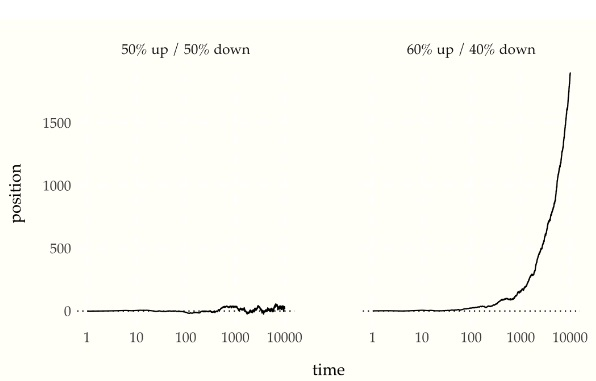
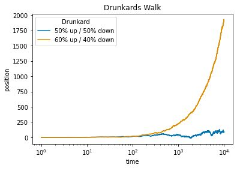
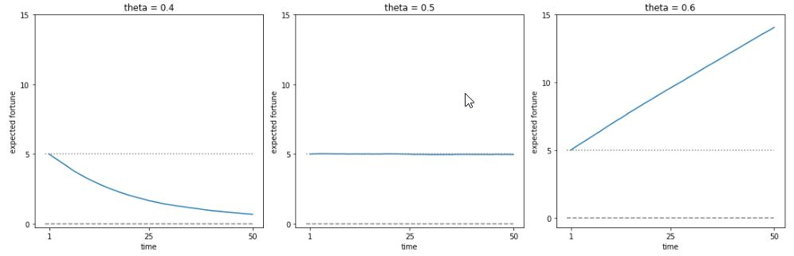
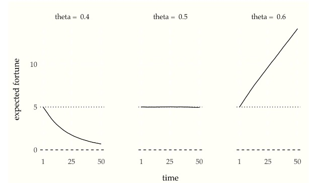
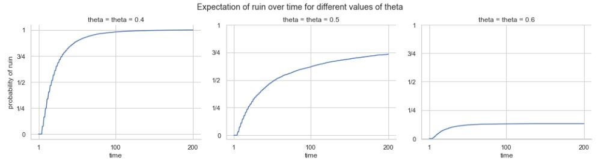
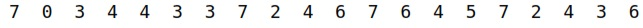
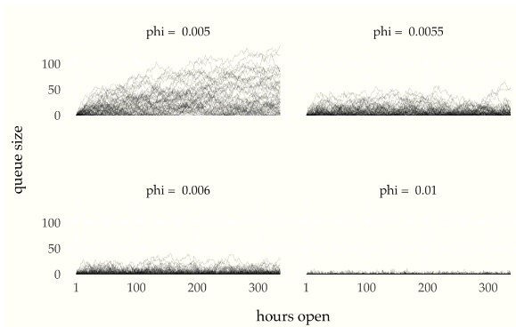
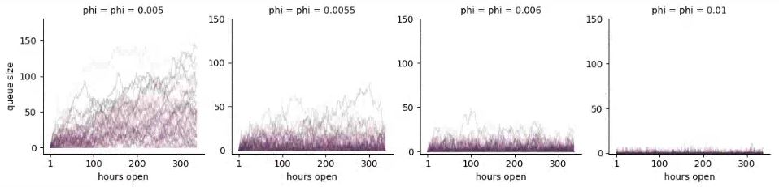

# Infinite Discrete Markov Chains

All of the Markov chains we have until now have had a finite number
of states.  In this chapter, we consider Markov chains with a
countably infinite number of states.  That is, they are still discrete,
but can take on arbitrary integer values.

## Drunkard's walk

The so-called *drunkard's walk* is a non-trivial Markov chain which
starts with value 0 and moves randomly right one step on the number
line with probability $$\theta$$ and left one step with probability $$1 -
\theta$$.

The initial value is required to be zero,

$$
p_{Y_1}(y_1) \ = \ 1 \ \mbox{ if } \ y_1 = 0.
$$

Subsequent values are generating with probability $$\theta$$ of adding
one and probability $$1 - \theta$$ of subtracting one,

$$
p_{Y_{t+1} \mid Y_t}(y_{t+1} \mid y_t)
\ = \
\begin{cases}
\theta & \mbox{if } \ y_{t + 1} = y_t + 1, \mbox{and}
\[4pt]
1 - \theta & \mbox{if } \ y_{t + 1} = y_t - 1.
\end{cases}
$$

Another way to formulate the drunkard's walk is by setting $$Y_1 = 0$$
and setting subsequent values to

$$
Y_{t+1} = Y_t + 2 \times Z_t - 1.
$$

where $$Z_t \sim \mbox{bernoulli}(\theta).$$ Formulated this way, the
drunkard's walk $$Y$$ is a transform of the Bernoulli process $$Z$$.  We
can simulate drunkard's walks for $$\theta = 0.5$$ and $$\theta = 0.6$$
and see the trend over time.

```
import numpy as np

M = 10  # Set M to any value you need
theta = 0.5  # Set theta to any value you need
y = np.zeros(M)  # Initialize y with zeros
z = np.zeros(M)  # Initialize z with zeros
y[0] = 0  # Set the first value of y to 0

# Generate z and y values using the Bernoulli distribution
for m in range(1, M):
    z[m] = np.random.binomial(1, theta)
    y[m] = y[m - 1] + (1 if z[m] == 1 else -1)

```
{: .language-python}

We'll simulate from both processes for $$M = 1000$$ steps and plot.

Drunkard's walks of 10,000 steps with equal chance of going left or right (blue) versus a sixty percent chance of going left (red).  The dotted line is drawn at the starting point. As time progresses, the biased random walk drifts further and further from its starting point.

<!--  -->
```
import numpy as np
import pandas as pd
import matplotlib.pyplot as plt
import seaborn as sns

np.random.seed(1234)
M = 10000
z1 = np.random.binomial(1, 0.5, M)
z2 = np.random.binomial(1, 0.6, M)
y1 = np.cumsum(2*z1 - 1)
y2 = np.cumsum(2*z2 - 1)

drunkards_df = pd.DataFrame({
    'x': np.concatenate([np.arange(1, M+1), np.arange(1, M+1)]),
    'y': np.concatenate([y1, y2]),
    'drunkard': np.concatenate([np.repeat('50% up / 50% down', M), 
                                 np.repeat('60% up / 40% down', M)])
})

drunkards_plot = sns.lineplot(x='x', y='y', hue='drunkard', data=drunkards_df, palette='colorblind')

drunkards_plot.set_xscale('log')
drunkards_plot.set_xlabel('time')
drunkards_plot.set_ylabel('position')
drunkards_plot.set_title('Drunkards Walk')

# Set the legend labels
drunkards_plot.legend(title='Drunkard', labels=['50% up / 50% down', '60% up / 40% down'])

plt.show()
 
```
{: .language-python}



For the balanced drunkard, the expected drift per step is zero as
there is equal chance of going in either direction. After 10,000
steps, the expected position of the balanced drunkard remains the
origin.^[Contrary to common language usage, the expected position
being the origin after $$10,000$$ steps does not imply that we should
expect the drunkard to be at the origin. It is in fact very unlikely
that the drunkard is at the origin after 10,000 steps, as it
requires exactly 5,000 upward steps, the probability of which is
$$\mbox{binomial}(5,000 \mid 10,000, 0.5) = 0.008.$$] For the
unbalanced drunkard, the expected drift per step is $$0.6 \times 1 +
0.4 \times -1 = 0.2$$. Thus after 10,000 steps, the drunkard's
expected position is $$0.2 \times 10,000 = 2,000.$$


## Gambler's Ruin

Another classic problem which may be understood in the context of an
infinite discrete Markov chain is the gambler's ruin. Suppose a
gambler sits down to bet with a pile of $$N$$ chips and is playing a
game which costs one chip to play and returns one chip with a
probability of $$\theta$$.^[The original formulation of the problem,
involving two gamblers playing each other with finite stakes, was
analyzed in Christiaan Huygens. 1657. *Van Rekeningh in Spelen van
Geluck.* Here we assume one player is the bank with an unlimited
stake.] The gambler is not allowed to go into debt, so if the
gambler's fortune ever sinks to zero, it remains that way in
perpetuity. The results of the bets at times $$t = 1, 2, \ldots$$ can be
modeled as an independent and identically distributed random process
$$Z = Z_1, Z_2, \ldots$$ with

$$
Z_t \sim \mbox{bernoulli}(\theta).
$$

As usual, a successful bet is represented by $$Z_t = 1$$ and an
unsuccessful one by $$Z_t = 0$$.  The gambler's fortune can now be
defined recursively as a time series $$Y = Y_1, Y_2,
\ldots$$ in which the initial value is given by

$$
Y_1 = N
$$

with subsequent values defined recursively by

$$
Y_{n + 1}
\ = \
\begin{cases}
0 & \mbox{if} \ Y_n = 0, \ \mbox{and}
\[4pt]
Y_n + Z_n & \mbox{if} \ Y_n > 0.
\end{cases}
$$

Broken down into the language of Markov chains, we have an initial
distribution concentrating all of its mass at the single point $$N$$,
with mass function

$$
p_{Y_1}(N) = 1.
$$

Each subsequent variable's probability mass function is given by

$$
p_{Y_{t + 1} \mid Y_t}(y_{t + 1} \mid y_t)
\ = \
\begin{cases}
\theta & \mbox{if} \ y_{t + 1} = y_t + 1
\[4pt]
1 - \theta & \mbox{if} \ y_{t + 1} = y_t - 1.
\end{cases}
$$

These mass functions are all identical in that $$
p_{Y_{t+n+1} \mid Y_{t + n}} = p_{Y_{t + 1} \mid Y_t}.
$$  In other words, $$Y$$ is a time-homogeneous Markov chain.

We are interested in two questions pertaining to the gambler. First,
what is their expected fortune at each time $$t$$? Second, what is the
probability that they have fortune zero at time $$t$$.^[A gambler whose
fortune goes to zero is said to be *ruined.*]  Both of these
calculations have simple simulation-based estimates.

Let's start with expected fortune and look out $$T = 100$$ steps.
Suppose the chance of success on any given bet is $$\theta$$ and their
initial fortune is $$N$$. The simulation of the gambler's fortune is
just a straightforward coding of the time series.

```
import numpy as np

# Set initial values
N = 10
T = 100
theta = 0.5
y = np.zeros(T)
z = np.zeros(T)

# Set initial value of y
y[0] = N

# Simulate the process
for t in range(1, T):
    z[t] = np.random.binomial(1, theta)
    y[t] = y[t - 1] + (1 if z[t] else -1)

print(y)

```
{: .language-python}

```
[10. 11. 10.  9. 10.  9. 10.  9. 10. 11. 12. 13. 12. 13. 14. 13. 14. 15.
 14. 13. 14. 15. 14. 13. 12. 11. 10. 11. 12. 11. 12. 13. 12. 11. 12. 11.
 10.  9.  8.  9.  8.  7.  8.  9. 10. 11. 12. 11. 10. 11. 10.  9.  8.  7.
  6.  5.  4.  3.  2.  3.  4.  3.  2.  3.  2.  3.  2.  3.  4.  3.  4.  3.
  2.  3.  4.  5.  4.  3.  2.  1.  2.  3.  4.  5.  4.  3.  2.  3.  4.  5.
  6.  5.  6.  7.  6.  5.  4.  5.  6.  7.]
```
{: .output}

Now if we simulate that entire process $$M$$ times, we can calculate
the expected fortune as an average at each time $$t \in 1:T$$.

```
import numpy as np

# Set initial values
N = 10
T = 100
M = 1000
theta = 0.5
y = np.zeros((M, T))
z = np.zeros((M, T))
expected_fortune = np.zeros(T)

# Simulate the process for each m in M
for m in range(M):
    y[m][0] = N
    for t in range(1, T):
        z[m][t] = np.random.binomial(1, theta)
        y[m][t] = y[m][t - 1] + (1 if z[m][t] else -1)

# Calculate expected fortune at each time point
for t in range(T):
    expected_fortune[t] = np.mean(y[:, t])

print(expected_fortune)

```
{: .language-python}

```
[10.     9.976  9.982  9.986  9.97   9.954  9.992 10.006  9.97   9.986
  9.966  9.984  9.924  9.912  9.838  9.836  9.81   9.78   9.822  9.878
  9.868  9.826  9.86   9.848  9.868  9.876  9.824  9.824  9.78   9.776
  9.788  9.824  9.86   9.93   9.896  9.878  9.864  9.886  9.896  9.938
  9.984  9.962  9.932  9.982  9.996  9.978  9.968  9.948  9.952  9.996
 10.032 10.036 10.02   9.976 10.004  9.998  9.988  9.982  9.996 10.046
 10.004  9.978  9.946  9.994  9.974  9.94   9.898  9.838  9.828  9.808
  9.818  9.85   9.852  9.826  9.816  9.81   9.734  9.712  9.732  9.73
  9.726  9.776  9.74   9.748  9.772  9.778  9.772  9.74   9.754  9.7
  9.72   9.73   9.674  9.71   9.696  9.7    9.764  9.788  9.806  9.858]
```
{: .output}

Let's run $$M = 10,000$$ simulations for $$T = 50$$ starting with a stake
of $$N = 5$$ with several values of $$\theta$$ and plot the expected
fortunes.

Expected returns for gambler starting with stake $$N$$ and having a $$\theta$$ chance at each time point of increasing their fortune by 1 and a $$1 - \theta$$ chance of reducing their fortune by 1.  The horizontal dotted line is at the initial fortune and the dashed line is at zero.

```
import numpy as np
import pandas as pd
import matplotlib.pyplot as plt
from scipy.stats import bernoulli
from functools import partial
from itertools import product
from tqdm import tqdm

# Define functions
def simulate_fortune(theta, N=5, T=50):
    y = np.empty((T+1,))
    y[0] = N
    for t in range(1, T+1):
        if y[t-1] == 0:
            y[t] = 0
        else:
            y[t] = y[t-1] + np.random.choice([-1, 1], p=[1-theta, theta])
    return y

def expected_fortune(theta, M=10000, N=5, T=50):
    y = np.empty((M, T+1))
    for m in range(M):
        y[m] = simulate_fortune(theta, N=N, T=T)
    return np.mean(y[:, 1:], axis=0)

# Set parameters
np.random.seed(1234)
N = 5
T = 50
M = 10000
Theta = [0.4, 0.5, 0.6]

# Simulate and plot expected fortune
df_ruin = pd.DataFrame(columns=['time', 'expected_fortune', 'theta'])
for theta in Theta:
    expected_fortune_theta = expected_fortune(theta, M=M, N=N, T=T)
    df_theta = pd.DataFrame({'time': range(1, T+1),
                             'expected_fortune': expected_fortune_theta,
                             'theta': ['theta = {}'.format(theta)]*T})
    df_ruin = pd.concat([df_ruin, df_theta])

# Plot
fig, axes = plt.subplots(nrows=1, ncols=3, figsize=(15, 5))
for i, theta in enumerate(Theta):
    df_theta = df_ruin[df_ruin['theta'] == 'theta = {}'.format(theta)]
    ax = axes[i]
    ax.plot(df_theta['time'], df_theta['expected_fortune'])
    ax.axhline(y=N, linestyle=':', color='gray', linewidth=0.5)
    ax.axhline(y=0, linestyle='--', color='gray', linewidth=0.5)
    ax.set_title('theta = {}'.format(theta))
    ax.set_xlabel('time')
    ax.set_ylabel('expected fortune')
    ax.set_xticks([1, 25, 50])
    ax.set_yticks([0, 5, 10, 15])
plt.tight_layout()
plt.show()
```
{: .language-python}


Next, we'll tackle the problem of estimating the probability that a
gambler has run out of money at time $$t$$. In symbols, we are
going to use simulations $$y^{(1)}, \ldots, y^{(M)}$$ of the gambler's
time series,

Expected Fortune over Time for Different Values of $$\Theta$$

<!--  -->

$$
\begin{array}{rcl}
\mbox{Pr}[Y_t = 0]
& = &
\mathbb{E}\left[ \mathrm{I}\left[ Y_t = 0 \right] \right].
\[6pt]
& \approx &
\displaystyle
\frac{1}{M} \sum_{m = 1}^M \, \mathrm{I}\left[ y_t^{(m)} = 0 \right].
\end{array}
$$

This last term can be directly calculated by adding the indicator
variables to the calculations before.

```
for m in range(M):
    y[m, 0] = N
    for t in range(1, T):
        z = np.random.binomial(1, theta)
        y[m, t] = y[m, t - 1] + (1 if z else -1)
        ruined[m, t] = (y[m, t] == 0)
for t in range(T):
    estimated_pr_ruin[t] = np.mean(ruined[:, t])
```
{: .language-python}

So let's run that and plot the probability of ruin for the same three
choices of $$\theta$$, using $$M = 5,000$$ simulations.  But this time,
we'll run for $$T = 200$$ time steps.

Probability of running out of money for a gambler starting with stake $$N$$ and having a $$\theta$$ chance at each time point of increasing their fortune by 1 and a $$1 - \theta$$ chance of reducing their fortune by 1.  The horizontal dotted line is at 100 percent.

```
import numpy as np
import pandas as pd
import seaborn as sns
import matplotlib.pyplot as plt

np.random.seed(1234)

N = 5
T = 200
M = 5000
Theta = [0.4, 0.5, 0.6]

df_expect_ruin = pd.DataFrame(columns=['x', 'y', 'theta'])
for theta in Theta:
    y = np.empty((M, T))
    for m in range(M):
        y[m, 0] = N
        for t in range(1, T):
            if y[m, t - 1] == 0:
                y[m, t] = 0
            else:
                z = np.random.binomial(1, theta)
                y[m, t] = y[m, t - 1] + (1 if z else -1)
    pr_ruin = np.mean(y == 0, axis=0)
    df_theta = pd.DataFrame({
        'x': range(1, T+1),
        'y': pr_ruin,
        'theta': [f'theta = {theta}'] * T
    })
    df_expect_ruin = pd.concat([df_expect_ruin, df_theta], ignore_index=True)

sns.set_theme(style="whitegrid")
g = sns.relplot(
    data=df_expect_ruin, x='x', y='y',
    col='theta', kind='line', facet_kws=dict(sharey=False),
    col_wrap=3, height=4, aspect=1.2
)
g.set_axis_labels('time', 'probability of ruin')
g.set(xticks=[1, 100, 200], yticks=[0, 0.25, 0.5, 0.75, 1],
      yticklabels=['0', '1/4', '1/2', '3/4', '1'])
g.fig.subplots_adjust(top=0.85)
g.fig.suptitle('Expectation of ruin over time for different values of theta')
plt.show()
```
{: .language-python}



Even in a fair game, after 50 bets, there's nearly a 50% chance that
a gambler starting with a stake of 5 is ruined; this probabiltiy goes
up to nearly 75% after 200 bets.


## Queueing

Suppose we have a checkout line at a store (that is open 24 hours a
day, 7 days a week) and a single clerk. The store has a queue, where
customers line up for service. The queue begins empty. Each hour a
random number of customers arrive and a random number of customers are
served.  Unserved customers remain in the queue until they are served.

To make this concrete, suppose we let $$U_t \in 0, 1, \ldots$$ be the
number of customers that arrive during hour $$t$$ and that it has a
binomial distribution,

$$
U_t \sim \mbox{binomial}(1000, 0.005).
$$

Just to provide some idea of what this looks like, here are 20
simulated values,
<!--  -->

```
import numpy as np

M = 20
y = np.random.binomial(n=1000, p=0.005, size=M)

for m in range(M):
    print(f"{y[m]:2.0f}", end=" ")

```
{: .language-python}


```
6  7  6  9  8  8  5  5  7  2  2  4  5  7  5  0  3  2  6  4 
```
{: .output}

We can think of this as 1000 potential customers, each of which has a
half percent chance of deciding to go to the store any hour. If we
repeat, the mean number of arrivals is 5 and the standard deviation is
2.2.

Let's suppose that a clerk can serve up to $$V_t$$ customers per hour,
determined by the clerk's rate $$\phi$$,

$$
V_t \sim \mbox{binomial}(1000, \phi).
$$

If $$\phi < 0.005,$$ there is likely to be trouble.  The clerk
won't be able to keep up on average.

The simulation code just follows the definitions.

```
import numpy as np

queue = np.zeros(T) # Initialize queue array to zeros
queue[0] = 0 # Set first element to 0

for t in range(1, T):
    arrive[t] = np.random.binomial(n=1000, p=0.005)
    serve[t] = np.random.binomial(n=1000, p=phi)
    queue[t] = max(0, queue[t-1] + arrive[t] - serve[t])
```
{: .language-python}


The `max(0, ...)` is to make sure the queue never gets negative. If
the number served is greater than the total number of arrivals and
customers in the queue, the queue starts empty the next time step.

Let's try different values of $$\phi$$, the average server rate, and
plot two weeks of service.^[$$24 \mbox{hours/day} \ \times 14 \
\mbox{days} = 336 \mbox{hours}$$]


Multiple simulations of queue size versus time for a queue with $$\mbox{binomial}(1000, 0.005)$$ customers arriving per hour (an average of 5), and a maximum of $$\mbox{binomial}(1000, \phi)$$ customers served per hour, plotted for various $$\phi$$ (as indicated in the row labels).

<!--  -->


```
import numpy as np
import pandas as pd
import matplotlib.pyplot as plt
import seaborn as sns

np.random.seed(1234)

T = 14 * 24
run = 1
queue = np.empty(T)
queue[:] = np.nan

queue_df = pd.DataFrame({'t': [], 'queue': [], 'run': [], 'phi': []})

for m in range(50):
    for phi in [0.005, 0.0055, 0.006, 0.01]:
        queue[0] = 0
        for t in range(1, T):
            arrived = np.random.binomial(n=1000, p=0.005, size=1)
            served = np.random.binomial(n=1000, p=phi, size=1)
            queue[t] = max(0, queue[t-1] + arrived - served)
        df = pd.DataFrame({
            't': range(1, T+1),
            'queue': queue,
            'run': np.repeat(run, T),
            'phi': np.repeat(f'phi = {phi}', T)
        })
        queue_df = pd.concat([queue_df, df])
        run += 1

grid = sns.FacetGrid(queue_df, col='phi', sharey=False)
grid.map(sns.lineplot, 't', 'queue', 'run', alpha=0.2, linewidth=0.9,color='blue')
grid.set(xticks=[1, 100, 200, 300], yticks=[0, 50, 100, 150])
grid.set_axis_labels(x_var='hours open', y_var='queue size')
plt.show()


```
{: .language-python}




As can be seen in the plot, the queue not growing out of control is very sensitive to the average service rate per hour.  At an average rate of five customers served per hour (matching the average customer intake), the queue quickly grows out of control.  With as few as five and a half customers served per hour, on average, it becomes stable long term; with seven customers served per hour, things settle down considerably.  When the queue goes up to 50 people, as it does with $$\phi = 0.0055$$, wait times are over ten hours.  Because of the cumulative nature of queues, a high server capacity is required to deal with spikes in customer arrival.
