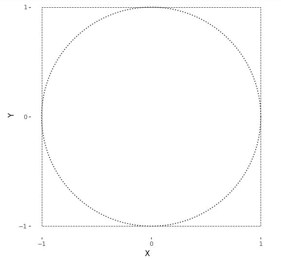

# Continuous Random Variables

So far, we have only considered discrete random variables, i.e.,
variables taking only integer values.  But what if we want to use
random variables to represent lengths or volumes or distances or
masses or concentrations or any of the other continuous properties in
the physical world?  We will need to generalize our approach so far.

Continuous random variables take on real values.  The set of real
numbers is *uncountable* in the sense of being strictly larger than
the set of integers.^[Georg Cantor developed the technique of
diagonalization to show it was impossible to have a one-to-one map
from the reals to the integers, thus proving the set of reals is
uncountable.]

The mathematics of probability is the same for real values.  Even more
importantly from a practical standpoint, the way we calculate event
probabilities and estimates remains the same with continuous
quantities.  The notion of a probability mass function, on the other
hand, must be replaced by its continuous equivalent, the probability
density function.


## Spinners and uniform continuous variables

Suppose $$\Theta$$ is a random variable representing the angle at which
a fair spin of a spinner lands.  We will use degrees and thus suppose
the value of $$\Theta$$ is between 0 and 360^[The end points are the
same, representing a complete rotation of 360 degrees; they are
labeled as such in the plot.]

A spinner resting at 36 degrees, or ten percent of the way around the circle.  A fair spin might land anywhere between 0 and 360 degrees.


```
df_spinner <- data.frame(value = c("0-360 degrees"), prob = c(0.3))
plot_spinner <-
  ggplot(data = df_spinner,
         aes(x = factor(1), y = prob, fill = value)) +
  geom_bar(stat = "identity", position = "fill", fill = "#ffffe8",
           color="black", size = 0.25) +
  coord_polar(theta = "y") +
  geom_segment(aes(y =  0.1, yend =  0.1, x = -1, xend = 1.375),
               arrow = arrow(type = "open"),
	       size = 0.5, color = "#666666") +
  geom_point(aes(x = -1, y = 0), color = "#666666", size = 3) +
  scale_x_discrete(breaks = c()) +
  scale_y_continuous(breaks = c(0, 0.1, 0.25, 0.5, 0.75),
                     labels = c("360 | 0    ", "36", "90", "180", "270")) +
  xlab(expression(paste(theta, " degrees"))) +
  ylab("") +
  ggtheme_tufte() +
  theme(legend.position = "none")
plot_spinner
```
{. language-r}


What does fair mean for continuous probabilities?  At the least, we
should be able to say that the probality of landing in any band is the
same no matter where the band lies on the circle.  That is, landing
between 0 and 36 degrees should be the same as landing between 200 and
236 degrees.  Also, because 36 degrees is one tenth of the way around
the circle, the chance of landing in any 36 degree band has to be
10%.^[A circle can be divided into ten bands of 36 degrees to create
exhaustive and exclusive intervals, the event probabilities of landing
in which must be the same by fairness and must total one because they
exhaust all possible outcomes.]  We can express that in probability
notation as


$$
\mbox{Pr}[0 \leq \Theta \leq 36]
\ = \
\frac{1}{10}
$$

and

$$
\mbox{Pr}[200 \leq \Theta \leq 236]
\ = \
\frac{1}{10}.
$$

We are not talking about the probability of $$\Theta$$ taking on a
particular value, but rather of it falling in a particular interval.^[
In general, the probability of a fair spinner $$\Theta$$ falling in
interval is the fraction of the circle represented by the interval, i.e.,
$$
\mbox{Pr}[\theta_1 \leq \Theta \leq \theta_2]
= \frac{\theta_2 - \theta_1}{360}.
$$
for $$0 \leq \theta_1 \leq \theta_2 \leq 360.$$]
For continuous random variables, outcomes do not have probability
mass.  Instead, probability mass is assigned continuously based on the
probability of a variable falling in a region.

## The paradox of vanishing point probabilities

In our first example, we took a fair spinner to land at exactly 36
degrees; it could've been 36.0376531 degrees or even an irrational
number such as $$0.3333\cdots.$$^[When I learned decimal
representations, we wrote $$0.\bar{3}$$ for the decimal
representation of $$\frac{1}{3}.$$] What's the probability the spinner
landed on exactly 36 degrees? Paradoxically, the answer is zero.

$$
\mbox{Pr}[\Theta = 36] = 0.
$$

Why must this be?  If the probability of any specific outcome was
greater than zero, every other possible value would have to have the
same probability to satisfy fairness.  But then if we summed them all
up, the total would be greater than one, which is not possible.
Something has to give, and that something is the idea of particular
point outcomes having probability mass in a continuous distribution.
The paradox arises because some number must come up, but every number
has zero probability.

## Simulating uniform values

We will assume that our programming language comes equipped with a
function `uniform_rng(L, H)` that generates numbers uniformly in the
interval $$[L, H]$$.

For instance, the following program simulates from the uniform
interval.


```
import numpy as np

M = 5  # Number of elements
y = np.zeros(M)  # Initialize the output array with zeros

for m in range(M):
    y[m] = np.random.uniform(0, 1)

print('y =', y)
```
{: .language-python}

```
y = [0.38758361 0.45822924 0.24143984 0.44435819 0.25484211]
```
{: .output}

Let's simulate $$M = 10$$ draws and look at the result,

<!--  -->

```
 import numpy as np

np.random.seed(1234)  # Set the random seed
M = 10  # Number of elements
y = np.random.uniform(size=M)  # Generate the random array

for m in range(M):
    print(f'{y[m]:5.4f}', end=' ')  # Print each element with format '5.4f'
```
{: .language-python}

```
0.1915 0.6221 0.4377 0.7854 0.7800 0.2726 0.2765 0.8019 0.9581 0.8759
```
{: .output}

These are only printed to a few decimal places.  As usual, it's hard
to get a sense for the sequence of values as raw numbers.  The most popular way to summarize one-dimensional data is with a *histogram*, as shown in the following plot.

Histogram of 10 draws from a $$\\mbox{uniform}(0, 1)$$ distribution.

<!--  -->

```
from plotnine import *
import pandas as pd

df_unif_10 = pd.DataFrame({'y': y})
unif_10_plot = ggplot(df_unif_10, aes(x='y')) + \
  geom_histogram(binwidth=0.1, center=0.05, color="black", fill="#ffffe6", size=0.25) + \
  scale_x_continuous(breaks=[i/10 for i in range(0, 11)], limits=[0, 1], expand=[0, 0.02], name="y") + \
  scale_y_continuous(breaks=[1, 2, 3, 4, 5], expand=[0.02, 0], name="count") + \
  theme_tufte()

print(unif_10_plot)
```
{: .language-python}


The range of values from 0 to 1 is broken up into ten equally spaced
bins, 0 to 0.1, 0.1 to 0.2, up to 0.9 to 1.0. Each bin is then drawn
as a rectangle with a height proportional to the number of values that
fell into the bin.

Even though the distribution draws uniformly in the interval, with
only ten draws, the probability of having one draw in each bin is
small,^[The first draw can be in any bin, the second in any of 9 bins,
the third in any of 8 bins, and so on, yielding a probability for each
bin containing a single draw of $$\prod_{n=1}^{10} \frac{n}{10}
\approx 0.00036.$$] whereas the probability of having many values in a
single bin is relatively high.^[For example, the probability of having
a bin with exactly five draws involves a choice of the distinguished
bin, a choice of which of the five draws go in the distinguished
bin, then the probabilities of the distinguished bins and other bins,
$${10 \choose 1} \times {10 \choose 5} \times \left(\frac{1}{10}\right)^5 \times
\left(\frac{9}{10}\right)^5 \approx 0.015.$$]  As usual, we turn to
repetition and sizing to see what's going on.

Histograms for uniform(0, 1) samples of increasing sizes.  The proportion of draws falling into each bin becomes more uniform as the sample size increases.  With each sample plotted to the same height, the vertical count axis varies in scale among the plots.


```
import pandas as pd
import numpy as np
import matplotlib.pyplot as plt
import seaborn as sns
import plotnine as p9

np.random.seed(1234)
df_unif = pd.DataFrame()
for N in [2**n for n in range(2, 13, 2)]:
    y = np.random.uniform(size=N)
    df_unif = pd.concat([df_unif, pd.DataFrame({'y': y, 'size': ['N={}'.format(N)] * N})])

plot = (
    p9.ggplot(df_unif, p9.aes(x='y')) +
    p9.facet_wrap('size', scales='free') +
    p9.geom_histogram(binwidth=0.1, center=0.05, color='black', fill='#ffffe6') +
    p9.scale_x_continuous(breaks=[0, 0.5, 1], labels=['0.0', '0.5', '1.0'], limits=[0, 1], expand=[0, 0.02]) +
    p9.scale_y_continuous(name='proportion of draws', breaks=[], expand=(0.02, 0)) +
    p9.theme(panel_spacing={'y': 24, 'x': 24}, aspect_ratio=0.5, subplots_adjust={'wspace': 0.25}) +
    p9.theme_tufte()+ theme(subplots_adjust={'hspace': 0.25}))
plot
```
{: .language-python}


## Calculating $$\pi$$ via simulation

Now that we have a continuous random number generator, there are all
kinds of values we can compute. Here, we show how to calculuate the
first few digits of $$\pi$$. We'll carry this out by formulating an
event probability over some continuous random variables whose
probability is a fraction of $$\pi$$.


We start with the basic fact of algebra that that $$\pi$$ is the area of
a unit radius circle.^[The area of a circle of radius $$r$$ is $$\pi
\times r^2$$, so when $$r = 1$$, the area is $$\pi$$.] We then assume there
are two independent, uniform random variables $$X$$ and $$Y$$,

$$
X, Y \sim \mbox{uniform}(-1, 1).
$$

Simulations $$x^{(m)}, y^{(m)}$$ of these variables pick out a point on
the plane within a square bounded by -1 and 1 in both dimensions. Here
is a plot of the square in which the draws will fall. Also shown is a
circle of unit radius inscribed within that square.  Draws may or may
not fall within the circle.^[Technically, the
bearer of area is a disc and the line around its border a circle.
Mathematicians are picky because, topologically speaking, a disc has
two dimensions whereas a circle has but one.]

A unit circle (dotted line) centered at the origin is inscribed in a square (dashed lines) with axes running from -1 to 1.

```
import numpy as np
import plotnine as p9
from plotnine.themes import theme_tufte
from numpy import cos
from numpy import sin


radians = np.linspace(0, 2*np.pi, 100)

bullseye_target_plot = (
  p9.ggplot(p9.aes(x='X', y='Y')) +
  p9.geom_path(
    data=p9.aes(x=cos(radians), y='sin(radians)'), 
    size=0.8, color='#333333', linetype="dotted"
  ) +
  p9.geom_path(
    data=p9.aes(x=[-1, -1, 1, 1, -1], y=[-1, 1, 1, -1, -1]), 
    size=0.4, color='#333333', linetype="dashed"
  ) +
  p9.scale_x_continuous(limits=[-1, 1], breaks=[-1, 0, 1]) +
  p9.scale_y_continuous(limits=[-1, 1], breaks=[-1, 0, 1]) +
  p9.coord_fixed(ratio=1) +
  theme_tufte()
)
bullseye_target_plot

```
{: .language-python}



A point $$(x, y)$$ will fall within the unit circle if^[A point falls on
a circle of radius $$r$$ if $$x^2 + y^2 = r^2$$.]

$$
x^2 + y^2 \leq 1.
$$

Let's see what this looks like with $$M = 250$$ draws.  The resulting
plot is known as a *scatterplot*---it places values at their $$(x, y)$$
coordinates, resulting in them being "scattered."

$$M = 250$$ simulated draws of $$(x^{(m)}, y^{(m)})$$ from a $$\\mbox{uniform}(-1, 1)$$ distribution.  Points within the circle are plotted using $$+$$ and those outside it with $$\\circ$$.

<!--  -->

```
import numpy as np
import pandas as pd
import plotnine as p9
from plotnine.themes import theme_tufte

np.random.seed(1234)

M = 250
X = np.random.uniform(-1, 1, size=M)
Y = np.random.uniform(-1, 1, size=M)
df = pd.DataFrame({'X': X, 'Y': Y, 'within': (X**2 + Y**2 < 1)})

radians = np.linspace(0, 2*np.pi, 200)

bullseye_plot = (
    p9.ggplot(df, p9.aes(x='X', y='Y')) +
    p9.annotate("path", x=np.cos(radians), y=np.sin(radians),
                 size=0.8, color='#333333', linetype="dashed") +
    p9.annotate("path", x=[-1, -1, 1, 1, -1], y=[-1, 1, 1, -1, -1],
                 size=0.4, color='#333333', linetype="dotted") +
    p9.geom_point(p9.aes(shape='within', color='within'), size=2.25) +
    p9.scale_shape_manual(values=[1, 3]) +
    p9.scale_color_manual(values=["blue","red"]) + #"#333333", "#111111"
    p9.scale_x_continuous(limits=[-1, 1], breaks=[-1, 0, 1]) +
    p9.scale_y_continuous(limits=[-1, 1], breaks=[-1, 0, 1]) +
    p9.coord_fixed(ratio=1) +
    theme_tufte() +
    p9.theme(legend_position="none")
)

bullseye_plot

```
{: .language-python}


For random variables $$X, Y \sim \mbox{uniform}(-1, 1)$$, the event of
their falling within the unit circle is $$X^2 + Y^2 \leq 1$$. Because
$$X$$ and $$Y$$ are drawn uniformly from within the square, the
probability of their being within the circle is proportional to the
circle's area. The circle's area is $$\pi$$, whereas the overall area of
the square is 4. So the probability of a random draw within the square
being within the circle is

$$
\mbox{Pr}[X^2 + Y^2 \leq 1] = \frac{\pi}{4}.
$$

We know how to estimate event probabilities using simulation.  The
code here is straightforward.

```
import random

M = 1000000  # set the number of samples
inside = 0  # initialize the counter for points inside the circle

# generate M random points and count how many are inside the circle
for m in range(M):
    x = random.uniform(-1, 1)
    y = random.uniform(-1, 1)
    if x**2 + y**2 <= 1:
        inside += 1

# estimate pi using the number of points inside the circle
pi_estimate = 4 * inside / M

# print the results
print('Pr[in circle] =', inside / M)
print('estimated pi =', pi_estimate)

```
{: .language-python}

```
Pr[in circle] = 0.78507
estimated pi = 3.14028
```
{: .output}

We recover the simulation-based estimate of $$\pi$$ by multiplying the
event probability of $$X^2 + Y^2 \leq 1$$ by four.

Let's run this with $$M = 1,000,000$$ and see what we get,

```
import numpy as np

np.random.seed(1234)  # set the random seed
M = 1000000  # set the number of samples
X = np.random.uniform(-1, 1, M)
Y = np.random.uniform(-1, 1, M)
inside = np.sum(X**2 + Y**2 < 1)  # count the number of points inside the circle
Pr_target = inside / M  # compute the target probability

# print the results
print(f"Pr[in circle] = {Pr_target:.3f}")
print(f"estimated pi = {4 * Pr_target:.3f}")
 
```
{: .language-python}
```
Pr[in circle] = 0.786
estimated pi = 3.143
```

We actually knew the answer ahead of time here, $$\pi \approx 3.14159$$.
The simulation-based estimate is on the right track.^[But not going to
win any $$\pi$$ digit-generating contests, either. Remember, we need one
hundred *times* as many draws for each subsequent digit of precision
using i.i.d. simulation.] At least the first couple of digits are
correct.

If you want to do this all the old-fashioned way with calculus, note
that the top half of the circle is given by the function $$y = \sqrt{1
- x^2}$$.  Integrating this from $$-1$$ to $$1$$ and doubling it thus
produces the required value,

$$
\pi = 2 \times \int_{-1}^1 \sqrt{1 - x^2} \, \mathrm{d}x.
$$

Simulation-based methods are largely used in practice to solve nasty
integrals without analytic solutions.


## The curse of dimensionality

In most introductory examples, including the ones in this book,
intuitions are developed based on one or two dimensions---essentially,
we use what can be visualized. It turns out that intuitions based on a
few dimensions are not only useless, but harmful, when extended to
higher dimensions.  This section attempts to explain why, and along
the way, introduce the key notion for sampling of the typical set.

Working by example, let's start with the base case of a single random
variable $$X_1$$ with a uniform distribution over the line in the
interval $$(0, 1)$$,

$$
X_1 \sim \mbox{uniform}(0, 1).
$$

The length of our unit line is one (hence the name), so the
probability of falling in an interval is proportional to the
interval's length.^[This also explains why a point has probability
zero---it has length zero.]

Now extend this to two dimensions, letting the pair of random
variables $$(X_1, X_2)$$ be uniformly distributed in the unit
square, $$(0, 1) \times (0, 1)$$,

$$
X_1, X_2 \sim \mbox{uniform}(0, 1).
$$

The area of a $$1 x 1$$ square is one, so that the probability of
falling in a region within that square is proportional to the area of the region.^[Thus a point or a line has zero probability in a square.]

Going one dimension further, let $$(X_1, X_2, X_3)$$ be random variables
uniformly distributed in a unit cube, $$(0, 1)^3 = (0, 1) \times (0, 1)
\times (0, 1)$$,

$$
X_1, X_2, X_3 \sim \mbox{uniform}(0, 1).
$$

The unit cube has unit volume, $$1 \times 1 \times 1 = 1$$. Thus
the probability of falling in a region within that cube is
proportional to the volume of the region.^[Thus a plane has zero
probability in a cube. This generalizes in the obvious way, so this
will be the last note.]

Now we can just go all the way, and let $$X = (X_1, \ldots, X_N)$$ be an
$$N$$-dimensional random variable generated uniformly in an
$$N$$-dimensional unit hypercube, $$(0, 1)^N$$,

$$
X_n \sim \mbox{uniform}(0, 1) \ \ \mbox{for} \ \ n \in 1:N.
$$

As before, the hypervolume is $$1 \times 1 \times \cdots \times 1 = 1$$,
so the probability of lying in a region of the hypercube is
proportional to the hypervolume of the region.^[The fact that we go
from line to square to cube and then run out of words should be a
tipoff that we're barely acquainted with high dimensions. To be fair,
we have "tesseract" for a four-dimensional hypercube, but that's a
technical term that might have lain buried in introductions to
geometry if not for the Marvel Universe, and even there, it was known
colloquially as "the cube."]

We saw that in two dimensions, the probability of a random draw from a
unit square lying in the inscribed circle was approximately 0.74. As
dimensionality increases, this number goes to zero quickly. In other
words, most of the probability mass (as measured by hypervolume) in
high dimensions lies in the corners.  Let's see just how much by
simulation.

```
import numpy as np

def euclidean_length(x):
    return np.sqrt(np.sum(np.square(x)))

max_log2_N = 10
M = 5

mean_d = np.zeros(max_log2_N)
min_d = np.zeros(max_log2_N)
max_d = np.zeros(max_log2_N)

for log2_N in range(1, max_log2_N+1):
    N = 2**log2_N
    d = np.zeros(M)
    for m in range(M):
        x = np.random.uniform(-0.5, 0.5, size=N)
        d[m] = euclidean_length(x)
    mean_d[log2_N-1] = np.mean(d)
    min_d[log2_N-1] = np.min(d)
    max_d[log2_N-1] = np.max(d)

```
{: .language-python}

We take `x^2` to operate elementwise on the members of `x`, e.g.,
$$(1, 2, 3)^2 = (1, 4, 9)$$.  The square root, sum, and other operations
should be self explanatory.  The Euclidean length function is being
defined with *lambda abstraction*, where the `x.` indicates that the
argument to the function is `x` and the result is the result of
plugging the value for `x` into the body, `sqrt(sum(x^2))`.

Let's plot what we get out to $$1,000$$ dimensions or so.

Plot of the average distance (solid line) of a uniform draw from a hypercube to the center of the hypercube as a function of the number of dimensions.  The minimum and maximum distance (dotted lines) are shown based on $$M = 10,000$$ simulations.

<!--  -->

```
import numpy as np
import pandas as pd
import matplotlib.pyplot as plt

def euclidean_length(x):
    return np.sqrt(np.sum(x**2))

np.random.seed(1234)
M = 10000
log2maxN = 10
min_d = np.empty(log2maxN)
max_d = np.empty(log2maxN)
mean_d = np.empty(log2maxN)
d = np.empty(M)
for log2n in range(1, log2maxN+1):
    n = 2**log2n
    for m in range(M):
        x = np.random.uniform(-0.5, 0.5, size=n)
        d[m] = euclidean_length(x)
    min_d[log2n-1] = np.min(d)
    max_d[log2n-1] = np.max(d)
    mean_d[log2n-1] = np.mean(d)
# print(f'min_d[log2n-1]={min_d},max_d[log2n-1] ={max_d },mean_d[log2n-1]={mean_d}')
df_curse = pd.DataFrame({
    'dimensions': np.repeat(2**np.arange(1, log2maxN+1), 3),
    'distance': np.concatenate((min_d, mean_d, max_d)),
    'type': np.repeat(['min', 'mean', 'max'], log2maxN)
})
# print(df_curse )
curse_plot = (
    ggplot(df_curse, aes(x='dimensions', y='distance')) +
    geom_line(aes(linetype='type'), size=0.5) +
    scale_x_log10(breaks=[1, 10, 100, 1000, 10000]) +
    scale_y_continuous(breaks=[0, 2, 4, 6, 8, 10]) +
    scale_linetype_manual(values=['dotted', 'solid', 'dotted']) +
    ylab('Distance of draw to center') +
    xlab('Dimensions of unit hypercube') +
    theme_tufte() +
    theme(legend_position='none')
)
curse_plot
 
```
{: .language-python}


While it may seem intuitively from thinking in two dimensions that
draws should be uniformly dispersed and thus appear near the origin,
they in fact do two things that are quite surprising based on our
low-dimensional intuitions,

* draws get further and further away from the origin, on average, as
dimension increases, and
* draws accumulate in a thin shell of distance from the origin, with
no draws being anywhere near the origin in high dimensions.

The first fact is obvious when you consider the definition of distance
is the square root of the squared dimension values, which we will
write as

$$
||x|| = \sqrt{x_1^2 + x_2^2 + \cdots + x_N^2}.
$$

In this form, it is clear that as $$N$$ increases, so does $$
||x||
$$ as we
simply keep adding squared terms $$x_n^2$$ with each additional
dimension.

Although the draws accumulate in a thin shell of distance from the
origin, it would be wrong to conclude that they are anywhere near each
other.  They are further from each other, on average, than they are
from the origin.  For example, let's simulate just for 100 dimensions,

```
import numpy as np

M = 10000
N = 10
d = np.empty(M)
for m in range(M):
    x = np.random.uniform(-0.5, 0.5, size=N)
    y = np.random.uniform(-0.5, 0.5, size=N)
    d[m] = np.sqrt(np.sum((x - y)**2))
print('min =', np.min(d), '; mean =', np.mean(d), '; max =', np.max(d))

```
{: .language-python}


```
min = 0.38514151598863117 ; 
mean = 1.2702829208415631 ; 
max = 2.1206861405752284
```
{: .output}

Let's run that for $$M = 10,000$$ and $$N = 100$$ and see what we get.

```
import numpy as np

N = 100
M = 10000
d = np.empty(M)
for m in range(M):
    x = np.random.uniform(size=N)
    y = np.random.uniform(size=N)
    d[m] = np.sqrt(np.sum((x - y)**2))
print(f"min = {np.min(d):.1f}; mean = {np.mean(d):.1f}; max = {np.max(d):.1f}")

```
{: .language-python}

```
min = 3.1; mean = 4.1; max = 5.0
```
{: .output}

We see that the average distances between randomly generated points is
even greater than the average distance to the origin.