# Continuous Distributions and Densities

## Continuous cumulative distribution functions

Suppose $$\Theta \sim \mbox{uniform}(0, 360)$$ is the result of spinning
a fair spinner.  The cumulative distribution function is defined
exactly as for discrete random variables,^[Note that we have moved
from Roman to Greek letters, but have kept to our capitalization
convention for random variables---$$\Theta$$ is the capitalized form of
$$\theta$$.]

$$
F_{\Theta}(\theta) = \mbox{Pr}[\Theta \leq \theta].
$$

That is, it's the probability the random variable is less than or
equal to $$\theta$$.  In this case, because the spinner is assumed to be
fair, the cumulative distribution function is

$$
F_{\Theta}(\theta) = \frac{\theta}{360}.
$$

This is a linear function of $$\theta$$, i.e., $$\frac{1}{360} \times
\theta$$, as is reflected in the following plot.

Cumulative distribution function for the angle $$\theta$$ (in degrees) resulting from a fair spin of a spinner.  The dotted line shows the value at 180 degrees, which is a probability of one half and the dashed line at 270 degrees, which is a probability of three quarters.

<!-- 
y = np.array([0, 0, 1, 1])

# Create the figure and axis
fig, ax = plt.subplots()

# Plot the line
ax.plot(x, y, color="#333333", linewidth=0.5)

# Set the x and y axis labels
ax.set_xlabel(r'$\theta$')
ax.set_ylabel(r'$F_\Theta(\theta)$')

# Set the x and y axis limits and ticks
ax.set_xlim([-90, 360])
ax.set_xticks([0, 90, 180, 270, 360])
ax.set_ylim([0, 1])
ax.set_yticks([0, 0.25, 0.5, 0.75, 1])
ax.set_yticklabels(["0", r"$\frac{1}{4}$", r"$\frac{1}{2}$", r"$\frac{3}{4}$", "1"])

# Add the dotted and dashed lines
ax.plot([180, 180], [0, 0.5], color="#333333", linestyle="dotted", linewidth=1)
ax.plot([180, -90], [0.5, 0.5], color="#333333", linestyle="dotted", linewidth=1)
ax.plot([270, 270], [0, 0.75], color="#333333", linestyle="dashed", linewidth=0.5)
ax.plot([270, -90], [0.75, 0.75], color="#333333", linestyle="dashed", linewidth=0.5)

# Show the plot
plt.show()

```
{: .language-python}

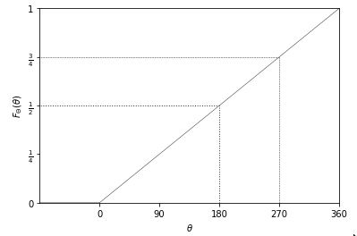

We can verify this result using simulation.  To estimate cumulative
distribution functions, we take $$M$$ simulated values $$\theta^{(m)}$$ and
then sort them in ascending order.

```
import numpy as np

M = 100  # Set the value of M

theta = np.zeros(M)  # Create an empty numpy array for theta

# Generate M uniform random numbers between 0 and 360 and store them in theta
theta = np.random.uniform(low=0, high=360, size=M)

theta_ascending = np.sort(theta)  # Sort theta in ascending order

prob = np.arange(1, M+1) / M  # Calculate the probabilities

```
{: .language-python}

The expression `(1:M)` denotes the sequence $$1, 2, \ldots, M$$, so that
`(1:M) / M` denotes $$\frac{1}{M}, \frac{2}{M}, \ldots, \frac{M}{M}$$.
The trick is to put the sorted random variable the $$x$$-axis and the
probability values on the $$y$$ axis. Here's a run with $$M = 1,000$$
simulated values.

Plot of the cumulative distribution function of a random variable $$\theta$$ representing the result of a fair spin of a spinner from 0 to 360 degrees.  As expected, it is a simple linear function because the underlying variable $$\theta$$ has a uniform distribution.


```
import numpy as np
import pandas as pd
from plotnine import ggplot, aes, geom_line, scale_x_continuous, scale_y_continuous, xlab, ylab

M = 1000
theta = np.random.uniform(0, 360, size=M)
theta_asc = np.sort(theta)
prob = np.arange(1, M+1) / M

unif_cdf_df = pd.DataFrame({'theta': theta_asc, 'prob': prob})
unif_cdf_plot = (
    ggplot(unif_cdf_df, aes(x='theta', y='prob')) +
    geom_line() +
    scale_x_continuous(breaks=[0, 90, 180, 270, 360]) +
    scale_y_continuous(breaks=[0, 0.25, 0.5, 0.75, 1.0]) +
    xlab('$\\theta$') +
    ylab('$F_\\Theta(\\theta)$')
)
unif_cdf_plot

```
{: .language-python}

<!-- 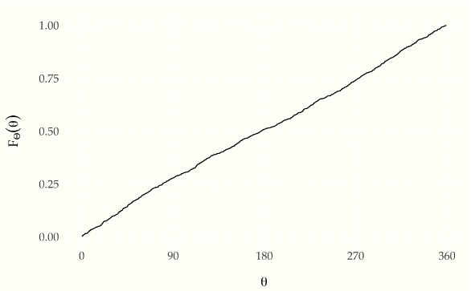 -->
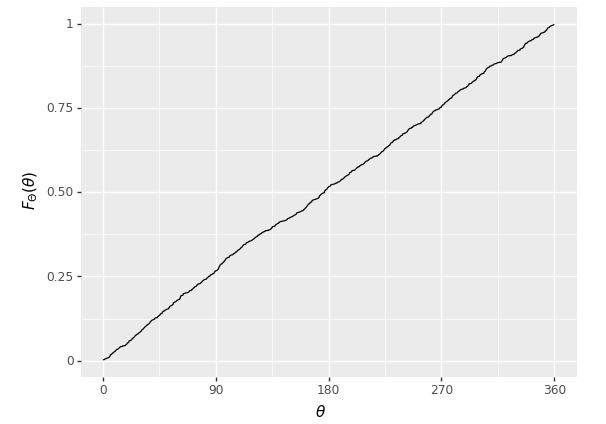

Even with $$M = 1,000$$, this is pretty much indistinguishable from the
one plotted analytically.

As with discrete parameters, the cumulative distribution function may
be used to calculate interval probabilities, e.g.,^[With continuous
variables, the interval probabilities are open below ($$180 < \Theta$$)
and closed above ($$\Theta \leq 270$$), due to the definition of the
cumulative distribution function as a closed upper bound
($$F_{\Theta}(\theta) = \mbox{Pr}[\Theta \leq \theta]$$).]

$$
\begin{array}{rcl}
\mbox{Pr}[180 < \Theta \leq 270]
& = & \mbox{Pr}[\Theta \leq 270] \ - \ \mbox{Pr}[\Theta \leq 180]
\\[2pt]
& = & F_{\Theta}(270) - F_{\Theta}(180)
\\[2pt]
& = & \frac{3}{4} - \frac{1}{2}
\\[2pt]
& = & \frac{1}{4}.
\end{array}
$$


## The log odds transform

Now that we have seen how to generate uniform random numbers from 0 to
360, it is time to consider generating standard uniform variates from
0 to 1. Suppose $$\Theta$$ is a random variable with a standard uniform
distribution, i.e., $$\Theta \sim \mbox{uniform}(0, 1)$$.  Because
probabilities are scaled from zero to one, we can think of $$\Theta$$ as
denoting a random probability.

Given a probability value $$\theta \in (0, 1)$$, we can define its *log odds* by

$$
\mbox{logit}(\theta) = \log \frac{\theta}{1 - \theta}.
$$

This is just the natural logarithm of the odds, $$\frac{\theta}{1 -
\theta}$$.  Now let

$$
\Phi = \mbox{logit}(\Theta)
$$

be the random variable representing the log odds. We say that $$\Phi$$
is a transform of $$\Theta$$, because its value is determined by the
value of $$\Theta$$.

Simulating transformed variables is straightforward.

```
import numpy as np

M = 1000
theta = np.random.uniform(0, 1, size=M)
alpha = np.log(theta / (1 - theta))

print(f'alpha = {alpha[:10]} ...')


```
{: .language-python}

```
alpha = [ 1.99678538 -1.77469355 -0.77809048  0.70232242  0.52317288 -2.15661683
 -1.72339989 -0.29737391 -3.47165039  0.2311787 ] ...
```
{: .output}

We can run this and see the first ten values,

<!-- 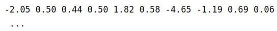 -->

```
import numpy as np

np.random.seed(1234)

M = 10000

def logit(x):
    return np.log(x / (1 - x))

theta = np.random.uniform(size=M)
alpha = logit(theta)

for m in range(10):
    print(f'{alpha[m]:.2f}', end=' ')
    
print('...') 


```
{: .language-python}

```
-1.44 0.50 -0.25 1.30 1.27 -0.98 -0.96 1.40 3.13 1.95 ...
```
{: .output}

To understand the distribution of values of $$\Phi$$, let's look at histograms.  First, we have the uniform draws of $$\Theta$$, and then the transform to log odds $$\Phi = \mathrm{logit}(\Theta)$$,
Histogram of 10,000 simulated draws of $$\theta \sim \mbox{uniform}(0, 1)$$.

<!-- 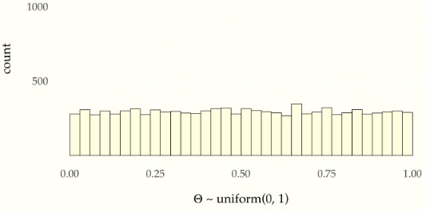 -->

```
import pandas as pd
from plotnine import ggplot, aes, geom_histogram, scale_x_continuous, scale_y_continuous, xlab
from plotnine.themes import theme_minimal

df_prob_unif = pd.DataFrame({'theta': theta})
unif_prob_plot = (
    ggplot(df_prob_unif, aes(x='theta')) +
    geom_histogram(binwidth=1/34, center=1/68, color='black',
                   fill='#ffffe6', size=0.25) +
    scale_x_continuous(breaks=[0, 0.25, 0.5, 0.75, 1]) +
    scale_y_continuous(limits=[0, 1300], breaks=[500, 1000]) +
    xlab('$\\theta$ ~ uniform(0, 1)') +
    theme_minimal()
)
unif_prob_plot

```
{: .language-python}


Histogram of 10,000 simulated draws of $$\theta \sim \mbox{uniform}(0, 1)$$ transformed to the log odds scale by $$\Phi = \mbox{logit}(\theta).$$

<!-- 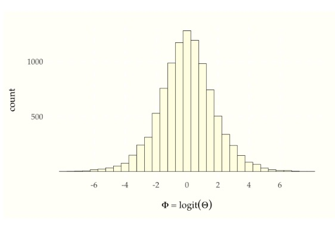 -->

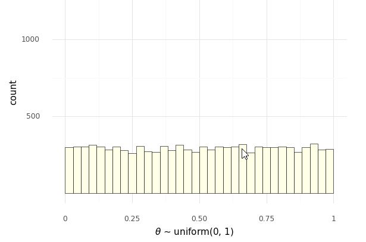

```
import pandas as pd
from plotnine import *
import numpy as np

np.random.seed(1234)

M = 10000
logit = lambda x: np.log(x / (1 - x))

theta = np.random.uniform(size=M)
alpha = logit(theta)

for m in range(10):
    print(f'{alpha[m]:.2f}', end=' ')
print('...')

df_prob_unif = pd.DataFrame({'theta': theta})
unif_prob_plot = (
    ggplot(df_prob_unif, aes(x='theta')) +
    geom_histogram(binwidth=1/34, center=1/68, color='black',
                   fill='#ffffe6', size=0.25) +
    scale_x_continuous(breaks=[0, 0.25, 0.5, 0.75, 1]) +
    scale_y_continuous(limits=[0, 1300], breaks=[500, 1000]) +
    xlab(r'$\Theta \sim \mathrm{uniform}(0, 1)$') +
    ggtitle('Probability density of uniform distribution') +
    theme_tufte()
)
unif_prob_plot

df_log_odds = pd.DataFrame({'alpha': alpha})
log_odds_plot = (
    ggplot(df_log_odds, aes(x='alpha')) +
    geom_histogram(binwidth=0.5, color='black', fill='#ffffe6',
                   size=0.25) +
    scale_x_continuous(breaks=[-6, -4, -2, 0, 2, 4, 6]) +
    scale_y_continuous(limits=[0, 1300], breaks=[500, 1000]) +
    xlab(r'$\varphi = \mathrm{logit}(\Theta)$') +
    ggtitle('Probability density of log-odds') +
    theme_tufte()
)
log_odds_plot
```
{: .language-python}

```
-1.44 0.50 -0.25 1.30 1.27 -0.98 -0.96 1.40 3.13 1.95 ...

```
{: .output}

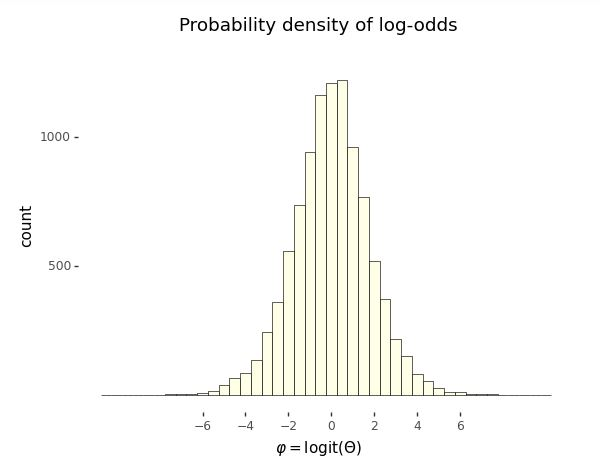

Even though the probability variable $$\Theta \sim \mbox{uniform}(0,
1)$$ is uniform by construction, the log odds variable $$\Phi =
\mbox{logit}(\Theta)$$ is not distributed uniformly.

A further feature of the log odds plot is that the distribution of
values is symmetric around zero. Zero on the log odds scale
corresponds to 0.5 on the probability scale,^[Recall that the inverse
log odds function is defined by $$\mbox{logit}^{-1}(u) = \frac{1}{1 +
\exp(-u)}.$$ This function is called the *logistic sigmoid* in
engineering circles. Inverses satisfy for $$u \in \mathbb{R}$$,
$$\mbox{logit}(\mbox{logit}^{-1}(u)) = u$$ and $$v \in (0, 1)$$,
$$\mbox{logit}^{-1}(\mbox{logit}(v)) = v.$$] i.e.,

$$
0 = \mbox{logit}(0.5),
$$

or equivalently,

$$
\mbox{logit}^{-1}(0) = 0.5.
$$

Unboundedness and symmetry around zero make log odds quite convenient
statistically and will resurface in categorical regressions.

The third relevant feature of the log odds plot is that almost all of
the values are within $$\pm 6$$ of the origin. This is not surprising
given that we took $$10,000$$ draws and

$$
\mbox{logit}^{-1}(-6) = 0.0025
$$

and

$$
\mbox{logit}^{-1}(6) = 0.9975
$$

on the probability scale.

We can also do what we did for uniform distributions and plot the
cumulative distribution based on simulation; we need merely insert the
log-odds transform.

```
import numpy as np

M = 1000# define the value for M

theta = np.zeros(M)
for m in range(M):
    theta[m] = np.random.uniform(0, 360)

theta_ascending = np.sort(the
```
{: .language-python}

We again plot with $$M = 1,000$$ simulated values.

Plot of the cumulative distribution function of a random variable $$\Phi = \mbox{logit}(\theta)$$ representing the log odds transform of a uniformly distributed random variable $$\theta \sim \mbox{uniform}(0, 1)$$.  The curve it picks out is S-shaped.  The asymptotes at 0 and 1 are indicated with dashed lines; the symmetries around 0 on the $$x$$-axis and 0.5 on the $$y$$-axis are picked out with dotted lines.


<!-- 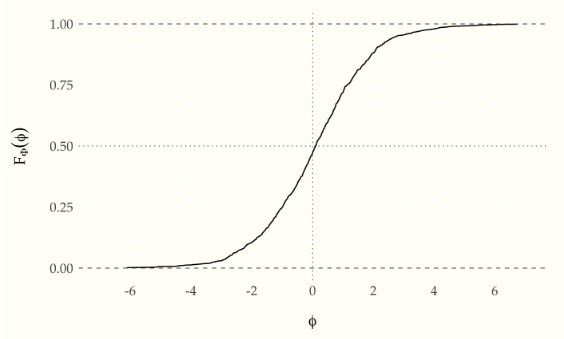 -->

```
import numpy as np
import pandas as pd
import matplotlib.pyplot as plt
import seaborn as sns

def logit(u):
    return np.log(u / (1 - u))

M = 1000
phi = logit(np.random.uniform(size=M))
phi_asc = np.sort(phi)
prob = np.arange(1, M+1) / M

logistic_cdf_df = pd.DataFrame({'phi': phi_asc, 'prob': prob})
logistic_cdf_plot = sns.lineplot(data=logistic_cdf_df, x='phi', y='prob', axes=plt.gca())
logistic_cdf_plot.axhline(y=1, linestyle='--', linewidth=0.3, color='#333333')
logistic_cdf_plot.axhline(y=0, linestyle='--', linewidth=0.3, color='#333333')
logistic_cdf_plot.axvline(x=0, linestyle=':', linewidth=0.3, color='#333333')
logistic_cdf_plot.axhline(y=0.5, linestyle=':', linewidth=0.3, color='#333333')
logistic_cdf_plot.set(xlim=(-7, 7), xticks=[-6, -4, -2, 0, 2, 4, 6], yticks=[0, 0.25, 0.5, 0.75, 1.0])
logistic_cdf_plot.set(xlabel=r'$\phi$', ylabel=r'$F_{\Phi}(\phi)$')
sns.set_style('ticks')
plt.show()


```
{: .language-python}

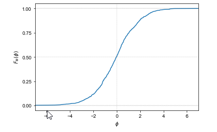

The result is an S-shaped function whose values lie between 0 and 1,
with asymptotes at one as $$\theta$$ approaches $$\infty$$ and at zero as
$$\theta$$ approaches $$-\infty$$.  The argument of 0 has a value of 0.5.

The cumulative distribution function of this distribution is well
known and has a closed analytic form based on the inverse of the log
odds transform,

$$
F_{\Theta}(\theta)
\ = \
\mathrm{logit}^{-1}(\theta)
\ = \
\frac{1}{1 + \exp(-\theta)}.
$$

The inverse log odds function is itself known as the
*logistic sigmoid* function.^[A name presumably derived from its shape
and the propensity of mathematicians, like doctors, to prefer Greek
terminology---the Greek letter "$$\sigma$$" (sigma) corresponds to the
Roman letter "S".]

## Expectation and variance of continuous random variables

Just as with discrete random variables, the expectation of a
continuous random variable $$Y$$ is defined as a weighted average of its
values.  Only this time, the weights are defined by the probability
density function rather than by the probability mass function.
Because $$Y$$ takes on continuous values, we'll need calculus to compute
the weighted average.

$$
\mathbb{E}[Y] = \int_{-\infty}^{\infty} y \times p_Y(y) \, \mathrm{d}y.
$$

Integrals of this general form should be read as a weighted average.
It averages the value of $$y$$ with weights equal to the density
$$p_Y(y)$$ of $$y$$.^[Sometimes physicists will rearrange integral
notation to reflect this and write $$\mathbb{E}[f(y)] = \int
\mathrm{d}y \ p_Y(y) \times f(y)$$ or even $$\mathbb{E}[f(y)] = \int
p_Y(\mathrm{d}y) \times f(y).$$]

Variances are calculated just as they were for discrete variables, as

$$
\mbox{var}[Y]
\ = \
\mathbb{E}\left[
\left(Y - \mathbb{E}[Y]\right)
\right].
$$

Let's check this with some simulation by estimating the mean and
variance of our running example. Suppose we have a a random variable
$$\Phi = \mbox{logit}(\Theta)$$, where $$\Theta \sim \mbox{uniform}(0,
1)$$. We can estimate the expectation and variance of $$\Phi$$ by
simulating and calculating means and variances of the simulated values,

```
import numpy as np

np.random.seed(1234)

M = 1000
phi = np.zeros(M)

for m in range(M):
    phi[m] = logit(np.random.uniform())

E_Phi = np.sum(phi) / M
var_Phi = np.sum((phi - E_Phi)**2) / M

print(f"Estimated E[Phi] = {E_Phi}; var[Phi] = {var_Phi}; sd[Phi] = {np.sqrt(var_Phi)}")

      
```
{: .language-python}


```
Estimated E[Phi] = 0.05805343885611037; var[Phi] = 3.609094985913; sd[Phi] = 1.8997618234697211
```
{: .output}

Let's run that for $$M = 1,000,000$$ and see what we get.

<!-- 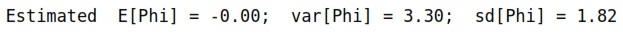 -->

```
import numpy as np

M = int(1e6)
phi = np.random.logistic(size=M)

E_Phi = np.sum(phi) / M
var_Phi = np.sum((phi - E_Phi)**2) / M

print(f"Estimated E[Phi] = {E_Phi:.2f}; var[Phi] = {var_Phi:.2f}; sd[Phi] = {np.sqrt(var_Phi):.2f}")


```
{: .language-python}

```
Estimated E[Phi] = -0.00; var[Phi] = 3.30; sd[Phi] = 1.82
```
{: .output}

The true value of the expectation $$\mathbb{E}[Y]$$ is zero, and the
true value of the variance is $$\frac{\pi^2}{3} \approx 3.29$$.^[The
true mean and variance for the logistic distribution can be calculated
analytically. See the final section on this chapter for the analytic
derivativation of the probability density function.  The density must
be integrated to analytically calculate the mean and variance, though
the result for the mean also arises from symmetry.]

## From histograms to densities

There is no equivalent of a probability mass function for continuous
random variables. Instead, there is a probability density function,
which in simulation terms may usefully be thought of as a limit of a
histogram as the number of draws increases and the width of bins
shrinks.  Letting the number of simulations grow from $$10$$ to
$$1,000,000$$, we see the limiting behavior of the histograms.

Histograms of $$M$$ simulated draws of $$\theta \sim \mbox{uniform}(0, 1)$$ transformed to the log odds scale by $$\Phi = \mbox{logit}(\theta).$$ The limiting behavior is shown in the bell-shaped curve in the lower right based on $$1,000,000$$ draws.

<!-- 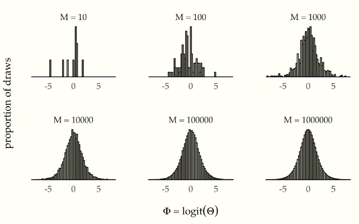 -->

```
import numpy as np
import pandas as pd
import matplotlib.pyplot as plt
import seaborn as sns

np.random.seed(1234)

df_log_odds_growth = pd.DataFrame()
for log10M in range(1, 7):
    M = 10**log10M
    alpha = np.random.logistic(size=M)
    df = pd.DataFrame({'alpha': alpha, 'M': [f'M = {M}']*M})
    df_log_odds_growth = pd.concat([df_log_odds_growth, df], ignore_index=True)

# Define the grid
grid = sns.FacetGrid(df_log_odds_growth, col='M', col_wrap=3)

# Plot the histogram for each group
grid.map(
    sns.histplot,
    'alpha',
    element='step',
    stat='density',
    common_norm=False,
    bins=75,
    palette='colorblind'
)

# Set the axis labels and limits
grid.set(
    xlim=(-8.5, 8.5),
    xticks=[-5, 0, 5],
    xlabel=r'$\Phi = \mathrm{logit}(\Theta)$',
    ylabel='proportion of draws'
)

# Show the plot
plt.show()

```
{: .language-python}

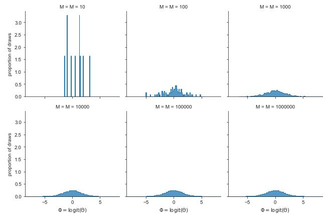

In a histogram, a bin's height is proportional to the number of
simulations that landed in that bin. Because each bin is the same
width, a bin's area (given by its width time its height) must also
be proportional to the number of simulations that landed in that bin.

With simulation, the estimate of a probability landing in a bin is
just the proportion of simulate values that land in the bin. Thus we
can think of the area of a histogram's bar as an estimate of the
probability a value will fall in that bin.

Because the bins are exclusive (a number can't fall in two bins), the
probability of landing in either of two bins is proportional to the
sum of their areas. This notion extends to intervals, where the
estimated probability of the random variable falling between -2 and 2
is just the proportion of area between those two values in the
histogram of simulations. Similarly, we can take a simulation-based
estimate of $$\mbox{Pr}[\Theta \leq \theta]$$ for any $$\theta$$ as the
proportion of simulated values that are less than or equal to
$$\theta$$. This is just the area to the left of the $$\theta$$.

As the number of draws $$M$$ increases, the estimated bin probabilities
become closer and closer to the true values. Now we are going to look
at the limiting continuous behavior. Put a point in the middle of the
top of each histogram bar and connect them with lines. With a finite
number of bins, that makes a jagged pointwise linear function. As the
number of bins increases and the number of draws per bin increases,
the function gets smoother and smoother. In the limit as $$M
\rightarrow \infty$$, it approaches a smooth function. That smooth
function is called the *probability density function* of the random
variable.  Let's see what that limiting function looks like with $$M =
1,000,000$$ draws.

Histogram of $$M = 1,000,000$$ simulations of $$\theta \sim \mbox{uniform}(0,1)$$ transformed to $$\Phi = \mbox{logit}(\theta)$$. The black line connects the tops of the histogram bins.  In the limit, as the number of draws and bins approach infinity, the connecting line approaches the probability density function for the variable being simulated.

<!-- 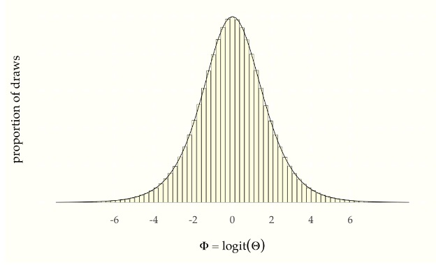 -->

```
import numpy as np
import pandas as pd
import matplotlib.pyplot as plt
import seaborn as sns
from scipy.stats import logistic

np.random.seed(1234)

M = int(1e6)
alpha = logistic.rvs(size=M)
density_limit_df = pd.DataFrame({'alpha': alpha})

density_limit_plot = sns.histplot(
    data=density_limit_df,
    x='alpha',
    stat='density',
    bins=75,
    color='blue',
    alpha=0.5
)
density_limit_plot.set(
    xlim=(-9, 9),
    xticks=[-6, -4, -2, 0, 2, 4, 6],
    xlabel=r'$\Phi = \mathrm{logit}(\Theta)$',
    ylabel='proportion of draws'
)
density_limit_plot.plot(
    np.linspace(-9, 9, num=1000),
    logistic.pdf(np.linspace(-9, 9, num=1000), loc=0, scale=1),
    color='red',
    linewidth=0.5
)
sns.set_style("ticks", {"xtick.major.size": 2, "ytick.major.size": 2})
sns.despine(offset=5)
plt.show()


```
{: .language-python}

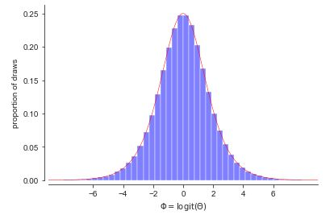

## A detour through calculus

We have seen that the probability of a variable falling in an interval
is estimated by proportion of the overall histogram area falls in the
interval---that is, the sum of the histogram areas in the interval.
What we want to do is let the number of bins and number of draws
continue to increase to get ever better approximations.  When we let
the number of bins increase toward infinity, we have a familiar limit
from integral calculus.

If $$p_Y(y)$$ is the continuous density function we get as the limit of
the histogram, then the probability that $$Y$$ falls between $$a$$ and $$b$$
is given by the proportion of area between $$a$$ and $$b$$ in the function
$$p_Y(y)$$. This is the key insight for understanding density functions
and continuous random variables.  For bounded intervals, we have

$$
\mbox{Pr}[a \leq Y \leq b]
\ \propto \
\int^b_a \ p_Y(y) \, \mathrm{d}y.
$$

To make our lives easier and avoid writing the proportional-to symbol
($$\propto$$) everywhere, we will make the conventional assumption that
our density functions like $$p_Y$$ are *normalized*.  This means that
the total area under their curve is one,

$$
\int_{-\infty}^{\infty} p_Y(y) \, \mathrm{d}y \ = \ 1.
$$

Because they are based on the limits of histograms, which are counts,
we will also meet the standard requirement placed on density functions
that they be positive, so that for all $$y \in \mathbb{R}$$,

$$
p_Y(y) \geq 0.
$$

With these assumptions in place, we now define interval probabilities
using definite integration over density functions,

$$
\mbox{Pr}[a \leq Y \leq b]
\ = \
\int^b_a \ p_Y(y) \, \mathrm{d}y.
$$

For simple upper bounds, we just integrate from negative infinity,

$$
\mbox{Pr}[Y \leq b]
\ = \
\int_{-\infty}^b \ p_Y(y) \, \mathrm{d}y.
$$

This reveals the relation between the cumulative distribution function
$$F_Y) = \mbox{Pr}[Y \leq b]$$ and the probability density function $$p_Y$$

$$
F_Y(b) \ = \ \int_{-\infty}^b \ p_Y(y) \, \mathrm{d}y.
$$

Working the other way around, it reveals that the probability density
function is just the derivative of the cumulative distribution
function,

$$
p_Y(b) = \frac{\mathrm{d}}{\mathrm{d}y} F_Y(y) \Bigg|_{y = b}.
$$

Thus the units of a probability density function are change in
cumulative probability, not probability.  Density functions must be
integrated to get back to units of probability.


## The uniform density function

We've already seen the histograms for variables $$\Theta \sim
\mbox{uniform}(0, 1)$$ distributed uniformly from zero to one. With an
increasing numbers of draws, the histograms flatten out. With more
draws the histograms will level out even more until the density
becomes a straight line. This means that the probability density
function of a uniformly distributed random variable is
constant.^[Another way to reach the same conclusion is by calculus. We
worked out from first principles that the cumulative distribution
function is linear if uniformity means equal probability of landing in
any interval of the same size. The derivative of a linear function is
constant, so the density for a uniform distribution must be constant.]
 That is, if $$\Theta \sim \mbox{uniform}(a, b)$$, then
 $$p_{\Theta}(\theta) = c$$ for some constant $$c$$. Let's see what that
looks like so the solution for $$c$$ becomes evident.


<!-- 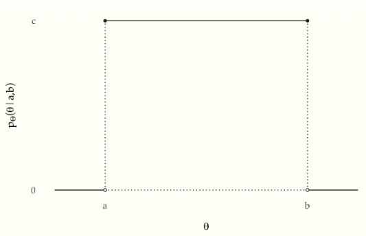 -->

```
import pandas as pd
import matplotlib.pyplot as plt
import seaborn as sns

uniform_pdf_df = pd.DataFrame({'y': [0, 1], 'p_y': [1, 1]})
sns.set(rc={'figure.figsize':(4,4)})
uniform_pdf_plot = sns.lineplot(data=uniform_pdf_df, x='y', y='p_y', marker='o', color='#333333')
uniform_pdf_plot.set(xticks=[0, 1], xticklabels=['a', 'b'], yticks=[0, 1], yticklabels=['0', 'c'], xlim=(-0.1, 1.1), ylim=(-0.1, 1.1), xlabel=r'$\theta$', ylabel=r'$p_{\Theta}(\theta|a,b)$')
uniform_pdf_plot.axhline(y=1, xmin=-0.1, xmax=0, linestyle='dotted')
uniform_pdf_plot.axhline(y=1, xmin=1, xmax=1.1, linestyle='dotted')
uniform_pdf_plot.axvline(x=0, ymin=0, ymax=1, linestyle='dotted')
uniform_pdf_plot.axvline(x=1, ymin=0, ymax=1, linestyle='dotted')
uniform_pdf_plot.text(-0.2, -0.1, '0')
uniform_pdf_plot.text(1.05, -0.1, '1')
plt.show()

```
{: .language-python}

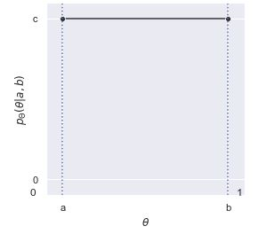

The plot shows the area from $$a$$ to $$b$$ under $$c$$ to be $$(b - a)
\times c$$. Given that we require the area to be one, that is, $$(b - a)
\times c = 1$$, we can work out $$c$$ by dividing both sides by $$b - a$$,

$$
c  = \frac{\displaystyle{1}}{\displaystyle b - a}.
$$

Putting this into density notation, if $$\Theta \sim \mbox{uniform}(a,
b)$$, then

$$
p_{\Theta}(\theta) = \mbox{uniform}(\theta \mid a, b),
$$

where we have now worked out that

$$
\mbox{uniform}(\theta \mid a, b) = \frac{1}{b - a}.
$$

That is, the density does not depend on $$y$$---it is constant and the
same for every possible value of $$\theta$$.^[For convenience, we can
assume the impossible values of $$\theta$$ have density zero.]


## Back to simulation

The traditional bottleneck to performing statistics beyond the data
collection was wrangling integral calculus to provide analytic results
or approximations for a given applied problem. Today, very general
numerical solvers absolve us of the heavy lifting of calculus and
replace it with wrangling computer code for simulations.  This lets us
solve much harder problems directly.

Let's actually solve the integral we mentioned in the last section,
namely the probability that a log odds variable will land between -2
and 2.

```
import numpy as np

success = 0
M = 1000 # replace with desired number of iterations
for m in range(1, M+1):
    Phi = np.random.uniform(0, 1)
    Phi = np.log(Phi / (1 - Phi))
    if -2 < Phi < 2:
        success += 1

print('Pr[-2 < Phi < 2] =', success / M)

```
{: .language-python}

```
Pr[-2 < Phi < 2] = 0.759
```
{: .output}

Let's run that for $$M = 100,000$$ simulation draws and see what we get,

<!-- 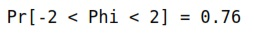
 -->
 
```
import numpy as np

np.random.seed(1234)
M = 100000
Phi = np.log(np.random.uniform(0, 1, M) / (1 - np.random.uniform(0, 1, M)))
success = 0
for m in range(M):
    if -2 < Phi[m] < 2:
        success += 1

print('Pr[-2 < Phi < 2] =', '{:.2f}'.format(success / M))

```
{: .language-python}


```
Pr[-2 < Phi < 2] = 0.87
```
{: .output}

What is perhaps more remarkable than not requiring calculus is that we
don't even require the formula for the density function $$p_{\Phi}$$---we
only need to be able to simulate random instantiations of the random
variable in question.

## Laws of probability for densities

Whether a random variable $$Y$$ is continuous or discrete, its
cumulative distribution function $$F_Y$$ is defined by

$$
F_Y(y) = \mbox{Pr}[Y \leq y].
$$

Using simulation, if $$Y$$ is a continuous random variable, its
probability density function $$p_Y$$ is the limit of the histogram of
simulation draws.  Using calculus, the density $$p_Y$$ of a continuous
random variable $$Y$$ is defined as the derivative of the cumulative
distribution function $$F_Y$$,^[Differential notation avoids the fiddly
notation arising from bound variables, e.g., $$p_Y(y) \ = \
\frac{\mathrm{d}}{\mathrm{d}y} F_Y(y).$$ With multivariate functions,
the derivative operator is replaced with the gradient operator $$\nabla.$$]

$$
p_Y = \mathrm{d} F_Y.
$$

Joint cumulative distribution functions for a pair of continuous random
variables $$X, Y$$ are defined as expected,

$$
F_{X, Y}(x, y) = \mbox{Pr}[X \leq x \ \mbox{and} \ Y \leq y],
$$

and may be easily extended to more variables.  With simulation,
cumulative distribution functions may be recreated by sorting the
simulated values and normalizing.

Joint densities for a pair $$X, Y$$ of continuous random variables are
defined by differentiating the joint cumulative distribution
twice,^[With bound variables, $$p_{X, Y}(x, y) =
\frac{\partial^2}{\partial x \partial y} F_{X, Y}(x, y).$$]

$$
p_{X, Y} = \mathrm{\partial^2} F_{X, Y}.
$$

Marginal densities $$p_X$$ may now be defined in terms of the joint
density $$p_{X, Y}$$ by integration,^[If we had a convenient integral
operator, we could avoid the bound variable fiddling.  As written, in
the traditional style, it is muddied that the integral just averages
over $$y$$ treating $$x$$ as a variable bound by the function definition
notation.]

$$
p_X(x) = \int_{-\infty}^{\infty} p_{X, Y}(x, y) \, \mathrm{d}y.
$$

With simulation, if we can simulate $$x^{(m)}, y^{(m)}$$ jointly, then
we can simulate $$x^{(m)}$$ by simply dropping $$y^{(m)}$$.

If we can simulate from $$Y$$, we can compute $$p_X(x)$$ for a given value
of $$x$$ by averaging,

$$
p_X(x)
\ \approx \
\frac{1}{M} \sum_{m \in 1:M} p_{X,Y}(x, y^{(m)}).
$$

Conditional densities $$p_{X \mid Y}$$ are defined by dividing the joint
density $$p_{X, Y}$$ by the marginal density $$p_{X}$$,

$$
p_{X \mid Y}(x \mid y)
\ = \
\frac{\displaystyle p_{X, Y}(x, y)}
     {p_Y(y)}.
$$

Conditional densities $$p_{X \mid Y}(x \mid y)$$ may be handled by
simulation for specific values of $$y$$.

Equivalently, we can see this as a definition of the joint density in
terms of the conditional and marginal,

$$
p_{X, Y}(x, y)
\ = \
p_{X \mid Y}(x \mid y) \times p_Y(y).
$$

With simulation, this is often the strategy to generate simulations
from the joint distribution---first simulate from $$Y$$, then simulate
$$X$$ given $$Y$$.

A convenient form of marginalization uses this definition,

$$
p_X(x)
= \int_{-\infty}^{\infty}
p_{X \mid Y}(x, y) \times p_Y(y)
\, \mathrm{d} y.
$$

Continuous random variables $$X$$ and $$Y$$ are independent if their
densities factor, so that for all $$x, y$$,

$$
p_{X, Y}(x, y)
\ = \
p_X(x) \times p_Y(y),
$$

or equivalently,

$$
p_{X \mid Y}(x \mid y)
\ = \
p_X(x).
$$

Expectations for continuous random variables are defined using
integration to calculate the average of $$y$$ weighted by the density
$$p_Y(y)$$,

$$
\mathbb{E}[Y]
\ = \
\int_{-\infty}^{\infty} y \times p_Y(y) \, \mathrm{d}y.
$$

In moving from discrete to continuous variables, we have merely
switched the definition from summation to integration.  Luckily,
calculation by simulation need not change---we will still be
calculating expectations by averaging over simulated values.  If we
can simulate $$y^{(m)}$$ according to $$p_Y(y)$$ for $$m \in 1:M$$, our
simulation-based estimate is

$$
\mathbb{E}[f(y)]
\ \approx \
\frac{1}{M} \sum_{m = 1}^M
f \! \left( y^{(m)} \right).
$$

This estimate becomes exact as $$M \rightarrow \infty$$.

Variances are defined in terms of expectation, just as before,

$$
\mbox{var}[Y]
\ = \
\mathbb{E}\left[
\left(
Y - \mathbb{E}[Y]
\right)^2
\right]
\ = \
\mathbb{E}[Y^2]
- \left( \mathbb{E}[Y] \right)^2.
$$

Variances can be estimated through simulation like any other
expectation.^[The sample variance computed by standard software
divides by $$M - 1$$ to correct for the bias introduced by using the
sample mean to estimate variance.  The maximum likelihood estimate
resulting from dividing by $$M$$ is biased to underestimate variance
with finite samples; asymptotically, it provides the correct
result, because the $$\frac{M}{M-1}$$ correction factor approaches one
as $$M$$ increases.]


## Jacobians and changes of variables

When we moved from a random variable $$\Theta \sim \mbox{uniform}(0,
1)$$ to a variable $$\Phi = \mbox{logit}(\Theta)$$, we made a
class *change of variables*. That means we can use calculus to compute
the probability density function.  But let's do it in full generality.

We'll start by assuming we have a random variable $$X$$ with a known
density function $$p_X(x)$$. Assume further we have a smooth and
invertible function $$f$$ and define a new random variable $$Y = f(X)$$.
The density of $$Y$$ is then given by the rather daunting formula

$$
p_Y(y)
\ = \
p_X(f^{-1}(y))
\, \times \,
\left|
\,
\frac{\mathrm{d}}
     {\mathrm{d}u}
f^{-1}(u) \Big|_{u = y}
\,
\right|.
$$


We're going to work through this in pieces using our running example.
To keep the puzzle pieces straight, let $$X = \Theta \sim
\mbox{uniform}(0, 1)$$ be our uniform probability variable and $$Y =
\Phi = \mbox{logit}(\Theta)$$ be the transformed variable on the log
odds scale.  Our goal is to calculate the density of $$\Phi$$ given that
we know the density of $$\Theta$$ and the transform from
$$\Theta$$ to $$\Phi$$.  We begin by noting that

$$
\mbox{logit}^{-1}(y) = \frac{1}{1 + \exp(-y)}.
$$

So to evaluate $$p_{\Phi}(\phi)$$, we first need to evaluate
$$p_{\Theta}(\mbox{logit}^{-1}(\phi))$$. We know this term will evaluate
to 1, because $$p_{\Theta}(\theta) = 1$$ for every $$\theta$$.  So clearly
just inverting and plugging in isn't enough.

We also need to account for the change in variables from $$\Theta$$ to
$$\Phi$$.  This is where the Jacobian term comes into the
equation---that's everything past the $$\times$$ sign.  The Jacobian is
the absolute value of the derivative of the inverse transform
evaluated at the value in question.  For our running example, we can
work out through the chain rule that

$$
\frac{\mathrm{d}}{\mathrm{d} u}
\mbox{logit}^{-1}(u)
\ = \
\mbox{logit}^{-1}(u)
\times \left(1 - \mbox{logit}^{-1}(u)\right).
$$

So if we plug in $$u = \phi$$ here, and put all the pieces back
together, we get

$$
p_{\Phi}(\phi)
\ = \
\mbox{logit}^{-1}(\phi)
\times
\left( 1 - \mbox{logit}^{-1}(\phi) \right).
$$

This distribution is known as the standard logistic distribution,

$$
\mbox{logistic}(\phi \mid 0, 1)
\ = \
\mbox{logit}^{-1}(\phi)
\times
\left( 1 - \mbox{logit}^{-1}(\phi) \right).
$$

Thus after all the dust has settled, we know that if $$\Theta \sim
\mbox{uniform}(0, 1)$$ and $$\Phi = \mbox{logit}(\Theta)$$, then $$\Phi
\sim \mbox{logistic}(0, 1)$$.^[The meaning of the parameters 0 and
1 will be explained in the next section.]

## Exponential distributions

We have already seen that if we take a uniformly distributed variable,
$$
U \sim \textrm{uniform}(0, 1),
$$
and log-odds transform it to
$$
V = \textrm{logit}(U),
$$
the resulting variable has a standard logistic
distribution,
$$
V \sim \textrm{logistic}(0, 1).
$$

In this section, we consider a negative log transform,
$$
Y = -\log U,
$$
We know that if $$U \in (0, 1)$$, then $$\log U \in (-\infty, 0)$$, and hence
$$
Y = -\log U \in (0, \infty).
$$

Let's plot a histogram of simulated values of $$Y$$ to see what its
density looks like.  The simulation is trivial.
```
import numpy as np

u = np.random.uniform(0, 1)
y = -np.log(u)

```
{: .language-python}

We'll generate $$M = 10^6$$ draws and calculate some summary statistics.

```
import numpy as np

y = -np.log(np.random.uniform(0, 1, 1000))
print("mean(y) = {:.2f}".format(np.mean(y)))
print("sd(y) = {:.2f}".format(np.std(y)))
print("central 95 pct interval = ({:.2f}, {:.2f})".format(np.quantile(y, 0.025), np.quantile(y, 0.975)))
print("min = {:.2f};  max = {:.2f}".format(np.min(y), np.max(y)))

```
{: .language-python}

```
mean(y) = 1.04
sd(y) = 0.98
central 95 pct interval = (0.03, 3.65)
min = 0.00;  max = 5.97
```
{: .output}

It's clear that the variable has a mean and standard deviation of one,
but is highly right skewed.

Histogram of $$M = 10^6$$ draws from $$U \sim \textrm{uniform}(0, 1)$$ transformed to $$Y = -\log U.$$  The mean and standard deviation are 1, but the distribution is highly right skewed.

<!-- 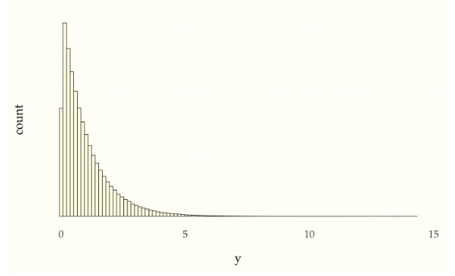
 -->

```
import numpy as np
import pandas as pd
import matplotlib.pyplot as plt
import seaborn as sns

y = -np.log(np.random.uniform(0, 1, 1000000))
exp_df = pd.DataFrame({'y': y})
exp_hist_plot = sns.histplot(exp_df, x='y', color='#ffffe6', edgecolor='black',
                             bins=100, stat='density')
exp_hist_plot.set(xlabel='y', ylabel='density')
plt.show()

```
{: .language-python}

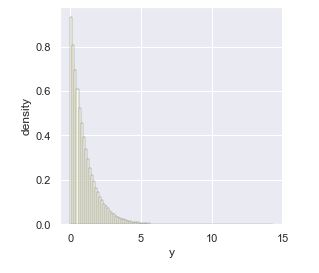

While the histogram plot lets us visualize the density, we can also
derive the density $$p_Y$$ from the uniform density $$p_U$$ given the
transform

$$
Y \ = \ f(U) \ = \ -\log U.
$$

First, we calculate the inverse transform,

$$
\begin{array}{rcl}
Y & = & -\log U \\[3pt]
-Y & = & \log U \\[3pt]
\exp(-Y) & = & U
\end{array}
$$

so that

$$
f^{-1}(Y) = \exp(-U).
$$

We'll need the derivative of this inverse for the Jacobian,^[We need
to employ the chain rule here,

$$
\frac{\textrm{d}}{\textrm{d}x} a(b(x))
\ = \
\left( \frac{\textrm{d}}{\textrm{d}u} a(u) \Bigg|_u = b(x) \right)
 \cdot
\left( \frac{\textrm{d}}{\textrm{d}{x}} b(x) \right),
$$

with $$a(u) = \exp(u)$$ and $$
b(x) = -x.
$$


$$
\begin{array}{rcl}
\frac{\textrm{d}}{\textrm{d}y} f^{-1}(y)
& = & \frac{\textrm{d}}{\textrm{d}y} \exp(-y)
\\[4pt]
& = & -\exp(-y).
\end{array}
$$

We can now derive the density of $$Y = f(U) = -\log U$$, where $$
U \sim
 \textrm{uniform}(0, 1),
 $$
 
$$
\begin{array}{rcl}
p_Y(y)
& = &
p_U(f^{-1}(y))
\cdot
\left|
\frac{\textrm{d}}{\textrm{d}y} \exp(-y)
\right|
\\[8pt]
& = &
\textrm{uniform}(f^{-1}(y) \mid 0, 1)
\cdot
\left| -\exp(-y) \right|
\\[8pt]
& = & \exp(-y).
\end{array}
$$

The result, as simple as it looks, is a properly normalized
density.^[Given the derivative $$\frac{\textrm{d}}{\textrm{d}y}
-\exp(-y) \ = \
\exp(-y),$$ the basic rule for computing definite integrals,

$$
\begin{array}{rcl}
\int_a^b f(x) \, \textrm{d}x
& = &
\int f(x) \, \textrm{d}x \, \Big|_{x = b}
\ - \
\int f(x) \, \textrm{d}x \, \Big|_{x = a}
\\[6pt]
& = & -\exp(-x)\Big|_{x = b} - -\exp(-x)\Big|_{x = a}
\\[6pt]
& = & -\exp(-b) + \exp(-a).
\end{array}]
$$

Plugging in $$a = 0$$ and $$b = \infty$$ (the latter is really taking a
limit), gives us $$
-\exp(-\infty) + \exp(-0) = 0 + 1 = 1.
$$

This distribution is popular enough to get its own name, the
exponential distribution, the standard version of which is
conventionally defined by

$$
\textrm{exponential}(y \mid 1) = \exp(-y).
$$

As for other distributions, we will write $$Y \sim
\textrm{exponential}(1)$$ if $$p_Y(y) = \textrm{exponential}(y) =
\exp(-y).$$

We will generalize the standard exponential by allowing it to be
scaled.  Unlike the normal distribution, which scales a standard
normal by multiplying it by a scale parameter, it is conventional to
divide a standard exponential variate by a rate parameter to get a
general exponential variate.  Suppose $$V \sim \textrm{exponential}(1)$$
and we define a new variable $$Y = V / \lambda$$ for some rate $$\lambda > 0.$$ [A rate parameter divides a variable in contrast to a rate
parameter, which multiplies a parameter.]  This gives us a general
exponential variate, $$Y \sim \textrm{exponential}(\lambda).$$

To define the general exponential density, we just apply the Jacobian
formula again, keeping in mind that our transform is

$$
h(V) = V / \lambda,
$$

which has an inverse

$$
h^{-1}(Y) = \lambda \cdot Y.
$$

Plugging this into the formula for a change of variables, we get

$$
\begin{array}{rcl}
p_Y(y)
& = &
p_V\left(h^{-1}(y)\right)
\cdot
\left|
\frac{\textrm{d}}{\textrm{d}y} h^{-1}(y)
\right|
\\[8pt]
& = &
p_V(\lambda \cdot y)
\cdot
\left| \frac{\textrm{d}}{\textrm{d}y} \lambda \cdot y \right|
\\[8pt]
& = &
\exp(-\lambda \cdot y)
\cdot
\lambda.
\end{array}
$$

This gives us the final form of the exponential distribution,

$$
\textrm{exponential}(y \mid \lambda)
\ = \
\lambda \cdot \exp(-\lambda \cdot y).
$$

By construction, we know that if the standard distribution has a mean
of 1, then the transformed version has a mean of $$1 / \lambda.$$
Similarly, the transformed version also has a standard deviation of $$1
/ \lambda$$.^[The inverse cumulative distribution function for the
standard exponential is just the function $$-\log u$$ used to construct
the variable.  It is thus simple symbolically to derive the cumulative
distribution function and the generalized version with a non-unit rate.]
