# Statistical Inference and Inverse Problems

*Deductive inference* works from facts toward conclusions
deterministically.  For example, if I tell you that all men are mortal
and that Socrates is a man, you can deductively conclude that Socrates
is mortal.  *Inductive inference*, on the other hand, is a bit more
slippery to define, as it works from observations back to facts.  That
is, if we think of the facts as governing or generating the
observations, then induction is a kind of inverse inference.
*Statistical inference* is a kind of inductive inference that is
specifically formulated as an inverse problem.

## Laplace's birth ratio model

The roots of statistical inference lie not in games of chance, but in
the realm of public health.  Pierre-Simon Laplace was investigating
the rate of child births by sex in France in an attempt to predict
future population sizes.^[Pierre-Simon Laplace. 1812. *Essai
philosophique sur les probabilités*. H. Remy. p. lvi of the
Introduction.  Annotated English translation of the 1825 Fifth
Edition: Andrew I. Dale, 1995. *Philosophical Essay on
Probabilities*. Springer-Verlag.]  Laplace reports the following
number of live births, gathered from thirty departments of France
between 1800 and 1802 was as follows.

$$
\begin{array}{r|r}
\mbox{sex} & \mbox{live births}
\\ \hline
\mbox{male} & 110\,312
\\
\mbox{female} & 105\,287
\end{array}
$$

Laplace assumed each birth is independent and each has probability
$$\Theta \in [0, 1]$$ of being a boy.  Letting $$Y$$ be the number of male
births and $$N$$ be the total number of births, Laplace assumed the
model

$$
Y  \sim \mbox{binomial}(N, \Theta).
$$

In other words, his data-generating distribution had the probability
mass function^[The constant $$N$$ that appears in the full binomial
notation is suppressed in the density notation $$p_{Y \mid
\Theta}$$---it is common to suppress constants in the notation to make
the relationship between the modeled data $$Y$$ and parameters $$\Theta$$
easier to scan.]

$$
p_{Y \mid \Theta}(y \mid \theta)
\ = \
\mbox{binomial}(y \mid N, \theta).
$$

Because it employs a binomial distribution, this model assumes that
the sex of each baby is independent, with probability $$\theta$$ of
being a boy.  This may or may not be a good approximation to reality.
Part of our job is going to be to check the assumptions like this
built into our models.

We know how to generate $$Y$$ given values for the parameter $$\Theta$$,
but we are now faced with the *inverse problem* of drawing inferences
about $$\Theta$$ based on observations about $$Y$$.


## What is a model?

We say that this simple formula is a *model* in the sense that it is
not the actual birth process, but rather a mathematical construct
meant to reflect properties of the birth process.  In this sense, it's
like Isaac Newton's model of the planetary motions using differential
equations.^[Isaac Newton. 1687. *Philosophiae Naturalis Principia
Mathematica*.  Translated as I. Bernard Cohen and Anne
Whitman. 1999. *The Principia: Mathematical Principles of Natural
Philosophy.* University of California Press.]  The equations are not
the planets, just descriptions of how they move in response to
gravitational and other forces.

Models like Newton's allow us to predict certain things, such as the
motion of the planets, the tides, and balls dropped from towers.  But
they typically only approximate the full process being modeled in some
way.  Even Newton's model, which is fabulously accurate at predictions
at observable scales, is only an approximation to the finer-grained
models of motion and gravity introduced by Albert Einstein.^[Einstein,
Albert. 1907. Über das Relativitätsprinzip und die aus demselben
gezogenen Folgerungen. (English translation: On the relativity
principle and the conclusions drawn from it.) *Jahrbuch der
Radioaktivität und Elektronik* 4:411--462.]  which itself was only a
special case of the more general theory of relativity.^[Einstein,
Albert. 1916. The foundation of the general theory of
relativity. *Annalen Phys.* 14:769--822.]  Each successive model is
better than the last in that it's better at prediction, more general,
or more elegant---science does not progress based on a single
criterion for improving models.

The reproductive process is complex, and many factors may impinge on
the sex of a baby being born.  Part of our job as scientists is to
check the assumptions of our models and refine them as necessary.
This needs to be done relative to the goal of the model.  If the goal
of this simple reproductive model is only to predict the prevalence of
male births at a national scale, then a simple, direct prevalence
model with a single parameter like the one we have introduced may be
sufficient.

To conclude, when we say "model", all we have in mind is some
mathematical construct taken to represent some aspect of reality.
Whether a model is useful is a pragmatic question which must be judged
relative to its intended application.


## What is a random variable?

As in all statistical modeling, Laplace treated the observed number of
male births $$Y$$ as a random variable.  This assumes a form of
counterfactual reasoning whereby we assume the world might have been
some other way than it actually turned out to be.

As in most statistical models, Laplace treated $$N$$ as a constant.  In
many cases, the denominator of binary events is not itself a constant,
but is itself a random variable determined by factors of the
environment.  For instance, the number of attempts an athlete on a
sports team get depends on the ability of that athlete and the number
of reviews a movie receives depends on its popularity.

As originally formulated by Thomas Bayes,^[Bayes, T., 1763. LII. An
essay towards solving a problem in the doctrine of chances. By the
late Rev. Mr. Bayes, FRS communicated by Mr. Price, in a letter to
John Canton, AMFRS. *Philosophical Transactions of the Royal Society*,
pp. 370--418.]  Laplace also treated $$\Theta$$ as a random variable.
That is, Laplace wanted to infer, based on observation and
measurement, that the probability that $$\Theta$$'s value was in a
certain range.  Specifically, Laplace was curious about the question
of whether the male birth rate is higher, which can be expressed in
probabilistic terms by the event probability $$\mbox{Pr}[\Theta >
0.5]$$.


## Laplace's inverse problem

Given a total of $$N$$ births, we have introduced random variables for

* the observed data of $$Y$$ male births, and
* the probability $$\Theta$$ that a live birth will result in a boy.

We also have the actual observed number of male births, $$y$$.  That is,
we know the value of the random variable $$Y$$.  Given our observed
data, we can ask two obvious questions, namely

* What is the probability of a boy being born?
* Is it more likely that a boy is born than a girl?

Given that $$\Theta$$ is the male birth rate, the first question is
asking about the value of $$\Theta$$.  To provide a probabilistic
answer, we want to look at the distribution of $$\Theta$$ given that we
observe the actual data $$Y = y$$, which has the density $$p_{\Theta \mid
Y}(\theta \mid y)$$.  We can summarize this distribution
probabilistically using intervals, for instance by reporting the
central 95% interval probability,

$$
\mbox{Pr}\left[ 0.025 \leq \Theta \leq 0.975
                \ \Big| \
		Y = y
         \right].
$$

The second question, namely whether boys are more likely to be born,
is true if $$\Theta > \frac{1}{2}$$.  The probability of this event is

$$
\mbox{Pr}\left[ \Theta > \frac{1}{2}
                \ \Bigg| \
		Y = y
         \right].
$$

If we can estimate this event probability, we can answer Laplace's
second question.^[The quality of the answer will be determined by the
quality of the data and the quality of the model.]

## Bayes's rule to solve the inverse problem

The model we have is a *generative model*^[Also known as a *forward
model* or a *mechanistic model* by scientists.]---it works from a
parameter value $$\theta$$ to the observed data $$y$$ through a *sampling
distribution* with probability function $$p_{Y \mid \Theta}(y \mid
\theta).$$ What we need to solve our inference problems is the
*posterior density* $$p_{\Theta \mid Y}(\theta \mid y)$$.  Bayes
realized that the posterior could be defined in terms of the sampling
distribution as

$$
\begin{array}{rcl}
p_{\Theta \mid Y}(\theta \mid y)
& = &
\frac{\displaystyle
      p_{Y \mid \Theta}(y \mid \theta)
      \times
      p_{\Theta}(\theta)}
     {\displaystyle
      p_Y(y)}
\\[6pt]
& \propto &
p_{Y \mid \Theta}(y \mid \theta)
\times
p_{\Theta}(\theta).
\end{array}
$$

All of our sampling algorithms will work with densities known only up
to a proportion.

## The prior distribution

This still leaves the not inconsequential matter of how to determine
$$p_{\Theta}(\theta)$$, the density of the so-called *prior
distribution* of $$\Theta$$.  The prior distribution encapsulates what
we know about the parameters $$\Theta$$ before observing the actual data
$$y$$.  This prior knowledge may be derived in many different ways.

* We may have prior knowledge from physical constraints.  For example,
  if we are modeling the concentration of a molecule in a solution,
  the concentration must be positive.
* We may have prior knowledge of the basic scale of the answer from
  prior scientific knowledge.  For example, if we are modeling human
  growth, we know that heights above two meters are rare and heights
  above three meters are unheard of.
* We may have prior knowledge from directly related prior experiments.
  For example, if we are doing a Phase II drug trial, we will have
  data from the Phase I trial, or we may have data from Europe if we
  are doing a trial in the United States.
* We may have experiments from indirectly related trials.  For
  example, if we are modeling football player abilities, we have years
  and years of data from prior seasons.  We know nobody is going to average 10 points
  a game---it's just not done.

Because we are working probabilistically, our prior knowledge will
itself be modeled with a probability distribution, say with density
$$p_{\Theta}(\theta)$$.  The prior distribution may depend on
parameters, which may be constants or may themselves be unknown.  This
may seem like an awfully strong imposition to have to express prior
knowledge as a density.  If we can express our knowledge well and
sharply in a distribution, we will have an *informative prior.*
Luckily, because we are only building approximate models of reality,
the prior knowledge model does not need to be perfect.  We usually err
on the side of underpowering the prior a bit compared to what we
really know, imposing only *weakly informative priors*, such as those
that determine scales, but not exact boundaries of parameters.^[The
notion of a truly *uninformative prior* is much trickier, because to be
truly uninformative, a prior must be scale free.]

We will have a lot to say about prior knowledge later in the book, but
for now we can follow Laplace in adopting a uniform prior for the rate
of male births,

$$
\Theta \sim \mbox{uniform}(0, 1).
$$

In other words, we assume the prior density is given by

$$
p_{\Theta}(\theta) =  \mbox{uniform}(\Theta \mid 0, 1).
$$


Here, the bounds zero and one, expressed as constant parameters of the
uniform distribution, are logical constraints imposed by the fact that
the random variable $$\Theta$$ denotes a probability.

Other than the logical bounds, this uniform prior distribution is
saying a value in the range 0.01 to 0.05 is as likely as one in 0.48
to 0.52.  This is a very weak prior indeed compared to what we know
about births.  Nevertheless, it will suffice for this first analysis.

## The proportional posterior

With a prior and likelihood,^[Remember, the likelihood is just the
sampling distribution $$p_{Y \mid \Theta}(y \mid \theta)$$ viewed as a
function of $$\theta$$ for fixed $$y$$.] we have our full joint model in
hand,

$$
p_{Y \mid \Theta}(y \mid N, \theta) \times p_{\Theta}(\theta)
\ = \
\mbox{binomial}(y \mid N, \theta)
  \times \mbox{uniform}(\theta \mid 0, 1).
$$

We have carried along the constant $$N$$ so we don't forget it, but it
simply appears on the right of the conditioning bar on both sides of
the equation.

The sampling distribution $$p(y \mid \theta)$$ is considered as a
density for $$y$$ given a value of $$\theta$$.  If we instead fix $$y$$ and
view $$p(y \mid \theta)$$ as a function of $$\theta$$, it is called the
*likelihood function*.  As a function, the likelihood function is not
itself a density.  Nevertheless, it is crucial in posterior inference.

With Bayes's rule, we know the posterior is proportional to the prior
times the likelihood,

$$
\underbrace{p_{\Theta \mid Y}(\theta \mid y)}_{\text{posterior}}
\ \propto \
\underbrace{p_{Y \mid \Theta}(y \mid \theta)}_{\text{likelihood}}
\ \times \
\underbrace{p_{\Theta}(\theta)}_{\text{prior}}.
$$

Given the definitions of the relevant
probability functions,^[
For reference, these are the likelihood
$$
\mbox{binomial}(y \mid N, \theta)
\ \propto \
\theta^y \times (1 - \theta)^{N - y}
$$
and the prior
$$
\mbox{uniform}(\theta \mid 0, 1)
\ = \
1.
$$
]
we have

$$
\begin{array}{rcl}
p_{\Theta \mid Y}(\theta \mid y, N)
& \propto &
\mbox{binomial}(y \mid N, \theta)
  \times \mbox{uniform}(\theta \mid 0, 1)
\\[4pt]
& \propto &
\theta^y \times (1 - \theta)^{N - y}
\end{array}
$$

To summarize, we know the posterior $$p_{\Theta \mid Y}$$ up to a
proportion, but are still missing the normalizing constant so that it
integrates to one.^[We return to the normalizer later when we discuss
the beta distribution.]


## Sampling from the posterior

Now that we have a formula for the posterior up to a proportion, we
are in business for sampling from the posterior.  All of the sampling
algorithms in common use require the density only up to a proportion.

For now, we will simply assume a method exists to draw a sample
$$\theta^{(1)}, \cdots, \theta^{(M)}$$ where each $$\theta^{(m)}$$ is
drawn from the posterior $$p_{\Theta \mid y}(\theta \mid y)$$ given the
observed data $$y$$.

When we do begin to employ general samplers, they are going to require
specifications of our models that are exact enough to be programmed.
Rather than relying on narrative explanation, we'll use a pseudocode
for models that can be easily translated for an assortment of
posterior samplers.^[This specification is sufficient for coding a
sampler in BUGS, Edward, emcee, Greta, JAGS, NIMBLE, PyMC, Pyro, or
Stan.]

$$
\begin{array}{r|lr}
\mbox{Name} & \mbox{simple binomial}
\\ \hline
\mbox{Data}
& N \in \mathbb{N}
\\
& y_n \in \{ 0, 1 \}
& \mbox{ } \hfill \mbox{for} \ n \in 1:N
\\ \hline
\mbox{Parameters}
& \theta \in (0, 1)
\\ \hline
\mbox{Prior}
& \theta \sim \mbox{uniform}(0, 1)
\\ \hline
\mbox{Likelihood}
& y_n \sim \mbox{binomial}(N, \theta)
& \mbox{ } \hfill \mbox{for} \ n \in 1:N
\end{array}
$$

## Simulating data

Rather than starting with Laplace's data, which will present
computational problems, we will start with some simulated data.  We
simulate data for a model by simulating the parameters from the prior,
then simulating the data from the parameters.  That is, we run the
model in the forward direction from prior to parameters to data.  This
is usually how we construct the models in the first place, so this
should be a natural step.  In pseudocode, this is a two-liner.

```
from random import uniform, randint

theta = uniform(0, 1)
y = randint(0, N)  # assuming N is the number of trials
successes = randint(0, y)  # number of successes based on y and theta

print('theta =', theta, '; y =', y, '; number of successes =', successes)

```
{: .language-python}

Before we can actually simulate, we need to set the constants, because
they don't have priors.  Here, we'll just take $$N = 10$$ for
pedagogical convenience.  Let's run it a few times and see what we
get.

<!-- 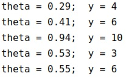 -->

```
import random

random.seed(123)
N = 10
for m in range(1, 6):
    theta = random.uniform(0, 1)
    y = random.randint(0, N)
    print(f"theta = {theta:.2f}; y = {y}")

```
{: .language-python}


```
theta = 0.05; y = 1
theta = 0.77; y = 4
theta = 0.11; y = 0
theta = 0.38; y = 8
theta = 0.33; y = 0

```
{: .output}

The values simulated for $$\theta$$ are not round numbers, so we know
that we won't satisfy $$y = N \times \theta$$, the expected value of a
random variable $$Y$$ such that $$Y \sim \mbox{binomial}(N, \theta)$$.
From an estimation perspective, we won't have $$\theta = y / N$$,
either.  So the question becomes what are reasonable values for
$$\theta$$ based on our observation of $$y$$?  That's precisely the
posterior, so let's proceed to sampling from that.  We'll just assume
we have a function that samples from the posterior of a model with a
given name when passed the data for the model.  Here, the data
consists of the values of $$y$$ and $$N$$, and we will run $$M = 1\,000$$
iterations.

```
N = 10
y = 3
theta[1:M] = posterior_sample('simple binomial', y, N)

print 'theta = ' theta[1:10] '...'
```
{: .language-python}


Let's run that and see what a few posterior draws look like.

<!-- 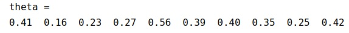 -->

```
import numpy as np

M = 1000
N = 10
y = 3
theta = np.random.beta(y + 1, N - y + 1, M)
print('theta = ', end='')
for n in range(10):
    print('{:.2f}  '.format(theta[n]), end='')

```
{: .language-python}

```
theta = 0.27  0.11  0.25  0.14  0.44  0.35  0.31  0.08  0.38  0.24  

```
{: .output} 

It's hard to glean much from the draws. What it does tell us is that
the posterior in the range we expect it to be in---near 0.3, because
the data was $$y = 3$$ boys in $$N = 10$$ births.  The first thing we want
to do with any posterior is check that it's reasonable.

For visualizing draws of a single variable, such as the proportion of
boy births $$\theta$$, histograms are handy.

Histogram of one thousand draws from the posterior $$p(\theta \mid y)$$.   With thirty bins, the histogram appears ragged, but conveys the rough shape and location of the posterior.


```
import pandas as pd
import matplotlib.pyplot as plt
import seaborn as sns

binom_post_df = pd.DataFrame({'theta': theta})
binomial_post_plot = sns.histplot(data=binom_post_df, x='theta', color='black', fill='#ffffe6', edgecolor='black', binwidth=0.025)
binomial_post_plot.set(xlim=(0, 1), xticks=[0, 0.25, 0.5, 0.75, 1], xlabel=r'$\theta$', ylabel='posterior draw proportion')
sns.set_style('ticks')
sns.despine(offset=10, trim=True)
plt.show()

```
{: .language-python}

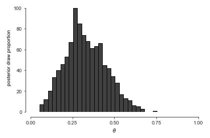
<!-- 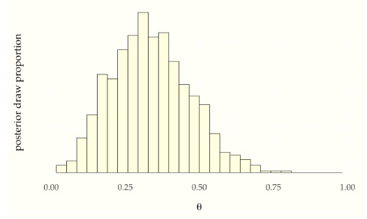 -->

Let's up $$M$$ to $$1\,000\,000$$ and double the number of bins to get a
better look at the posterior density. ^[A sample size $$M > 100$$ is
rarely necessary for calculating estimates, event probabilities, or
other expectations conditioned on data. For histograms, many draws are
required to ensure low relative error in every bin so that the
resulting histogram is smooth.]

Histogram of one million draws from the posterior $$p(\theta \mid y)$$.  A *much* larger $$M$$ is required to get a fine-grained view of the whole posterior distribution than is required for an accurate summary statistic.'}

<!-- 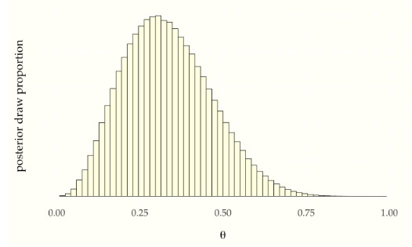 -->

```
import numpy as np
import pandas as pd
import matplotlib.pyplot as plt
import seaborn as sns

np.random.seed(1234)
M = 1000000
theta = np.random.beta(y + 1, N - y + 1, M)

binom_post_df2 = pd.DataFrame({'theta': theta})
binomial_post_plot2 = sns.histplot(data=binom_post_df2, x='theta', color='black', fill='#ffffe6', edgecolor='black', bins=60)
binomial_post_plot2.set(xlim=(0, 1), xticks=[0, 0.25, 0.5, 0.75, 1], xlabel=r'$\theta$', ylabel='posterior draw proportion')
sns.set_style('ticks')
sns.despine(offset=10, trim=True)
plt.show()
```
{: .language-python}

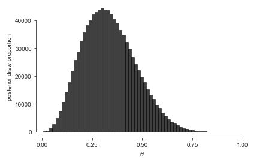

Histograms have their limitations. The distribution is slightly
asymmetric, with a longer tail to the right than to the left, but
asymmetry can be difficult to detect visually until it is more extreme
than here. Asymmetric distributions are said to be *skewed*, either to
the right or left, depending on which tail is longer.^[The formal
measurement of the *skew* of a random variable $$Y$$ is just another
expectation that may be estimated via simulation, $$\mbox{skew}[Y] =
\mathbb{E}\left[\left(\frac{Y -
\mathbb{E}[Y]}{\mbox{sd}[Y]}\right)^3\right].$$] It's also hard to
tell the exact location of the posterior mean and median visually.


## Posterior summary statistics

We often want to look at summaries of the posterior, the posterior
mean, standard deviation, and quantiles being the most commonly used
in practice.  These are all easily calculated based on the sample
draws.

Calculating the posterior mean and standard deviation are as
simple as calling built-in mean and standard deviation functions,

```
print('estimated posterior mean =', np.mean(theta))
print('estimated posterior sd =', np.std(theta))

```
{: .language-python}

```
estimated posterior mean = 0.33331827871568803
estimated posterior sd = 0.1309386704210955
```
{: .output}

Let's see what we get.

```
print(f'estimated posterior mean = {np.mean(theta):.2f}')
print(f'estimated posterior sd = {np.std(theta):.2f}')
```
{: .language-python}


```
estimated posterior mean = 0.33
estimated posterior sd = 0.13
```
{: .output}

<!-- 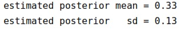 -->

The posterior mean and standard deviation are excellent marginal
summary statistics for posterior quantities that have a roughly normal
distribution.^[Most posterior distributions we will consider approach
normality as more data is observed.]  If the posterior distribution
has very broad or narrow tails or is highly skewed, standard deviation
and mean are less useful.

We can estimate quantiles just as easily, assuming we have built-in
functions to compute quantiles.

```
print('estimated posterior median =', np.quantile(theta, 0.5))
print('estimated posterior central 80 pct interval =', np.quantile(theta, [0.1, 0.9]))

```
{: .language-python}

```
estimated posterior median = 0.3237547839111739
estimated posterior central 80 pct interval = [0.16896885 0.51122413]
```
{: .output}

Running this produces the following.^[The median is slightly lower
than the mean, as they will be in right skewed distributions.]

<!-- 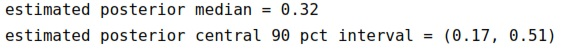 -->

```
print(f'estimated posterior median = {np.quantile(theta, 0.5):.2f}')
print(f'estimated posterior central 90 pct interval = ({np.quantile(theta, 0.1):.2f}, {np.quantile(theta, 0.9):.2f})')

```
{: .language-python}


```
estimated posterior median = 0.32
estimated posterior central 90 pct interval = (0.17, 0.51)
```
{: .output}


The posterior simulations and summaries answer Laplace's question
about the value of $$\theta$$, i.e., the proportion of boys born, at
least relative to this tiny data set.

We have reported a central 90% interval here. It is a 90% interval in
the sense that it is 90% probable to contain the value (relative to
the model, as always). We have located that interval centrally in the
sense that it runs from the 5% quantile to the 95% quantile.

There is nothing privileged about the width or location of a posterior
interval. A value is as likely to be in a posterior interval from the
1% quantile to the 91% quantile, or from the 10% quantile to the 100%
quantile. The width is chosen to be convenient to reason about.  With
a 90% interval, we know roughly nine out of ten values will fall
within it, and choosing a central interval gives us an idea of the
central part of the distribution.


## Estimating event probabilities

To answer the question about whether boys are more prevalent than
girls, we need to estimate $$\mbox{Pr}[\theta > 0.5]$$, which is
straightforward with simulation. As usual, we just count the number of
times that the simulated value $$\theta^{(m)} > 0.5$$ and divide by the
number of simulations $$M$$,

```
print(f'estimated Pr[theta > 0.5] = {np.mean(theta > 0.5):.4f}')

```
{: .language-python}


```
estimated Pr[theta > 0.5] = 0.1137
```
{: .output}

Running this, we see that with 3 boys in 10 births, the probability
boys represent more than 50% of the live births is estimated, relative
to the model, to be

```
print(f'estimated Pr[theta > 0.5] = {np.mean(theta > 0.5):.2f}')

```
{: .language-python}

```
estimated Pr[theta > 0.5] = 0.11
```
{: .output}


<!-- 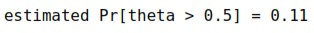 -->

Now let's overlay the median and central 90% interval.

Histogram of $$1,000,000$$ draws from the posterior 
$$p(\theta \mid y, N) \propto \mbox{binomial}(y \mid N, \theta),
$$ given 
$$
N = 10, y = 3
$$.  The median (50 percent quantile) is indicated with a dashed line and the boundaries of the central 90 percent interval (5 percent and 95 percent quantiles) are picked out with dotted lines.  The proportion of the total area shaded to the right of 0.5 represents the posterior probability that $$
\theta > 0.5,
$$ which is about 11 percent.

```

import numpy as np
from scipy.stats import beta
import matplotlib.pyplot as plt

# observed data
y = 435
N = 982

# prior
a, b = 1, 1
theta_prior = beta(a, b)

# posterior
M = 10000
theta = beta.rvs(a + y, b + N - y, size=M)
likelihood = beta.pdf(theta, a + y, b + N - y)
posterior = theta_prior.pdf(theta) * likelihood

# summary statistics
post_mean = np.mean(theta)
post_median = np.median(theta)
post_sd = np.std(theta)
post_80ci = np.quantile(theta, [0.1, 0.9])
post_prob = np.mean(theta > 0.5)

# plot posterior distribution
plt.hist(theta, bins=50, density=True, color='lightblue')
plt.axvline(x=post_median, linestyle='--', color='black', linewidth=0.5)
plt.axvline(x=post_80ci[0], linestyle=':', color='black', linewidth=0.5)
plt.axvline(x=post_80ci[1], linestyle=':', color='black', linewidth=0.5)
plt.xlabel(r'$\theta$')
plt.ylabel('Density')
plt.title('Posterior Distribution')
plt.show()

# print summary statistics
print(f'estimated posterior mean = {post_mean:.2f}')
print(f'estimated posterior median = {post_median:.2f}')
print(f'estimated posterior sd = {post_sd:.2f}')
print(f'estimated posterior central 90 pct interval = ({post_80ci[0]:.2f}, {post_80ci[1]:.2f})')
print(f'estimated Pr[theta > 0.5] = {post_prob:.2f}')

```
{: .language-python}

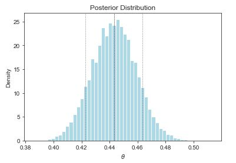

```
estimated posterior mean = 0.44
estimated posterior median = 0.44
estimated posterior sd = 0.02
estimated posterior central 90 pct interval = (0.42, 0.46)
estimated Pr[theta > 0.5] = 0.00
```
{: .output}

<!-- 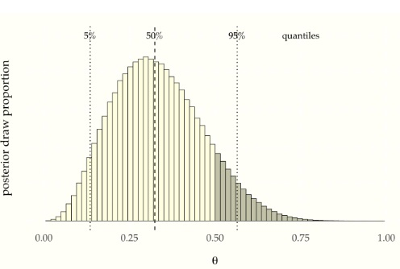 -->
## Laplace's data

What happens if we use Laplace's data, rather than our small data set,
which had roughly 110 thousand male births and 105 thousand female?
Let's take some draws from the posterior $$p(\theta \mid y, N)$$ where
$$y = 110\,312$$ boys out of $$N = 110\,312 + 105\,287$$ total births.
We'll take $$M = 1\,000\,000$$ simulations $$\theta^{(1)}, \ldots,
\theta^{(M)}$$ here because they are cheap and we would like low
sampling error.

```
import numpy as np
import seaborn as sns
import matplotlib.pyplot as plt
from scipy.stats import beta

np.random.seed(1234)

M = 1000000
boys = 110312
girls = 105287
theta = beta.rvs(boys + 1, girls + 1, size=M)

laplace_df = {'theta': theta}
laplace_plot = sns.histplot(data=laplace_df, x='theta', bins=50,
                            color='#ccccb6', edgecolor='black')
laplace_plot.set(xlim=(0.5075, 0.5175), xticks=[0.508, 0.510, 0.512, 0.514, 0.516],
                 xticklabels=['.508', '.510', '.512', '.514', '.516'], xlabel=r'$\theta$',
                 ylabel='posterior draws')
sns.set_style('ticks')
plt.show()

```
{: .language-python} 

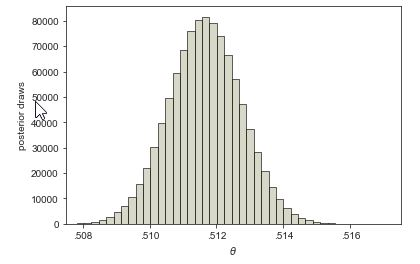
<!-- 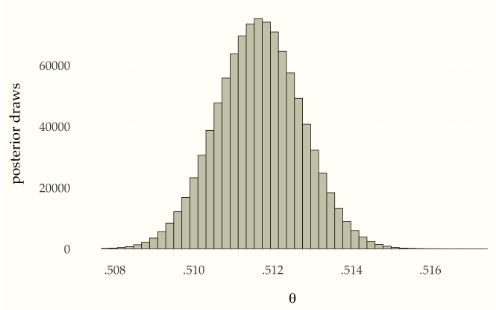 -->

The mean of the posterior sample is approximately 0.511, or a slightly
higher than 51% chance of a male birth.  The central 90% posterior
interval calculated from quantiles of the sample is $$(0.510, 0.513)$$.

What about the event probability that boy births are more likely than
girl births, i.e., $$\mbox{Pr}\[\theta > 0.5\]$$?  If we make our usual
calculation, taking draws $$\theta^{(1)}, \ldots, \theta^{(M)}$$ from
the posterior and look at the proportion for which $$\theta^{(m)} >
0.5$$, the result is 1.  No decimal places, just 1.  If we look at the
draws, the minimum value of $$\theta^{(m)}$$ in $$1\,000,000$$ draws was
approximately 0.506.  The proportion of draws for which $$\theta^{(m)} > 0.5$$ is thus 100%, which forms our estimate for $$\mbox{Pr}[\theta >
0.5]$$.

As we have seen before, simulation-based estimates provide
probabilistic guarantees about absolute tolerances.  With $$100\,000$$
draws, we are sure that the answer is 1.0000 to within plus or minus
0.0001 or less.^[Tolerances can be calculated using the central limit
theorem, which we will define properly when we introduce the normal
distribution later.]  We know the answer must be strictly less
than one.  Using some analytic techniques,\[The cumulative distribution function of the posterior, which is known to be the beta distribution $$p(\theta \mid y, N) = \mbox{beta}(\theta \mid y + 1, N - y + 1).$$\] the true estimate to within 27 decimal places is

$$
\mbox{Pr}[\theta > 0.5] = 1 - 10^{-27}.
$$

Thus Laplace was certain that the probability of a boy being born was
higher than that of a girl being born.


## Inference for and comparison of multiple variables

The first example of Laplace's is simple in that it has only a single
parameter of interest, $$\theta$$, the probability of a male birth.  Now
we will consider a very similar model with two variables, so that we
can do some posterior comparisons.  We will consider some simple
review data for two New York City-based Mexican restaurants.  The
first contender is Downtown Bakery II, an East Village Mexican
restaurant has $$Y_1 = 114$$ out of $$N_1 = 235$$ 5-star reviews on Yelp,
La Delicias Mexicanas, in Spanish Harlem, has $$Y_1 = 24$$ out of $$N_2 =
51$$ 5-start reviews.  Our question is, which is more likely to deliver
a 5-star experience?  In terms of proportion of 5-star votes, they are
close, with Downtown Bakery garnering 49% 5-star reviews and La
Delicias only 47%.  Knowing how noisy binomial data is, this is too
close to call.

We'll model each restaurant independently for $$n \in 1:2$$ as

$$
Y_n \sim \mbox{binomial}(N, \Theta_n)
$$

with independent uniform priors for $$n \in 1:2$$ as

$$
\Theta_n \sim \mbox{uniform}(0, 1).
$$

We can now draw $$\theta^{(1)}, \ldots, \theta^{(M)}$$ simulations from
the posterior $$p_{\Theta \mid Y, N}(\theta \mid y, N)$$ as usual.

The main event is whether $$\theta_1 > \theta_2$$---we want to know if
the probability of getting a five-star review is higher at Downtown
Bakery than La Delicias.  All we need to do is look at the posterior
mean of the indicator function $$\mathrm{I}[\theta_1 > \theta_2]$$.  The
calculus gets more complicated---a double integral is now required
because there are two variables.  The simulation-based estimate, on
the other hand, proceeds as before, counting proportion of draws in
which the event is simulated to occur.

$$
\begin{array}{rcl}
\mbox{Pr}[\theta_1 > \theta_2 \mid y, N]
& = &
\int_0^1 \int_0^1
\, \mathrm{I}[\theta_1 > \theta_2] \times p(\theta_1, \theta_2 \mid y, N)
\, \mathrm{d} \theta_1 \, \mathrm{d} \theta_2
\\[8pt]
& \approx &
\frac{1}{M} \sum_{m = 1}^M \mathrm{I}[\theta_1^{(m)} >
\theta_2^{(m)}].
\end{array}
$$

In pseudocode, this is just

```
success = 0
for m in range(M):
    theta_m = posterior.rvs()
    if theta_m > 1 - theta_m:
        success += 1
print(f"Pr[theta[1] > theta[2] | y, M] = {success/M}")

```
{: .language-python} 

```
Pr[theta[1] > theta[2] | y, M] = 1.0
```
{: .output} 

Let's run that with $$M = 10\,000$$ simulations and see what we get:

```
import numpy as np

M = 10000
y = np.array([114, 24])
N = np.array([235, 51])

theta1 = np.random.beta(y[0] + 1, N[0] - y[0] + 1, size=M)
theta2 = np.random.beta(y[1] + 1, N[1] - y[1] + 1, size=M)

prob = np.mean(theta1 > theta2)

print(f"Pr[theta[1] > theta[2] | y, M] = {prob:.2f}")

```
{: .language-python} 


```
Pr[theta[1] > theta[2] | y, M] = 0.58
```
{: .output}

<!-- 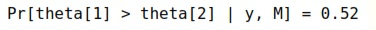 -->

Only about a `52`% chance
that Downtown Bakery is the better bet for a 5-star meal.^[As much as
this diner loves Downtown Bakery, the nod for food, ambience, and the
existence of beer goes to La Delicias Mexicanas.]

To get a sense of the posterior, we can construct a histogram of
posterior draws of $$\Delta = \Theta_1 - \Theta_2$$.

Histogram of posterior differences between probability of Downtown Bakery getting a 5-star review ($$\theta_1$$) and that of La Delicias Mexicanas getting one ($$\theta_2$$).  The draws for which $$\delta > 0$$ (equivalently, $$\theta_1 > \theta_2$$) are shaded darker.  The area of the darker region divided by the total area is the estimate of the probability that Downtown Bakery is more likely to get a 5-star review than La Delicias Mexicanas.

<!-- delta <- theta1 - theta2
delicias_df <- data.frame(delta = delta)

delicias_plot <-
  ggplot(delicias_df, aes(x = delta)) +
  geom_histogram(bins = 30, boundary = 0, binwidth = 0.01,
                 color = 'black', size = 0.25, fill = '#ffffe6') +
  geom_histogram(data = subset(delicias_df, delta > 0),
                 binwidth = 0.01, boundary = 0,
                 color = 'black', size = 0.25, fill = '#ccccb6') +
  xlab(expression(paste(delta, " = ", theta[1] - theta[2]))) +
  ylab("posterior draw proportion") +
  ggtheme_tufte() +
  theme(axis.text.y = element_blank())
delicias_plot -->

<!-- 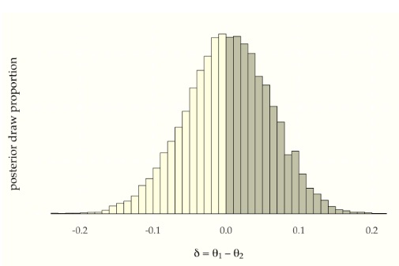
 -->
There is substantial uncertainty, and only 52% of the draws lie to the
right of zero.  That is,

$$\mbox{Pr}[\theta_1 > \theta_2]
\ = \ \mbox{Pr}[\delta > 0]
\ \approx \ 0.52.$$


